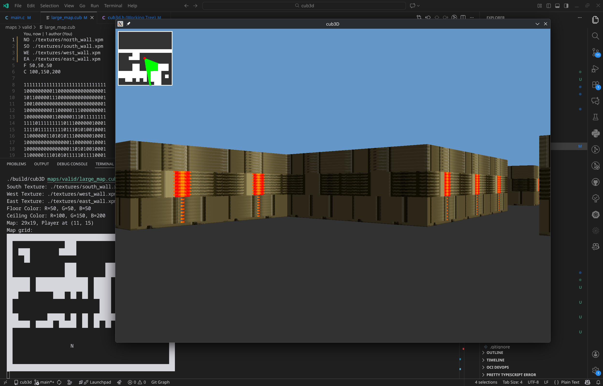
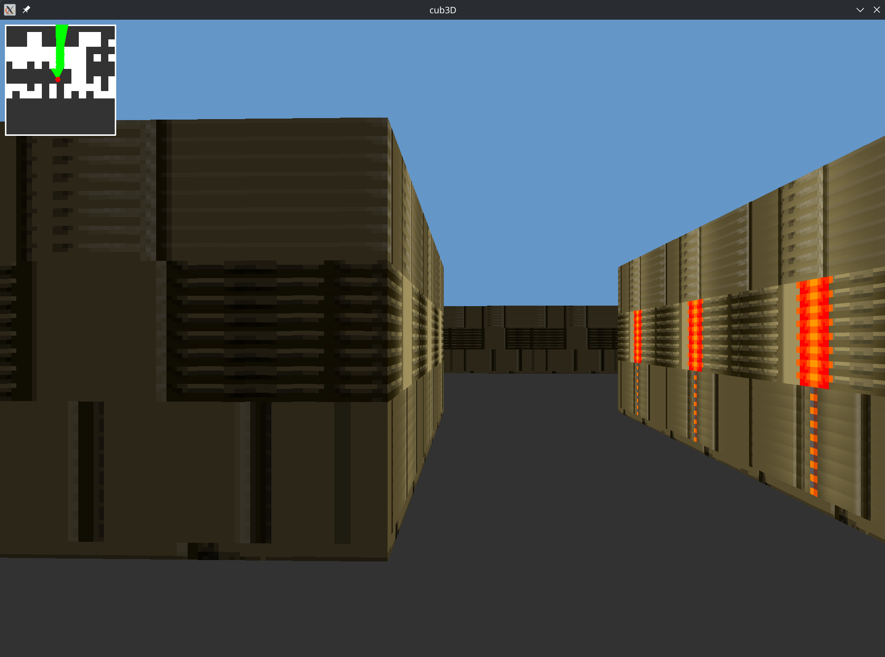

# Cub3D - Raycasting Game Engine

Ever wondered how Wolfenstein 3D pulled off that fake-3D magic back in the day? I built this raycasting engine in C to find out. It renders a first-person maze from a 2D map, no actual 3D math required, just some clever tricks with rays and distances.

## Screenshots

## What I Built

The core engine handles raycasting and rendering, but I also wrote a bunch of utility libraries from scratch because, why not make things harder for myself?

**libgc** - My own garbage collector that wraps malloc and automatically cleans up. No more memory leaks haunting me at 3 AM.

**libft** - Reimplemented a chunk of the C standard library. Turns out writing `strlen()` yourself teaches you things.

**libftprintf** - Custom printf because the real one is boring. Handles all the usual format specifiers.

**libftsscanf** - A scanf implementation for parsing config files. Regular expressions? Never heard of them.

**libgnl** - Reads files line by line. Simple but necessary for parsing those map files.

## Core Concepts Learned

### Raycasting Algorithm

The foundation of the 3D rendering system. For each column of pixels on screen, a ray is cast from the player's position through the game world until it hits a wall. The distance determines the wall's height on screen.

Key techniques:
- DDA (Digital Differential Analyzer) for efficient grid traversal
- Perpendicular distance calculation to avoid fisheye distortion
- CWhat I Learned

**Raycasting is Beautifully Simple**  
For every vertical line on screen, shoot a ray from the player until it hits a wall. The distance tells you how tall to draw that line. That's literally it. The trick is doing it fast enough, enter DDA (Digital Differential Analyzer) for efficient grid traversal, and perpendicular distance calculations to avoid that weird fisheye effect.

**Faking 3D is an Art Form**  
The whole world is just a 2D grid, but with some math you can make it look 3D. Converting screen pixels to ray directions, mapping distances to wall heights, and slapping textures on everything, it's all smoke and mirrors, and it's pretty satisfying when it works.

**Game Loops are Deceptively Tricky**  
Getting a smooth 60 FPS took more work than expected. Delta time keeps movement consistent regardless of frame rate, double buffering prevents ugly screen tearing, and proper timing makes everything feel responsive. Turns out "just update and render" isn't quite enough.

**Texture Mapping is Pixel Wizardry**  
Loading XPM files is the easy part. The fun begins when you're figuring out which exact pixel of a texture to draw based on where your ray hit the wall. Then you realize you need to interpolate coordinates, add some depth shading, and manipulate pixel buffers directly for performance. Worth it though, walls look way better with textures.

**Movement Needs Love Too**  
Smooth controls meant implementing vector-based movement, 2D rotation matrices for turning, and collision detection that doesn't let you walk through walls. All movement is scaled by delta time so it feels consistent no matter your frame rate.

**Math, Math, and More Math**  
This project was basically an excuse to use all that linear algebra and trig I thought I'd never need. Vectors, dot products, rotation matrices, coordinate transformations, turns out they're pretty useful when you're rendering a 3D world.