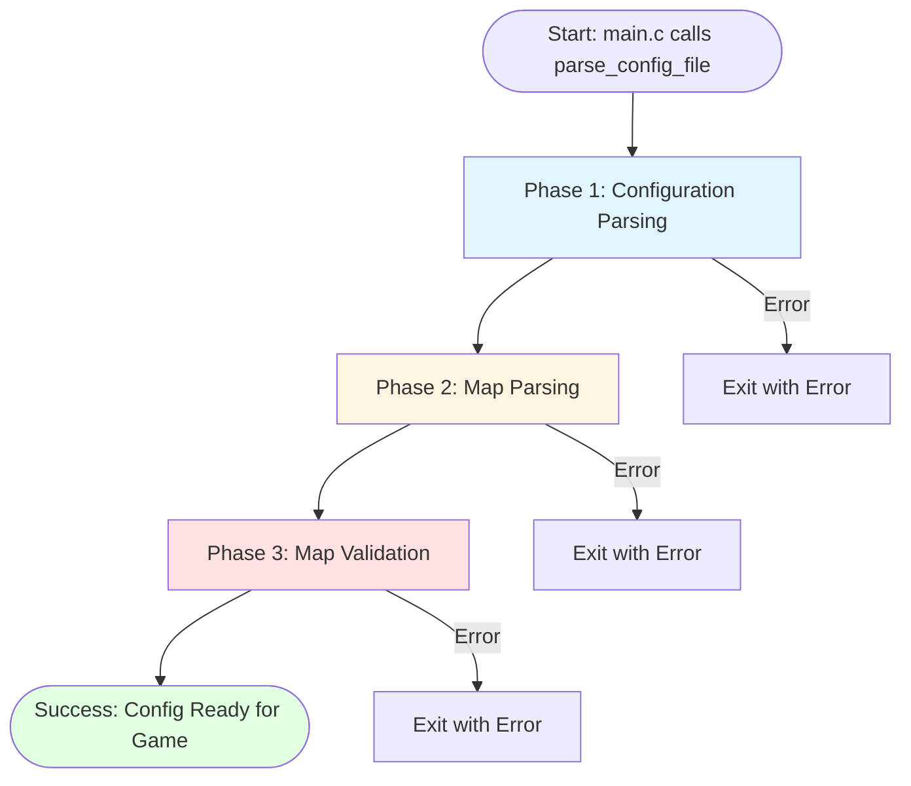
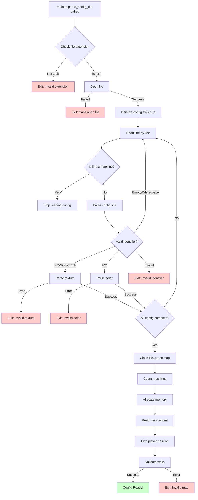
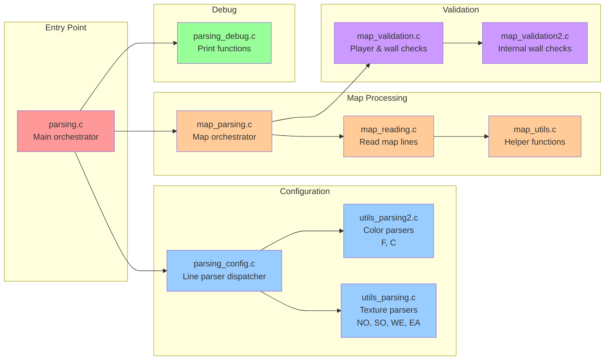
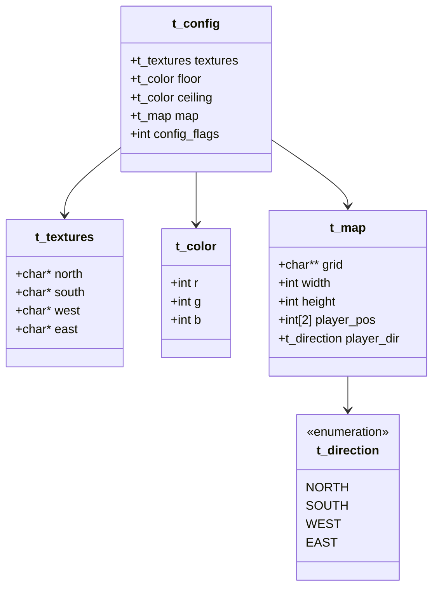
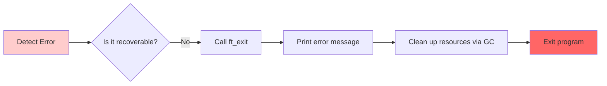
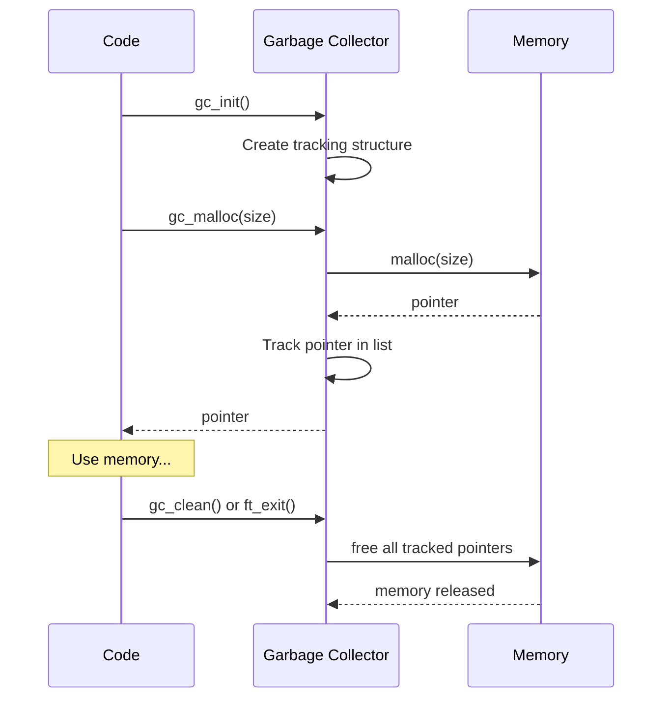
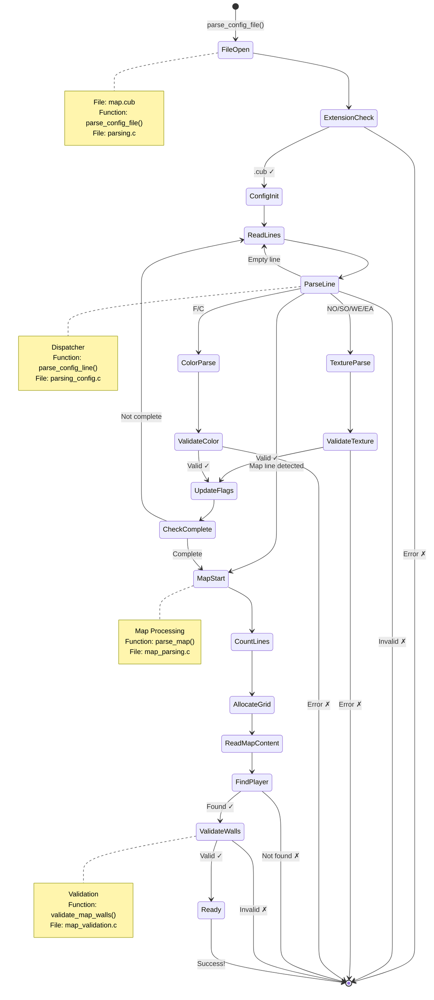

# cub3D Parsing System - Complete Guide

## Table of Contents
1. [Introduction](#introduction)
2. [Big Picture Overview](#big-picture-overview)
3. [The Parsing Journey](#the-parsing-journey)
4. [File Navigation Guide](#file-navigation-guide)

---

## Introduction

Welcome! This documentation will help you understand **every single detail** of how cub3D parses and validates configuration files. Even if you're new to C programming, by the end of these documents, you'll understand exactly how the parsing system works.

### What is Parsing?

**Parsing** is the process of reading a file (in our case, a `.cub` file) and converting its text content into data structures that our program can use. Think of it like translating a recipe written in English into a list of ingredients and instructions that a cooking robot can understand.

### Why Do We Need Parsing?

Our game needs to know:
- What textures to use for walls
- What colors to use for the floor and ceiling
- The layout of the map (where walls are, where the player starts, etc.)

All this information is stored in a `.cub` file, and the parsing system reads and validates this file.

---

## Big Picture Overview

### The Three Main Phases



### What Each Phase Does

| Phase | What It Does | Example |
|-------|--------------|---------|
| **Phase 1: Configuration** | Reads texture paths and colors | `NO ./textures/north.xpm` → stores in `config.textures.north` |
| **Phase 2: Map Parsing** | Reads the map grid | `111111\n100101` → stores in `config.map.grid[][]` |
| **Phase 3: Validation** | Checks if map is valid | Ensures walls surround all walkable areas |

---

## The Parsing Journey

Let's trace the complete flow from the moment `parse_config_file` is called:



---

## File Navigation Guide

The parsing system is organized across multiple files. Here's what each file does:



### File Descriptions

| File | Purpose | Key Functions |
|------|---------|---------------|
| **parsing.c** | Main entry point that orchestrates the entire parsing process | `parse_config_file()` |
| **parsing_config.c** | Dispatches each line to appropriate parser based on identifier | `parse_config_line()` |
| **utils_parsing.c** | Parses texture identifiers (NO, SO, WE, EA) | `parse_texture_no()`, `parse_texture_so()`, etc. |
| **utils_parsing2.c** | Parses color identifiers (F, C) | `parse_color_floor()`, `parse_color_ceiling()` |
| **map_parsing.c** | Counts map lines and orchestrates map reading | `parse_map()` |
| **map_reading.c** | Reads actual map content from file | `read_map_content()` |
| **map_utils.c** | Helper functions for map character validation | `is_map_char()`, `is_map_line()` |
| **map_validation.c** | Validates map walls and finds player | `find_player()`, `validate_map_walls()` |
| **map_validation2.c** | Advanced wall validation (internal walls) | `check_internal_walls()`, `check_sides()` |
| **parsing_debug.c** | Debug printing functions | `print_config()`, `print_map()` |

---

## Understanding the Data Structures

Before diving into the parsing logic, let's understand what data structures we're building:



### Structure Breakdown

#### `t_config` - The Master Structure
This is the **main structure** that holds everything. When we say "parsing the config file," we mean filling this structure with data.

```c
typedef struct s_config
{
    t_textures  textures;      // Paths to 4 wall textures
    t_color     floor;         // RGB color for floor
    t_color     ceiling;       // RGB color for ceiling
    t_map       map;           // The entire map data
    int         config_flags;  // Tracks what we've parsed
}   t_config;
```

**What is `config_flags`?**
This is a clever trick using **bit flags** to track which configuration elements we've already parsed. Each bit represents one element:

```
Binary:  0 0 1 1 1 1 1 1
         │ │ │ │ │ │ │ └─ Bit 0: NO texture (FLAG_NO = 0x01)
         │ │ │ │ │ │ └─── Bit 1: SO texture (FLAG_SO = 0x02)
         │ │ │ │ │ └───── Bit 2: WE texture (FLAG_WE = 0x04)
         │ │ │ │ └─────── Bit 3: EA texture (FLAG_EA = 0x08)
         │ │ │ └───────── Bit 4: F color   (FLAG_F  = 0x10)
         │ │ └─────────── Bit 5: C color   (FLAG_C  = 0x20)
         └─└───────────── (unused bits)
```

When all required elements are parsed, `config_flags` will equal `FLAG_ALL` (0x3F = 0b00111111).

#### `t_textures` - Wall Texture Paths
Stores the file paths to 4 texture images (one for each wall direction):

```c
typedef struct s_textures
{
    char    *north;  // Path like "./textures/north.xpm"
    char    *south;
    char    *west;
    char    *east;
}   t_textures;
```

#### `t_color` - RGB Color Value
Represents a color with red, green, and blue components (0-255):

```c
typedef struct s_color
{
    int r;  // Red:   0-255
    int g;  // Green: 0-255
    int b;  // Blue:  0-255
}   t_color;
```

Example: `F 220,100,0` becomes `{r: 220, g: 100, b: 0}` (an orange color)

#### `t_map` - The Game Map
Contains the actual map layout and player information:

```c
typedef struct s_map
{
    char          **grid;         // 2D array of characters
    int           width;          // Widest row in the map
    int           height;         // Number of rows
    int           player_pos[2];  // [x, y] position
    t_direction   player_dir;     // NORTH, SOUTH, EAST, or WEST
}   t_map;
```

**Grid Example:**
```
grid[0] = "111111"
grid[1] = "100101"
grid[2] = "101001"
grid[3] = "1100N1"
grid[4] = "111111"
```

---

## Error Handling Strategy

The parsing system uses a **fail-fast** approach: if any validation fails, the program exits immediately with a descriptive error message.



### Error Codes

| Exit Code | Meaning | Example Trigger |
|-----------|---------|-----------------|
| 1 | General error | Wrong usage, GC init failure, wall validation failure |
| 2 | Invalid extension | File doesn't end with `.cub` |
| 3 | Can't open file | File doesn't exist or no read permission |
| 4 | Invalid identifier | Duplicate identifier or invalid format |
| 5 | Missing elements | Not all required elements (NO, SO, WE, EA, F, C) present |
| 6 | Invalid map | Map format is wrong or incomplete |

---

## Memory Management: The Garbage Collector

This project uses a **custom garbage collector** (`libgc`) to manage memory automatically. This is SUPER important!

### How It Works



### Why This is Amazing

**Without GC:**
```c
char *texture = malloc(256);
if (error_happened) {
    free(texture);      // Must remember to free!
    exit(1);
}
// ... use texture ...
free(texture);          // Must free here too!
```

**With GC:**
```c
char *texture = gc_malloc(256);
if (error_happened) {
    ft_exit(1, "Error");  // GC automatically frees everything!
}
// ... use texture ...
// No manual free needed! GC cleans up automatically
```

### Key GC Functions

| Function | Purpose | When Used |
|----------|---------|-----------|
| `gc_init()` | Initializes the garbage collector | Once at program start (in main) |
| `gc_malloc(size)` | Allocates memory and tracks it | Instead of regular `malloc()` |
| `gc_strdup(str)` | Duplicates a string with tracking | Instead of `strdup()` |
| `gc_clean()` | Frees all tracked memory | At program exit |
| `ft_exit(code, msg)` | Prints error, calls `gc_clean()`, exits | On any error |

---

## Next Steps

Now that you understand the big picture, dive into the detailed documentation:

1. **[Config File Format](02_config_file_format.md)** - Learn the `.cub` file structure
2. **[Configuration Parsing](03_configuration_parsing.md)** - How textures and colors are parsed
3. **[Map Parsing](04_map_parsing.md)** - How the map grid is read
4. **[Map Validation](05_map_validation.md)** - How the map is validated
5. **[Dependencies Deep Dive](06_dependencies.md)** - Understanding the helper libraries

---

## Quick Reference: Key Constants

```c
// File extension
".cub"                  // Required file extension

// Map characters
#define WALL '1'                // Wall tile
#define WALKABLE '0'            // Walkable floor tile
#define NOT_WALKABLE ' '        // Space (non-walkable)
// Plus: 'N', 'S', 'E', 'W'     // Player starting positions

// Configuration flags
#define FLAG_NO  0x01           // North texture parsed
#define FLAG_SO  0x02           // South texture parsed
#define FLAG_WE  0x04           // West texture parsed
#define FLAG_EA  0x08           // East texture parsed
#define FLAG_F   0x10           // Floor color parsed
#define FLAG_C   0x20           // Ceiling color parsed
#define FLAG_ALL 0x3F           // All flags set (binary: 111111)
```

---

## Visual: Complete Parsing Flow

Here's the complete flow from file to ready-to-use config:



---

**Continue to:** [Config File Format →](02_config_file_format.md)
