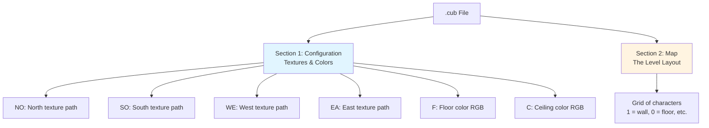
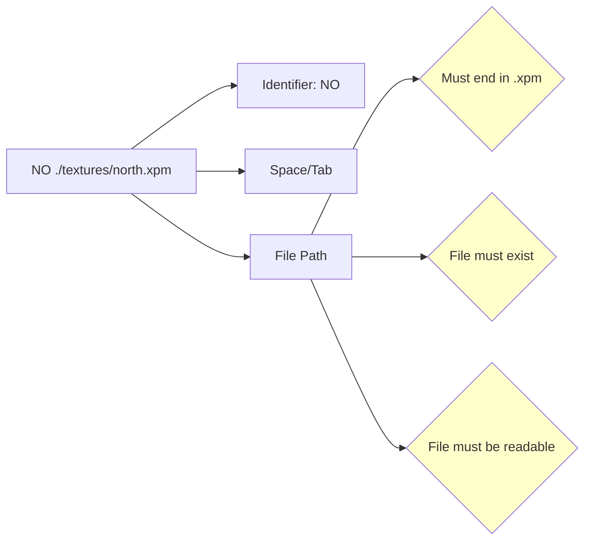
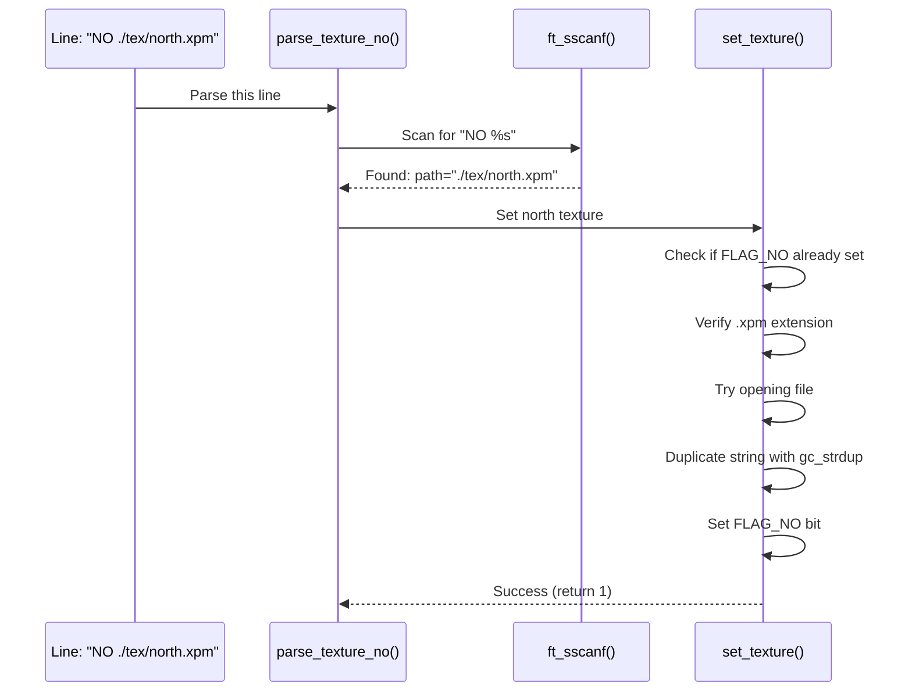
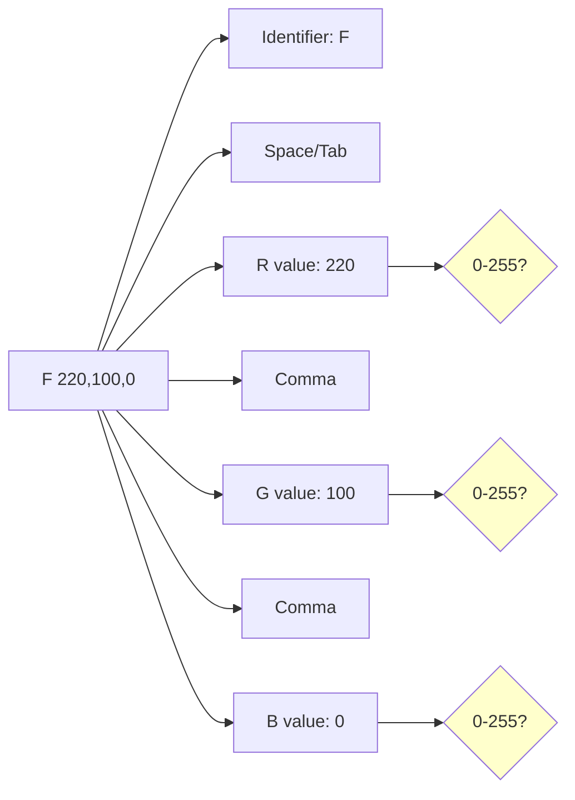
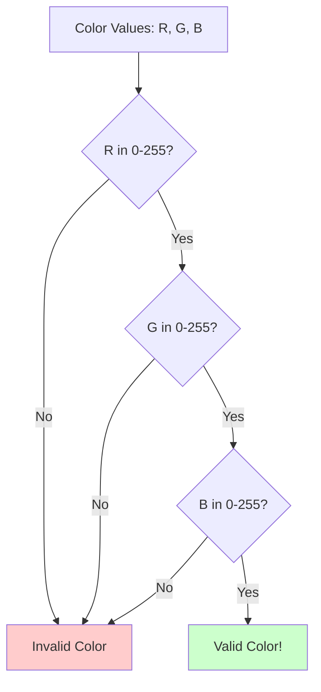
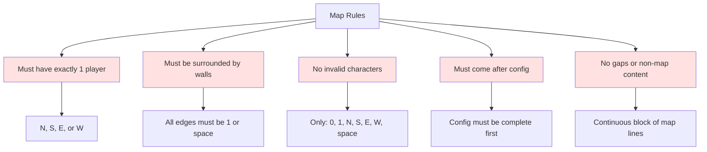
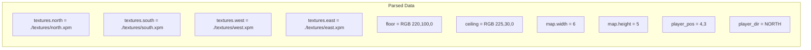
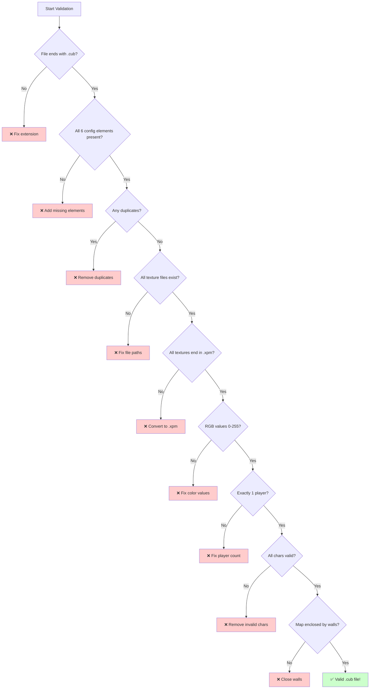

# Config File Format - The .cub File Explained

## Table of Contents
1. [What is a .cub File?](#what-is-a-cub-file)
2. [File Structure](#file-structure)
3. [Configuration Identifiers](#configuration-identifiers)
4. [Map Section](#map-section)
5. [Examples](#examples)
6. [Common Mistakes](#common-mistakes)

---

## What is a .cub File?

A `.cub` file is a **plain text file** that contains all the configuration data needed to run a cub3D game level. Think of it as a blueprint that tells the game:
- What the walls should look like (textures)
- What colors to use for floors and ceilings
- The layout of the level (the map)

### File Extension Requirement

The file **MUST** end with `.cub`. This is checked by the parser:

```c
// In parsing.c - parse_config_file()
len = ft_strlen(path);
if (len < 4 || ft_strcmp(path + len - 4, ".cub") != 0)
    ft_exit(2, "Map file must have .cub extension");
```

**Valid:** `level1.cub`, `map.cub`, `my_awesome_map.cub`  
**Invalid:** `level1.txt`, `map.cub.txt`, `level.cu`

---

## File Structure

A `.cub` file has **TWO main sections**, always in this order:



### Visual Layout

```
┌────────────────────────────────────────┐
│ Configuration Section                  │
│ (order doesn't matter)                 │
├────────────────────────────────────────┤
│ NO ./textures/north.xpm                │ ← North texture
│ SO ./textures/south.xpm                │ ← South texture
│ WE ./textures/west.xpm                 │ ← West texture
│ EA ./textures/east.xpm                 │ ← East texture
│                                        │
│ F 220,100,0                            │ ← Floor color (RGB)
│ C 225,30,0                             │ ← Ceiling color (RGB)
│                                        │
├────────────────────────────────────────┤
│ Map Section                            │
│ (must be at the end, no gaps allowed) │
├────────────────────────────────────────┤
│ 111111                                 │ ← Top wall
│ 100101                                 │ ← Room layout
│ 101001                                 │ ← More layout
│ 1100N1                                 │ ← Player starts here (N)
│ 111111                                 │ ← Bottom wall
└────────────────────────────────────────┘
```

### Important Rules

1. **Configuration must come BEFORE the map**
2. **All 6 configuration elements are REQUIRED** (NO, SO, WE, EA, F, C)
3. **Configuration order doesn't matter** (NO can come before or after SO, etc.)
4. **Each configuration element can only appear ONCE** (duplicates cause errors)
5. **Empty lines and whitespace between config lines are OK**
6. **Once map starts, no non-map content is allowed**

---

## Configuration Identifiers

### Texture Identifiers

#### Format: `ID path/to/texture.xpm`



#### The Four Texture Identifiers

| Identifier | Meaning | Which Wall Face | Example |
|------------|---------|-----------------|---------|
| **NO** | North | Wall facing north (player looking south sees this) | `NO ./textures/stone_wall.xpm` |
| **SO** | South | Wall facing south (player looking north sees this) | `SO ./textures/brick_wall.xpm` |
| **WE** | West | Wall facing west (player looking east sees this) | `WE ./textures/wood_wall.xpm` |
| **EA** | East | Wall facing east (player looking west sees this) | `EA ./textures/metal_wall.xpm` |

#### Visual Example: Which Texture Shows Where

```
        Player looking NORTH ↑
                 │
    ┌────────────┼────────────┐
    │            │            │
    │    WE   ┌──┴──┐   EA   │
    │         │  P  │         │  P = Player
    │         └──┬──┘         │
    │            │            │
    └────────────┼────────────┘
                 │
         Sees SO texture
         
If player turns around (looks SOUTH ↓):
         Sees NO texture
```

#### Parsing Logic (from `utils_parsing.c`)

```c
int parse_texture_no(t_config *config, const char *line)
{
    char path[256];
    
    // Try to parse: "NO <path>"
    if (ft_sscanf(line, "NO %s", path) == 1)
        return set_texture(config, &config->textures.north, path, FLAG_NO);
    return (0);  // Not a NO line, try next parser
}
```

**Step-by-step what happens:**



### Color Identifiers

#### Format: `ID R,G,B`



#### The Two Color Identifiers

| Identifier | Meaning | What It Colors | Example |
|------------|---------|----------------|---------|
| **F** | Floor | The ground color in the 3D view | `F 220,100,0` (orange floor) |
| **C** | Ceiling | The sky/ceiling color in the 3D view | `C 225,30,0` (red ceiling) |

#### RGB Values Explained

RGB stands for **Red, Green, Blue**. Each value must be between **0 and 255**.

- `0` means none of that color
- `255` means maximum of that color

**Common Colors:**

| RGB Values | Result | Visual |
|------------|--------|--------|
| `255,0,0` | Pure red | 🟥 |
| `0,255,0` | Pure green | 🟩 |
| `0,0,255` | Pure blue | 🟦 |
| `255,255,0` | Yellow | 🟨 |
| `0,0,0` | Black | ⬛ |
| `255,255,255` | White | ⬜ |
| `220,100,0` | Orange | 🟧 |
| `128,128,128` | Gray | ⬜ (but darker) |

#### Parsing Logic (from `utils_parsing2.c`)

```c
int parse_color_floor(t_config *config, const char *line)
{
    int  r, g, b;
    char c;
    
    c = '\0';
    // Scan format: "F %d,%d,%d" - note: must match exactly 3 values
    if (ft_sscanf(line, "F %d,%d,%d %c", &r, &g, &b, &c) != 3)
        return (0);  // Not a floor color line
    
    if (!validate_color(r, g, b))
        return (-1);  // Invalid RGB values
    
    config->floor = (t_color){r, g, b};  // Store the color
    return set_color(config, &config->floor, FLAG_F);
}
```

**Why the extra `%c` in sscanf?**

This is a clever validation trick! The `%c` at the end tries to read one more character:

```c
// Format: "F %d,%d,%d %c"
//           ^  ^  ^  ^
//           |  |  |  |
//         Red Green Blue Extra char?

// Valid: "F 220,100,0\n"     → sscanf returns 3 (R,G,B read, no extra char)
// Invalid: "F 220,100,0 X\n" → sscanf returns 4 (also reads 'X' into c)
```

By checking that `ft_sscanf()` returns exactly `3`, we ensure there's nothing unexpected after the RGB values!

#### Color Validation Logic

```c
int validate_color(int r, int g, int b)
{
    if (r < 0 || r > 255)
        return (0);
    if (g < 0 || g > 255)
        return (0);
    if (b < 0 || b > 255)
        return (0);
    return (1);  // All values valid!
}
```



---

## Map Section

### Map Characters

The map is made up of specific characters, each with a meaning:

| Character | Meaning | Walkable? | Example |
|-----------|---------|-----------|---------|
| `1` | Wall | ❌ No | Solid barrier |
| `0` | Floor | ✅ Yes | Empty walkable space |
| `N` | Player facing North | ✅ Yes (starting position) | Player starts here, looking up |
| `S` | Player facing South | ✅ Yes (starting position) | Player starts here, looking down |
| `E` | Player facing East | ✅ Yes (starting position) | Player starts here, looking right |
| `W` | Player facing West | ✅ Yes (starting position) | Player starts here, looking left |
| ` ` (space) | Void | ❌ No | Outside the map boundaries |

### Map Rules



### Map Layout Visualized

```
Valid Map:
┌─────────────────────┐
│ 111111111           │ ← Top wall (all 1s or spaces)
│ 100000001           │ ← Left wall (1), floor (0s), right wall (1)
│ 101110001           │ ← Internal walls and corridors
│ 100000001           │ 
│ 1000N0001           │ ← Player starting position
│ 100000001           │
│ 111111111           │ ← Bottom wall (all 1s or spaces)
└─────────────────────┘

Invalid Map (hole in wall):
111111111
100000001
10111 001  ← PROBLEM! Gap in the wall (space between 1s)
100000001
1000N0001
111111111
```

### Why Spaces Are Tricky

Spaces (` `) represent "void" - areas outside the playable map. They're like the edge of a cliff:

```
Visual representation:

11111
1   1      Map boundary (walls)
1 0 1      Center: walkable floor
1   1
11111

If there's a 0 next to a space:
11111
1  01  ← INVALID! Player could "fall off" here
1 0 1
11111
```

That's why validation checks all **8 neighbors** (including diagonals) of each walkable tile!

---

## Examples

### Example 1: Minimal Valid Config

```
NO ./textures/north.xpm
SO ./textures/south.xpm
WE ./textures/west.xpm
EA ./textures/east.xpm

F 220,100,0
C 225,30,0

111111
100001
101001
1100N1
111111
```

**What this creates:**
- 4 texture paths for walls
- Orange floor (`220,100,0`)
- Red ceiling (`225,30,0`)
- Small 6x5 map with player facing North



### Example 2: Config with Different Order

```
EA ./textures/east.xpm
C 225,30,0
NO ./textures/north.xpm
F 220,100,0
SO ./textures/south.xpm
WE ./textures/west.xpm

111111
100001
1010E1
110001
111111
```

**Still valid!** Configuration order doesn't matter. The parser checks all identifiers regardless of order.

### Example 3: Map with Spaces

```
NO ./textures/north.xpm
SO ./textures/south.xpm
WE ./textures/west.xpm
EA ./textures/east.xpm
F 220,100,0
C 225,30,0

        111111
        100001
11111111100001
100000000N0001
11111111100001
        100001
        111111
```

**Visual of this map:**

```
        ██████
        █    █
████████     █
█        N   █  ← Player starts here
████████     █
        █    █
        ██████
```

The spaces on the left create an irregular shape, which is perfectly valid as long as all walkable areas (`0` and `N`) are fully enclosed by walls.

### Example 4: With Empty Lines Between Config

```
NO ./textures/north.xpm

SO ./textures/south.xpm
WE ./textures/west.xpm

EA ./textures/east.xpm

F 220,100,0

C 225,30,0

111111
100001
101001
1100N1
111111
```

**Valid!** Empty lines between configuration elements are allowed. They're simply skipped by the parser.

---

## Common Mistakes

### ❌ Mistake 1: Wrong File Extension

```
my_map.txt  ← WRONG
my_map.cub.txt  ← WRONG
my_map.cu  ← WRONG
```

**Error:** `Map file must have .cub extension`

**Fix:** Name your file `my_map.cub`

---

### ❌ Mistake 2: Duplicate Configuration

```
NO ./textures/north.xpm
SO ./textures/south.xpm
WE ./textures/west.xpm
EA ./textures/east.xpm
NO ./textures/another_north.xpm  ← DUPLICATE!
F 220,100,0
C 225,30,0
```

**Error:** `Invalid or duplicate identifier/s`

**Why:** Each configuration element can only appear once. The `config_flags` mechanism detects duplicates:

```c
int set_texture(t_config *config, char **texture, char *path, int flag)
{
    if (config->config_flags & flag)  // Check if already set
        return (-1);  // Duplicate!
    // ... rest of function
}
```

---

### ❌ Mistake 3: Missing Configuration Element

```
NO ./textures/north.xpm
SO ./textures/south.xpm
WE ./textures/west.xpm
EA ./textures/east.xpm
F 220,100,0
// Missing C (ceiling)!

111111
100001
101001
1100N1
111111
```

**Error:** `Missing identifier element/s`

**Why:** All 6 elements are required. The check:

```c
if ((config->config_flags & FLAG_ALL) != FLAG_ALL)
    ft_exit(5, "Missing identifier element/s");

// FLAG_ALL = 0x3F = 0b00111111
// All 6 bits must be set!
```

---

### ❌ Mistake 4: Invalid Color Range

```
F 256,100,0  ← RED value is 256 (> 255)
C 225,30,0
```

**Error:** Invalid color (returns -1, triggers "Invalid or duplicate identifier/s")

**Why:** RGB values must be 0-255:

```c
int validate_color(int r, int g, int b)
{
    if (r < 0 || r > 255)  // 256 fails here!
        return (0);
    // ...
}
```

---

### ❌ Mistake 5: Wrong Texture Extension

```
NO ./textures/north.png  ← .png, not .xpm
```

**Error:** Invalid texture (returns -1)

**Why:** Only `.xpm` files are accepted:

```c
int is_xpm_file(const char *path)
{
    int len = ft_strlen(path);
    if (len < 4)
        return (0);
    if (ft_strncmp(path + len - 4, ".xpm", 4) != 0)
        return (0);  // Not .xpm!
    return (1);
}
```

---

### ❌ Mistake 6: Non-existent Texture File

```
NO ./textures/doesnt_exist.xpm  ← File doesn't exist
```

**Error:** Invalid texture

**Why:** Parser tries to open the file:

```c
int set_texture(t_config *config, char **texture, char *path, int flag)
{
    // ...
    fd = open(path, O_RDONLY);
    if (fd < 0)
        return (-1);  // File doesn't exist!
    close(fd);
    // ...
}
```

---

### ❌ Mistake 7: Extra Content After RGB

```
F 220,100,0 some text here  ← Extra content
C 225,30,0
```

**Error:** Invalid color

**Why:** The `%c` in `ft_sscanf` catches this:

```c
if (ft_sscanf(line, "F %d,%d,%d %c", &r, &g, &b, &c) != 3)
    return (0);
// If there's extra content, sscanf returns 4 (reads into 'c')
// We expect exactly 3 (R, G, B only)
```

---

### ❌ Mistake 8: Map Not at the End

```
NO ./textures/north.xpm
111111  ← Map starts here
100001
SO ./textures/south.xpm  ← WRONG! Config after map
```

**Error:** Parsing fails

**Why:** Once a map line is detected, the config reading stops:

```c
while (line != NULL)
{
    if (is_map_line(line))  // Detect map start
    {
        free(line);
        break;  // Stop reading config
    }
    // ...
}
```

---

### ❌ Mistake 9: Multiple Players

```
111111
10N001
101S01  ← Two players (N and S)
110001
111111
```

**Error:** `Invalid map format`

**Why:** Only exactly one player is allowed:

```c
static int check_player_char(t_config *config, int i, int j, int *found)
{
    if (config->map.grid[i][j] == 'N' || /* ... */)
    {
        if ((*found)++)  // If found > 0 (already found a player)
            return (-1);  // Multiple players!
        // ...
    }
}
```

---

### ❌ Mistake 10: Invalid Map Character

```
111111
10X001  ← X is not a valid character
101001
1100N1
111111
```

**Error:** `Invalid map format`

**Why:** Only specific characters are allowed:

```c
int is_map_char(char c)
{
    return (c == WALKABLE || c == WALL || c == 'N' || c == 'S'
        || c == 'E' || c == 'W' || c == NOT_WALKABLE);
    // 'X' doesn't match any of these!
}
```

---

## Quick Validation Checklist

Use this checklist to verify your `.cub` file:



**Checklist:**
- [ ] File extension is `.cub`
- [ ] NO, SO, WE, EA all present with `.xpm` files that exist
- [ ] F and C present with RGB values between 0-255
- [ ] No duplicate identifiers
- [ ] Map comes after all configuration
- [ ] Exactly one player character (N, S, E, or W)
- [ ] Only valid characters in map (0, 1, N, S, E, W, space)
- [ ] Map fully enclosed by walls (1) or spaces
- [ ] No gaps in walls around walkable areas

---

**Continue to:** [Configuration Parsing →](03_configuration_parsing.md)
