# Configuration Parsing - Reading Textures and Colors

## Table of Contents
1. [Overview](#overview)
2. [The Parsing Pipeline](#the-parsing-pipeline)
3. [File Opening and Validation](#file-opening-and-validation)
4. [Line-by-Line Processing](#line-by-line-processing)
5. [Texture Parsing Deep Dive](#texture-parsing-deep-dive)
6. [Color Parsing Deep Dive](#color-parsing-deep-dive)
7. [The Flag System](#the-flag-system)
8. [Complete Example Walkthrough](#complete-example-walkthrough)

---

## Overview

**Configuration parsing** is the first phase of the parsing system. Its job is to extract the 6 required configuration elements from the `.cub` file:

- **4 Textures:** NO, SO, WE, EA
- **2 Colors:** F (floor), C (ceiling)

### Main Function: `parse_config_file()`

Located in: **`src/parsing/parsing.c`**

This is the **entry point** called from `main()`:

```c
// In main.c:
parse_config_file(&(game.config), argv[1]);
```

---

## The Parsing Pipeline


---

## File Opening and Validation

### Step 1: Check File Extension

**File:** `src/parsing/parsing.c`  
**Function:** `parse_config_file()`

```c
int parse_config_file(t_config *config, char *path)
{
    int     fd;
    int     result;
    size_t  len;

    ft_memset(config, 0, sizeof(t_config));
    len = ft_strlen(path);
    if (len < 4 || ft_strcmp(path + len - 4, ".cub") != 0)
        ft_exit(2, "Map file must have .cub extension");
    // ...
}
```

**Explanation:**


**How `path + len - 4` works:**

```
String: "maps/level1.cub"
Index:   0123456789...14
         m a p s / l e v e l 1 . c u b
                                 ^
                                 |
                      path + 15 - 4 = path + 11
                      Points to ".cub"
```

**Why `len < 4`?**
If the filename is shorter than 4 characters (e.g., `"a.c"`), it can't possibly end with `.cub`, and accessing `path + len - 4` would be unsafe.

---

### Step 2: Open the File

```c
fd = open(path, O_RDONLY);
if (fd < 0)
    ft_exit(3, "Failed to open map file");
```

**What is `fd`?**
`fd` (file descriptor) is an integer that represents the opened file. Think of it as a "handle" or "ID" for the file:

- **fd >= 0:** Success! File is open
- **fd < 0:** Error! File doesn't exist or can't be read

**How `open()` works:**


---

### Step 3: Initialize Config Structure

```c
ft_memset(config, 0, sizeof(t_config));
```

**What does this do?**

`ft_memset` sets all bytes in the `config` structure to `0` (zero). This is like resetting everything to a clean state:

```c
// Before memset (random garbage):
config->config_flags = ???
config->textures.north = ???
config->floor.r = ???
// ... etc

// After memset (all zeros):
config->config_flags = 0
config->textures.north = NULL (0 as pointer)
config->floor.r = 0
// ... etc
```

**Why is this important?**
- Pointers set to `NULL` (not pointing to random memory)
- `config_flags` starts at `0` (no elements parsed yet)
- Color values start at `0`
- Ensures predictable starting state

---

## Line-by-Line Processing

### Main Reading Loop: `read_config_lines()`

**File:** `src/parsing/parsing.c`

```c
static int read_config_lines(t_config *config, int fd)
{
    char    *line;
    int     result;

    line = get_next_line(fd);
    while (line != NULL)
    {
        if (is_map_line(line))
        {
            free(line);
            break;
        }
        result = parse_config_line(config, line);
        free(line);
        if (result < 0)
            return (-2);
        line = get_next_line(fd);
    }
    return (0);
}
```

**Step-by-step flow:**

```mermaid
sequenceDiagram
    participant Loop as read_config_lines
    participant GNL as get_next_line
    participant Check as is_map_line
    participant Parse as parse_config_line
    
    Loop->>GNL: Read first line
    GNL-->>Loop: "NO ./textures/north.xpm\n"
    Loop->>Check: Is this a map line?
    Check-->>Loop: No
    Loop->>Parse: Parse this line
    Parse-->>Loop: Success (1)
    Loop->>Loop: free(line)
    
    Loop->>GNL: Read next line
    GNL-->>Loop: "SO ./textures/south.xpm\n"
    Loop->>Check: Is this a map line?
    Check-->>Loop: No
    Loop->>Parse: Parse this line
    Parse-->>Loop: Success (1)
    Loop->>Loop: free(line)
    
    Loop->>GNL: Read next line
    GNL-->>Loop: "111111\n"
    Loop->>Check: Is this a map line?
    Check-->>Loop: Yes! (Map started)
    Loop->>Loop: free(line)
    Loop->>Loop: break (stop reading config)
```

**Understanding `get_next_line()`:**

This function reads **one line at a time** from the file:

```
File content:          get_next_line() returns:
┌────────────────┐     ┌────────────────────────┐
│ NO ./tex/n.xpm │ →   │ "NO ./tex/n.xpm\n"    │ (1st call)
│ SO ./tex/s.xpm │ →   │ "SO ./tex/s.xpm\n"    │ (2nd call)
│ F 220,100,0    │ →   │ "F 220,100,0\n"       │ (3rd call)
│ 111111         │ →   │ "111111\n"            │ (4th call)
└────────────────┘     └────────────────────────┘
```

**Why `free(line)` after each iteration?**

`get_next_line()` allocates (mallocs) memory for each line. We must free it to avoid memory leaks:

```c
line = get_next_line(fd);  // Allocates memory
// ... use line ...
free(line);  // Release memory
```

However, in this project we use **garbage collector**, so `get_next_line` likely uses `gc_malloc`, which means `gc_clean()` will free everything at the end. The explicit `free()` is still good practice!

---

### Determining When Config Ends: `is_map_line()`

**File:** `src/parsing/map_utils.c`

```c
int is_map_line(const char *line)
{
    int i;
    int has_content;

    if (!line || !*line)
        return (0);
    i = 0;
    has_content = 0;
    while (line[i])
    {
        if (!is_map_char(line[i]) && line[i] != '\n')
            return (0);
        if (line[i] != NOT_WALKABLE && line[i] != '\n')
            has_content = 1;
        i++;
    }
    return (has_content);
}
```

**What makes a line a "map line"?**


**Examples:**

| Line | Is Map Line? | Why |
|------|--------------|-----|
| `"111111\n"` | ✅ Yes | All characters are valid map chars (1), has content |
| `"10N001\n"` | ✅ Yes | Valid map chars, has content |
| `"NO ./tex/n.xpm\n"` | ❌ No | Contains 'N', 'O' separately (not together as player), spaces, and '.' which aren't valid in that context |
| `"   \n"` | ❌ No | Only spaces, no content |
| `"F 220,100,0\n"` | ❌ No | Contains invalid characters (comma, letters not as player) |

**Helper function:** `is_map_char()`

```c
int is_map_char(char c)
{
    return (c == WALKABLE || c == WALL || c == 'N' || c == 'S'
        || c == 'E' || c == 'W' || c == NOT_WALKABLE);
}

// Expands to:
// return (c == '0' || c == '1' || c == 'N' || c == 'S'
//     || c == 'E' || c == 'W' || c == ' ');
```

---

## Texture Parsing Deep Dive

### The Dispatcher: `parse_config_line()`

**File:** `src/parsing/parsing_config.c`

```c
int parse_config_line(t_config *config, const char *line)
{
    int result;

    result = parse_all_textures(config, line);
    if (result != 0)
        return (result);
    result = parse_all_colors(config, line);
    if (result != 0)
        return (result);
    if (has_non_empty_content(line))
        return (-1);
    return (0);
}
```

**How dispatching works:**


**Return value meanings:**

| Return Value | Meaning | Action |
|--------------|---------|--------|
| `1` | Successfully parsed | Continue to next line |
| `0` | Not this identifier, try next | Try next parser |
| `-1` | Error (duplicate or invalid) | Exit program |

---

### Texture Parser: `parse_texture_no()`

**File:** `src/parsing/utils_parsing.c`

```c
int parse_texture_no(t_config *config, const char *line)
{
    char path[256];

    if (ft_sscanf(line, "NO %s", path) == 1)
        return set_texture(config, &config->textures.north, path, FLAG_NO);
    return (0);
}
```

**Understanding `ft_sscanf()`:**

`ft_sscanf` is like scanf, but reads from a string instead of stdin:

```c
// Format: "NO %s"
//          ^  ^
//          |  |
//        Match exactly "NO"
//             Match any string (no spaces)

ft_sscanf("NO ./textures/north.xpm", "NO %s", path)
//         ^                                    ^
//         Input string                         Output: path = "./textures/north.xpm"
//         Returns: 1 (successfully read 1 item)

ft_sscanf("SO ./textures/south.xpm", "NO %s", path)
//         Doesn't match "NO"
//         Returns: 0 (read 0 items)
```

**Flow diagram:**


---

### Texture Validation: `set_texture()`

**File:** `src/parsing/utils_parsing.c`

```c
int set_texture(t_config *config, char **texture, char *path, int flag)
{
    int fd;

    if (config->config_flags & flag)
        return (-1);
    if (!is_xpm_file(path))
        return (-1);
    fd = open(path, O_RDONLY);
    if (fd < 0)
        return (-1);
    close(fd);
    *texture = gc_strdup(path);
    if (!*texture)
        return (-1);
    config->config_flags |= flag;
    return (1);
}
```

**Step-by-step what each check does:**


#### Check 1: Duplicate Detection

```c
if (config->config_flags & flag)
    return (-1);
```

**How bitwise AND works for duplicate detection:**

```
Example: Checking if NO is already set

config_flags = 0b00000001  (NO already set)
FLAG_NO      = 0b00000001

config_flags & FLAG_NO = 0b00000001 (nonzero, means already set!)

---

Another example: NO not set yet

config_flags = 0b00000000  (nothing set)
FLAG_NO      = 0b00000001

config_flags & FLAG_NO = 0b00000000 (zero, means not set)
```

#### Check 2: File Extension

```c
if (!is_xpm_file(path))
    return (-1);
```

**Function:** `is_xpm_file()` from `utils_parsing.c`

```c
int is_xpm_file(const char *path)
{
    int len;

    len = ft_strlen(path);
    if (len < 4)
        return (0);
    if (ft_strncmp(path + len - 4, ".xpm", 4) != 0)
        return (0);
    return (1);
}
```

**Visual:**

```
Path: "./textures/north.xpm"
                        ^^^^
                        Compare last 4 chars with ".xpm"
                        
ft_strncmp(".xpm", ".xpm", 4) == 0  ✓ Match!
```

#### Check 3: File Existence

```c
fd = open(path, O_RDONLY);
if (fd < 0)
    return (-1);
close(fd);
```

**Why open and immediately close?**

We're just **testing** if the file exists and is readable. We don't actually need to read it now (that happens later when loading textures for the game).

```mermaid
sequenceDiagram
    participant Code
    participant OS
    
    Code->>OS: open("./textures/north.xpm")
    OS-->>Code: fd = 3 (success)
    Code->>OS: close(3)
    Note over Code: File exists and is readable ✓
```



#### Check 4: Store Path

```c
*texture = gc_strdup(path);
if (!*texture)
    return (-1);
```

**What is `gc_strdup()`?**

It duplicates a string (allocates memory and copies):

```c
// Input: path = "./textures/north.xpm"
// Output: new string in heap memory with garbage collector tracking

char *new_str = gc_strdup(path);
// new_str points to a new copy of "./textures/north.xpm"
```

**Why duplicate instead of just storing the pointer?**

The `path` array is **local** to the parsing function and will be overwritten on the next line. We need a **permanent copy**:

```c
void example()
{
    char path[256];  // Local array, on stack
    
    ft_sscanf(line1, "NO %s", path);  // path = "./tex/north.xpm"
    config->textures.north = path;  // ❌ WRONG! Path is local
    
    ft_sscanf(line2, "SO %s", path);  // path now = "./tex/south.xpm"
    // config->textures.north also points to path...
    // now both point to "./tex/south.xpm"! BUG!
    
    // ✅ CORRECT way:
    config->textures.north = gc_strdup(path);  // Permanent copy
}
```

#### Check 5: Set Flag

```c
config->config_flags |= flag;
```

**Bitwise OR to set a flag:**

```
Before: config_flags = 0b00000000 (nothing set)
        FLAG_NO      = 0b00000001

After:  config_flags |= FLAG_NO
        config_flags = 0b00000001 (NO is set)

---

Next texture:
Before: config_flags = 0b00000001 (NO set)
        FLAG_SO      = 0b00000010

After:  config_flags |= FLAG_SO
        config_flags = 0b00000011 (NO and SO are set)
```

---

## Color Parsing Deep Dive

### Color Parser: `parse_color_floor()`

**File:** `src/parsing/utils_parsing2.c`

```c
int parse_color_floor(t_config *config, const char *line)
{
    int  r, g, b;
    char c;

    c = '\0';
    if (ft_sscanf(line, "F %d,%d,%d %c", &r, &g, &b, &c) != 3)
        return (0);
    if (!validate_color(r, g, b))
        return (-1);
    config->floor = (t_color){r, g, b};
    return set_color(config, &config->floor, FLAG_F);
}
```

**Understanding the format string:** `"F %d,%d,%d %c"`


**Why `%c` at the end?**

This is a validation trick! We expect **exactly 3 values** (R, G, B). The `%c` tries to read an extra character:

```c
// Valid: "F 220,100,0\n"
// ft_sscanf returns 3 (read R, G, B, but no extra character)

// Invalid: "F 220,100,0 extra\n"
// ft_sscanf returns 4 (read R, G, B, and 'e' into c)

if (ft_sscanf(..., &r, &g, &b, &c) != 3)
    return (0);  // Must be exactly 3!
```

---

### Color Validation: `validate_color()`

**File:** `src/parsing/utils_parsing.c`

```c
int validate_color(int r, int g, int b)
{
    if (r < 0 || r > 255)
        return (0);
    if (g < 0 || g > 255)
        return (0);
    if (b < 0 || b > 255)
        return (0);
    return (1);
}
```

**Why 0-255?**

RGB color components are typically stored as **8-bit unsigned integers**:

```
8 bits can represent: 2^8 = 256 values
Range: 0 to 255

Binary:
00000000 = 0   (minimum, black)
11111111 = 255 (maximum, brightest)
```

**Visual representation:**

```
R = 220 = 11011100 (binary) → High red
G = 100 = 01100100 (binary) → Medium green  
B = 0   = 00000000 (binary) → No blue

Result: Orange color! 🟧
```

---

### Setting Color Flag: `set_color()`

**File:** `src/parsing/utils_parsing2.c`

```c
int set_color(t_config *config, t_color *color, int flag)
{
    (void)color;  // Unused parameter
    if (config->config_flags & flag)
        return (-1);
    config->config_flags |= flag;
    return (1);
}
```

**Why is `color` unused?**

The color values are **already stored** before this function is called:

```c
// In parse_color_floor():
config->floor = (t_color){r, g, b};  // ← Store color here
return set_color(config, &config->floor, FLAG_F);  // ← Just set flag
```

So `set_color()` only needs to:
1. Check if flag is already set (duplicate detection)
2. Set the flag

---

## The Flag System

### Understanding Bit Flags

Flags are a clever way to track multiple boolean states using a single integer:

```c
#define FLAG_NO  0x01  // 0b00000001
#define FLAG_SO  0x02  // 0b00000010
#define FLAG_WE  0x04  // 0b00000100
#define FLAG_EA  0x08  // 0b00001000
#define FLAG_F   0x10  // 0b00010000
#define FLAG_C   0x20  // 0b00100000
#define FLAG_ALL 0x3F  // 0b00111111
```

### Visual Representation

```
config_flags as parsing progresses:

Initial state:
┌─┬─┬─┬─┬─┬─┬─┬─┐
│0│0│0│0│0│0│0│0│ = 0x00 (nothing parsed)
└─┴─┴─┴─┴─┴─┴─┴─┘
 │ │ │ │ │ │ │ └─ Bit 0: NO
 │ │ │ │ │ │ └─── Bit 1: SO
 │ │ │ │ │ └───── Bit 2: WE
 │ │ │ │ └─────── Bit 3: EA
 │ │ │ └───────── Bit 4: F
 │ │ └─────────── Bit 5: C
 └─└───────────── (unused)

After parsing "NO":
┌─┬─┬─┬─┬─┬─┬─┬─┐
│0│0│0│0│0│0│0│1│ = 0x01
└─┴─┴─┴─┴─┴─┴─┴─┘

After parsing "SO":
┌─┬─┬─┬─┬─┬─┬─┬─┐
│0│0│0│0│0│0│1│1│ = 0x03
└─┴─┴─┴─┴─┴─┴─┴─┘

After parsing all 6:
┌─┬─┬─┬─┬─┬─┬─┬─┐
│0│0│1│1│1│1│1│1│ = 0x3F = FLAG_ALL ✓
└─┴─┴─┴─┴─┴─┴─┴─┘
```

### Operations on Flags


#### Setting a Flag (OR Operation)

```c
config->config_flags |= FLAG_NO;
```

**Bitwise explanation:**

```
config_flags = 0b00000000
FLAG_NO      = 0b00000001
              ─────────────  OR (|)
Result       = 0b00000001

The | operator sets bit 0 to 1, keeps others unchanged
```

#### Checking a Flag (AND Operation)

```c
if (config->config_flags & FLAG_NO)
    // Flag is set!
```

**Bitwise explanation:**

```
config_flags = 0b00000001  (NO is set)
FLAG_NO      = 0b00000001
              ─────────────  AND (&)
Result       = 0b00000001  (non-zero, TRUE)

---

config_flags = 0b00000000  (NO not set)
FLAG_NO      = 0b00000001
              ─────────────  AND (&)
Result       = 0b00000000  (zero, FALSE)
```

#### Checking All Flags

```c
if ((config->config_flags & FLAG_ALL) != FLAG_ALL)
    ft_exit(5, "Missing identifier element/s");
```

**Bitwise explanation:**

```
All set:
config_flags = 0b00111111
FLAG_ALL     = 0b00111111
              ─────────────  AND (&)
Result       = 0b00111111  (equals FLAG_ALL, all present!)

Missing C:
config_flags = 0b00011111  (C bit not set)
FLAG_ALL     = 0b00111111
              ─────────────  AND (&)
Result       = 0b00011111  (NOT equal to FLAG_ALL, missing elements!)
```

---

## Complete Example Walkthrough

Let's trace the parsing of this simple config:

```
NO ./textures/north.xpm
SO ./textures/south.xpm
WE ./textures/west.xpm
EA ./textures/east.xpm
F 220,100,0
C 225,30,0
```

### Step-by-Step Execution


### Memory State After Config Parsing

```
t_config config = {
    .textures = {
        .north = "0x1234" → "./textures/north.xpm"
        .south = "0x2345" → "./textures/south.xpm"
        .west  = "0x3456" → "./textures/west.xpm"
        .east  = "0x4567" → "./textures/east.xpm"
    },
    .floor = {
        .r = 220,
        .g = 100,
        .b = 0
    },
    .ceiling = {
        .r = 225,
        .g = 30,
        .b = 0
    },
    .map = {
        /* Not filled yet, done in map parsing phase */
    },
    .config_flags = 0b00111111  // All 6 flags set
}
```

---

## Summary Diagram


---

**Continue to:** [Map Parsing →](04_map_parsing.md)
