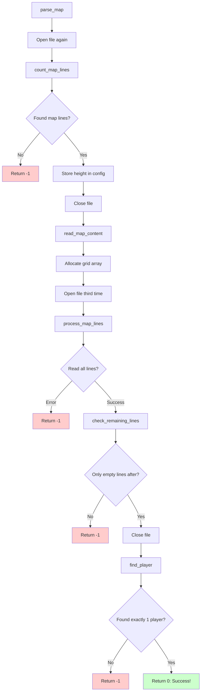
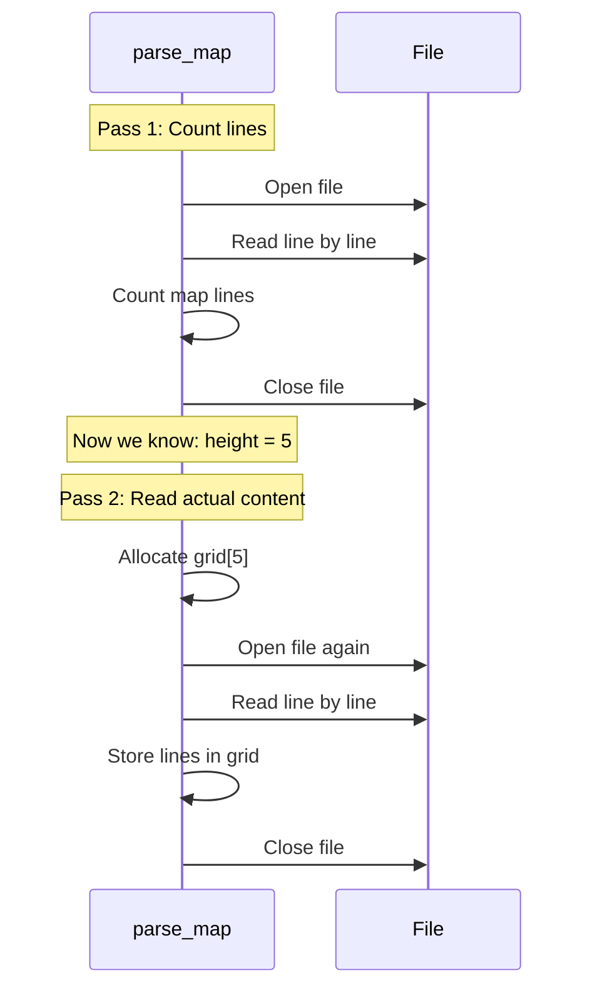
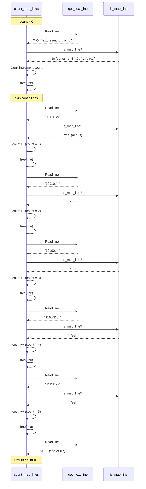
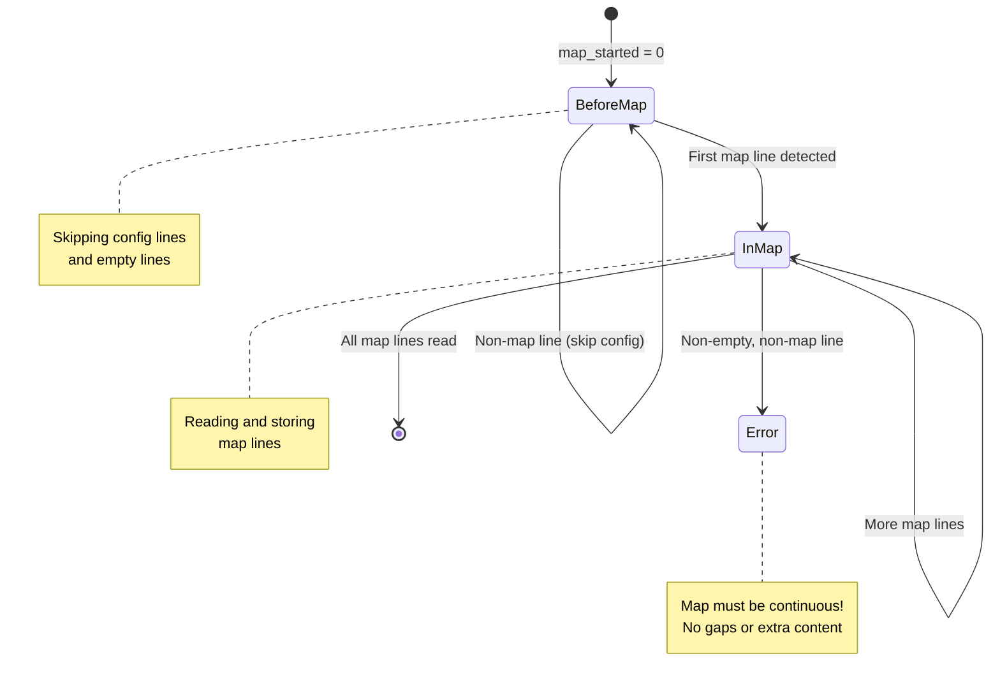
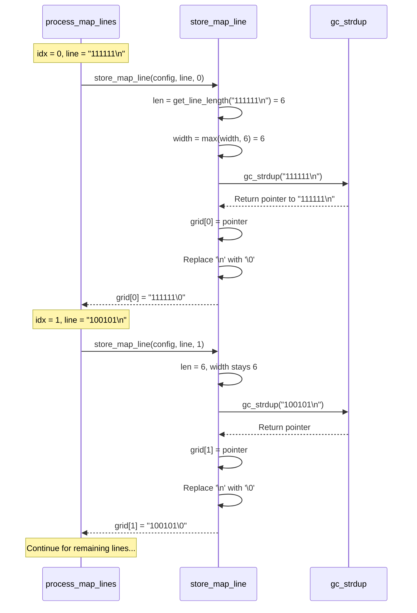
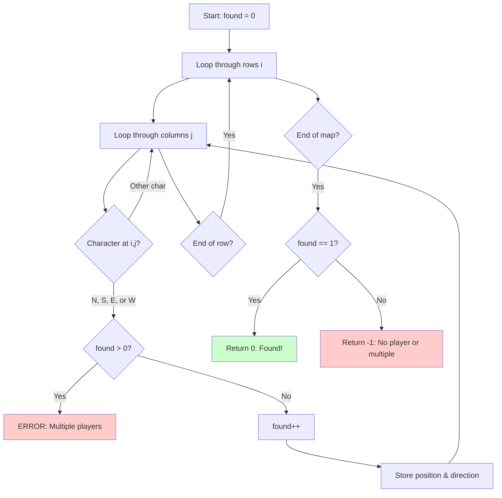
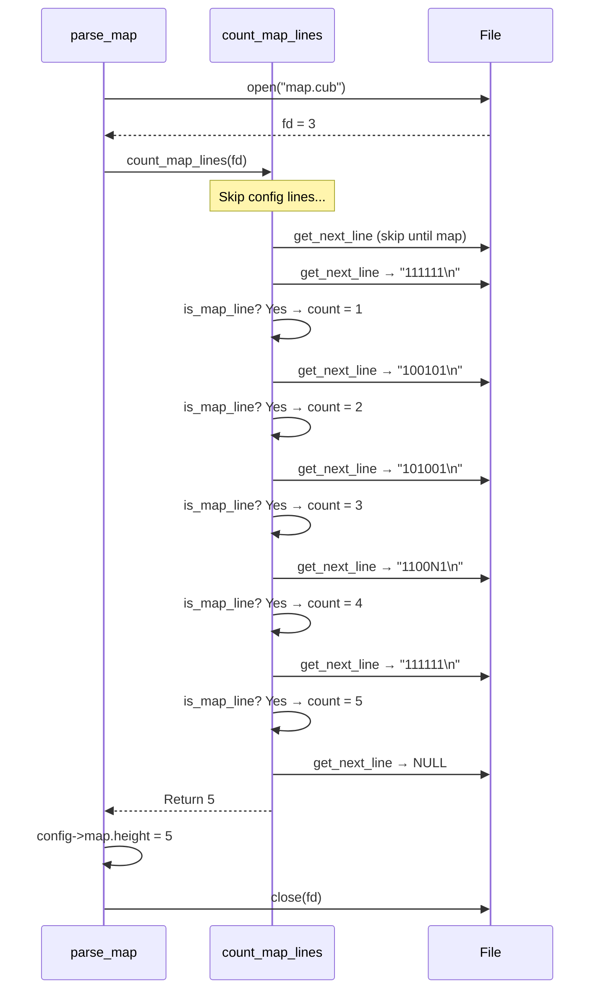
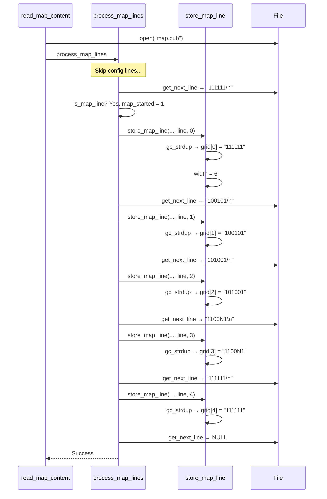
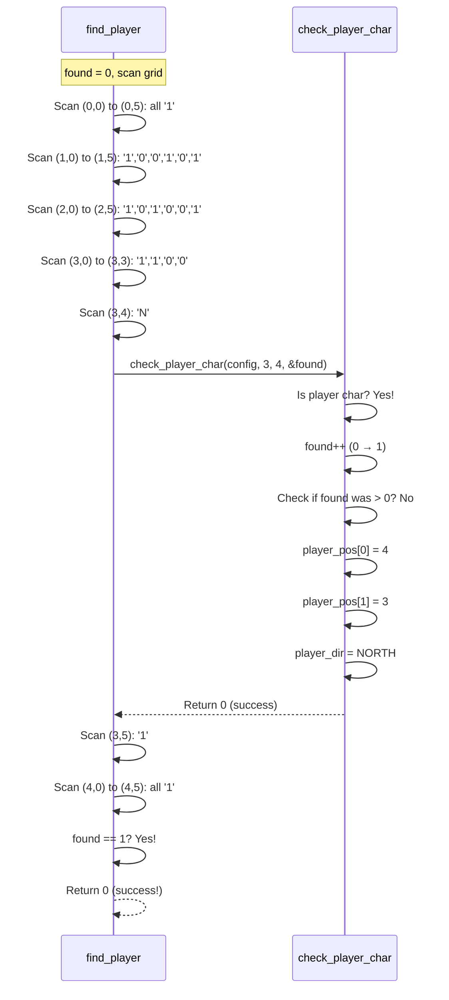
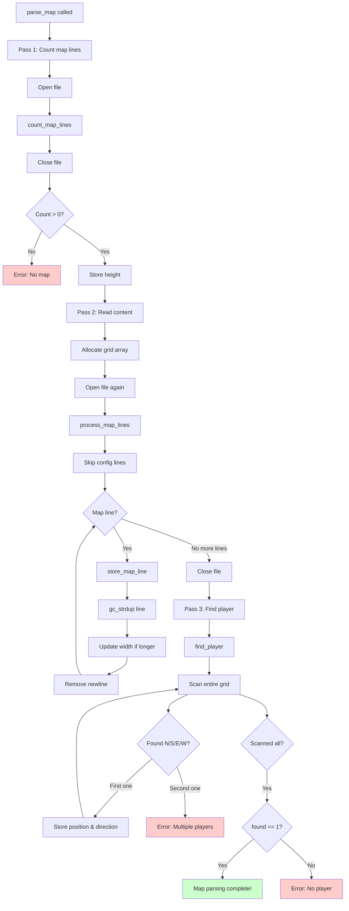

# Map Parsing - Reading the Game Level

## Table of Contents
1. [Overview](#overview)
2. [The Map Parsing Pipeline](#the-map-parsing-pipeline)
3. [Counting Map Lines](#counting-map-lines)
4. [Memory Allocation](#memory-allocation)
5. [Reading Map Content](#reading-map-content)
6. [Finding the Player](#finding-the-player)
7. [Complete Example Walkthrough](#complete-example-walkthrough)

---

## Overview

**Map parsing** is the second phase of the parsing system. After configuration elements (textures and colors) are parsed, we need to read the actual game map - the grid that defines where walls are, where the player starts, and the layout of the level.

### Main Function: `parse_map()`

Located in: **`src/parsing/map_parsing.c`**

Called from `parse_config_file()` after configuration is complete:

```c
// In parsing.c:
if (parse_map(config, path) < 0)
    ft_exit(6, "Invalid map format");
```

---

## The Map Parsing Pipeline



### Why Open the File Multiple Times?

You might wonder: "Why not read everything in one pass?"

**Answer:** Because we need to know **how many lines** the map has BEFORE we allocate memory for the grid!



This is the **standard approach** when you need to allocate dynamic memory based on file content!

---

## Counting Map Lines

### Function: `count_map_lines()`

**File:** `src/parsing/map_parsing.c`

```c
static int count_map_lines(int fd)
{
    char    *line;
    int     count;

    count = 0;
    line = get_next_line(fd);
    while (line)
    {
        if (is_map_line(line))
            count++;
        free(line);
        line = get_next_line(fd);
    }
    return (count);
}
```

### Step-by-Step Execution

Let's trace this with an example file:

```
NO ./textures/north.xpm
SO ./textures/south.xpm
WE ./textures/west.xpm
EA ./textures/east.xpm
F 220,100,0
C 225,30,0

111111
100101
101001
1100N1
111111
```

**Counting process:**



### Why Check `is_map_line()`?

Remember from the config parsing phase: we stop reading config when we encounter a map line. So when counting, we need to **skip all config lines** and only count actual map lines.

**Visual distinction:**

```
File structure:
┌─────────────────────────────┐
│ NO ./textures/north.xpm     │ ← Not a map line (config)
│ SO ./textures/south.xpm     │ ← Not a map line (config)
│ ...                         │
│                             │ ← Not a map line (empty)
│ 111111                      │ ← MAP LINE 1 ✓
│ 100101                      │ ← MAP LINE 2 ✓
│ 101001                      │ ← MAP LINE 3 ✓
│ 1100N1                      │ ← MAP LINE 4 ✓
│ 111111                      │ ← MAP LINE 5 ✓
└─────────────────────────────┘
```

---

## Memory Allocation

### Function: `parse_map()`

**File:** `src/parsing/map_parsing.c`

```c
int parse_map(t_config *config, const char *path)
{
    int     fd;
    int     line_count;

    fd = open(path, O_RDONLY);
    if (fd < 0)
        return (-1);
    line_count = count_map_lines(fd);
    close(fd);
    if (line_count == 0)
        return (-1);
    config->map.height = line_count;
    return (read_map_content(config, path));
}
```

**What happens after counting:**

```c
config->map.height = line_count;  // Store height (e.g., 5)
```

This sets up the height value that will be used to allocate the grid!

### Allocating the Grid: `read_map_content()`

**File:** `src/parsing/map_reading.c`

```c
int read_map_content(t_config *config, const char *path)
{
    int     fd;

    // Allocate array of string pointers (+ 1 for NULL terminator)
    config->map.grid = gc_malloc((config->map.height + 1) * sizeof(char *));
    if (!config->map.grid)
        return (-1);
    
    // Initialize all pointers to NULL
    ft_memset(config->map.grid, 0, (config->map.height + 1) * sizeof(char *));
    
    // ... continue reading ...
}
```

### Understanding the Allocation

The map grid is a **2D array** stored as an **array of pointers**:

```mermaid
graph TD
    A[config.map.grid] --> B[Pointer array on heap]
    
    B --> C[grid[0] → "111111"]
    B --> D[grid[1] → "100101"]
    B --> E[grid[2] → "101001"]
    B --> F[grid[3] → "1100N1"]
    B --> G[grid[4] → "111111"]
    B --> H[grid[5] → NULL]
    
    C --> I[String on heap: 1 1 1 1 1 1 \0]
    D --> J[String on heap: 1 0 0 1 0 1 \0]
    
    style A fill:#ffe1e1
    style B fill:#e1f5ff
    style I fill:#ccffcc
    style J fill:#ccffcc
```

**Memory layout:**

```
Stack:                          Heap:
┌──────────────┐               ┌──────────────────────────┐
│  config      │               │  Pointer array:          │
│  ┌────────┐  │               │  ┌────┐ ┌────┐ ┌────┐  │
│  │  map   │  │               │  │ ptr│ │ ptr│ │ ptr│  │
│  │ ┌────┐ │  │     points    │  └─┬──┘ └─┬──┘ └─┬──┘  │
│  │ │grid│─┼──┼───────to─────►│    │      │      │     │
│  │ └────┘ │  │               │    │      │      │     │
│  └────────┘  │               │    ▼      ▼      ▼     │
└──────────────┘               │  "111"  "100"  "101"   │
                                │   1 1    1 0    1 0    │
                                │   1 1    0 1    1 0    │
                                │   1 1    0 1    0 0    │
                                │   \0     \0     \0     │
                                └──────────────────────────┘
```

**Why `height + 1`?**

We allocate one extra pointer to store `NULL` at the end. This creates a **NULL-terminated array**, similar to `argv` in `main()`:

```c
// Array of 5 strings + 1 NULL:
grid[0] = "111111"
grid[1] = "100101"
grid[2] = "101001"
grid[3] = "1100N1"
grid[4] = "111111"
grid[5] = NULL  ← Marks the end!
```

This makes it easy to iterate:

```c
int i = 0;
while (grid[i] != NULL)
{
    // Process grid[i]
    i++;
}
```

**Why `ft_memset` to 0?**

After allocation, the pointers might contain garbage values. Setting them all to 0 (NULL) ensures:
- All pointers start as NULL
- If allocation fails partway through, we won't try to free garbage pointers
- The final NULL terminator is already in place

```c
Before memset:         After memset:
┌────┐                 ┌────┐
│ ?? │                 │NULL│
├────┤                 ├────┤
│ ?? │                 │NULL│
├────┤                 ├────┤
│ ?? │                 │NULL│
└────┘                 └────┘
```

---

## Reading Map Content

### Function: `process_map_lines()`

**File:** `src/parsing/map_reading.c`

```c
static int process_map_lines(t_config *config, int fd)
{
    char    *line;
    int     idx;
    int     map_started;

    idx = 0;
    map_started = 0;
    line = get_next_line(fd);
    while (line && idx < config->map.height)
    {
        if (is_map_line(line))
        {
            map_started = 1;
            if (store_map_line(config, line, idx++) < 0)
                return (free(line), -1);
        }
        else if (map_started && is_non_empty_line(line))
            return (free(line), -1);
        free(line);
        line = get_next_line(fd);
    }
    if (line)
        free(line);
    return (check_remaining_lines(fd));
}
```

### Understanding the State Machine

This function uses a **state machine** with two states:



### The Two States Explained

#### State 1: Before Map (`map_started = 0`)

In this state, we're still reading through configuration lines:

```
NO ./textures/north.xpm  ← Skip (not map)
SO ./textures/south.xpm  ← Skip (not map)
                         ← Skip (empty)
111111                   ← MAP STARTS! (transition to State 2)
```

#### State 2: In Map (`map_started = 1`)

Once we detect the first map line, we're now in "map reading mode":

```
111111  ← Store (map line)
100101  ← Store (map line)
        ← ERROR if non-empty! (gap in map not allowed)
```

**Why detect gaps?**

The map must be **one continuous block**. This is invalid:

```
111111
100101
       ← Empty line (OK)
F 0,0,0 ← INVALID! Config after map started
```

### Storing Each Line: `store_map_line()`

**File:** `src/parsing/map_utils.c`

```c
int store_map_line(t_config *config, char *line, int idx)
{
    int len;

    len = get_line_length(line);
    if (len > config->map.width)
        config->map.width = len;
    config->map.grid[idx] = gc_strdup(line);
    if (!config->map.grid[idx])
        return (-1);
    if (config->map.grid[idx][len] == '\n')
        config->map.grid[idx][len] = '\0';
    return (0);
}
```

### Step-by-Step Storage Process



### Tracking Map Width

Notice how `width` is tracked:

```c
if (len > config->map.width)
    config->map.width = len;
```

The width is the **length of the longest line**:

```
Map:
111111       ← Length: 6
100101       ← Length: 6
101001       ← Length: 6
1100N1       ← Length: 6

width = 6
```

But if lines have different lengths:

```
Map:
11111111111  ← Length: 11 (WIDEST)
100101       ← Length: 6
101001       ← Length: 6
1100N1       ← Length: 6

width = 11
```

**Why track width?**

Later, during rendering and validation, we need to know the maximum width to properly handle the grid!

### Removing Newlines

```c
if (config->map.grid[idx][len] == '\n')
    config->map.grid[idx][len] = '\0';
```

**Why remove `\n`?**

`get_next_line()` includes the newline character:

```
Line from file: "111111\n"
                       ^
                       newline
```

We don't want this in our stored strings, so we replace it with the null terminator:

```
Before: "111111\n\0"  (8 bytes)
        [1][1][1][1][1][1][\n][\0]

After:  "111111\0"    (7 bytes)
        [1][1][1][1][1][1][\0]
```

### Helper: `get_line_length()`

**File:** `src/parsing/map_utils.c`

```c
int get_line_length(const char *line)
{
    int len;

    len = 0;
    while (line[len] && line[len] != '\n')
        len++;
    return (len);
}
```

This counts characters **until** the newline or null terminator:

```
Input: "111111\n\0"
        0 1 2 3 4 5 6 7
        ↑           ↑
      start        \n found
      
Count: 0, 1, 2, 3, 4, 5 → stop at \n
Return: 6
```

---

## Finding the Player

After all map lines are stored, we need to find the player's starting position!

### Function: `find_player()`

**File:** `src/parsing/map_validation.c`

```c
int find_player(t_config *config)
{
    int     i;
    int     j;
    int     found;

    found = 0;
    i = -1;
    while (++i < config->map.height)
    {
        j = -1;
        while (config->map.grid[i][++j])
        {
            if (check_player_char(config, i, j, &found) < 0)
                return (-1);
        }
    }
    if (found == 1)
        return (0);
    return (-1);
}
```

### The Search Process



### Visual Example

Let's trace finding the player in this map:

```
Map grid:
  0 1 2 3 4 5  (column j)
0 1 1 1 1 1 1
1 1 0 0 1 0 1
2 1 0 1 0 0 1
3 1 1 0 0 N 1  ← Player at (4, 3)!
4 1 1 1 1 1 1
(row i)
```

**Scan process:**

```
Scan order:
(0,0) → (0,1) → (0,2) → ... → (0,5)  All '1's, skip
(1,0) → (1,1) → (1,2) → ... → (1,5)  No player
(2,0) → (2,1) → ...                  No player
(3,0) → (3,1) → (3,2) → (3,3) → (3,4)
                                  ↑
                                Found 'N'!
                                found = 1
                                player_pos = [4, 3]
                                player_dir = NORTH
```

### Checking Each Character: `check_player_char()`

**File:** `src/parsing/map_validation.c`

```c
static int check_player_char(t_config *config, int i, int j, int *found)
{
    if (config->map.grid[i][j] == 'N'
        || config->map.grid[i][j] == 'S'
        || config->map.grid[i][j] == 'E'
        || config->map.grid[i][j] == 'W')
    {
        if ((*found)++)  // Increment found and check if it was already > 0
            return (-1);  // Multiple players!
        config->map.player_pos[0] = j;  // x position (column)
        config->map.player_pos[1] = i;  // y position (row)
        config->map.player_dir = get_direction(config->map.grid[i][j]);
    }
    return (0);
}
```

**Understanding `(*found)++`:**

This is a clever trick that both increments `found` and checks its previous value:

```c
found = 0;

// First player found:
if ((*found)++)  // found is 0, then incremented to 1
    // 0 is false, so this doesn't execute

// Second player found:
if ((*found)++)  // found is 1, then incremented to 2
    return (-1);  // 1 is true, MULTIPLE PLAYERS ERROR!
```

**Post-increment breakdown:**

```c
// These are equivalent:
if ((*found)++)     ↔    old_value = *found;
                         (*found)++;
                         if (old_value)
```

### Storing Player Data

```c
config->map.player_pos[0] = j;  // x (column)
config->map.player_pos[1] = i;  // y (row)
config->map.player_dir = get_direction(config->map.grid[i][j]);
```

**Example:**

```
Map:
  0 1 2 3 4 5
0 1 1 1 1 1 1
1 1 0 0 1 0 1
2 1 0 1 0 0 1
3 1 1 0 0 N 1  ← Found at (j=4, i=3)
4 1 1 1 1 1 1

Result:
player_pos[0] = 4  (x coordinate)
player_pos[1] = 3  (y coordinate)
player_dir = NORTH
```

### Determining Direction: `get_direction()`

**File:** `src/parsing/map_validation.c`

```c
static t_direction get_direction(char c)
{
    if (c == 'N')
        return (NORTH);
    if (c == 'S')
        return (SOUTH);
    if (c == 'W')
        return (WEST);
    return (EAST);
}
```

**Direction enum:**

```c
typedef enum e_direction
{
    NORTH,   // = 0
    SOUTH,   // = 1
    WEST,    // = 2
    EAST     // = 3
}   t_direction;
```

**Visual representation:**

```
        NORTH (N)
            ↑
            |
WEST (W) ←--+--→ EAST (E)
            |
            ↓
        SOUTH (S)
```

---

## Complete Example Walkthrough

Let's trace parsing this complete map file:

```
NO ./textures/north.xpm
SO ./textures/south.xpm
WE ./textures/west.xpm
EA ./textures/east.xpm
F 220,100,0
C 225,30,0

111111
100101
101001
1100N1
111111
```

### Phase 1: Count Lines



### Phase 2: Allocate Memory

```c
config->map.grid = gc_malloc(6 * sizeof(char *));  // 5 + 1 for NULL
ft_memset(config->map.grid, 0, 6 * sizeof(char *));
```

**Memory state after allocation:**

```
config->map.grid:
┌────┐
│NULL│ [0]
├────┤
│NULL│ [1]
├────┤
│NULL│ [2]
├────┤
│NULL│ [3]
├────┤
│NULL│ [4]
├────┤
│NULL│ [5]  ← NULL terminator
└────┘
```

### Phase 3: Read and Store Lines



**Memory state after reading:**

```
config->map:
  .height = 5
  .width = 6
  .grid:
    ┌─────────────┐
    │ "111111"    │ [0]
    ├─────────────┤
    │ "100101"    │ [1]
    ├─────────────┤
    │ "101001"    │ [2]
    ├─────────────┤
    │ "1100N1"    │ [3]
    ├─────────────┤
    │ "111111"    │ [4]
    ├─────────────┤
    │ NULL        │ [5]
    └─────────────┘
```

### Phase 4: Find Player



**Final state:**

```c
config->map = {
    .grid = [...],  // Filled as shown above
    .width = 6,
    .height = 5,
    .player_pos = {4, 3},  // [x, y]
    .player_dir = NORTH
}
```

---

## Summary Visualization



---

**Continue to:** [Map Validation →](05_map_validation.md)
