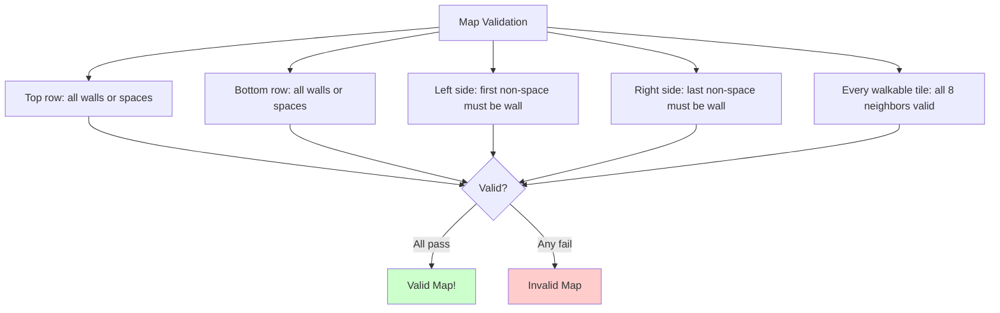
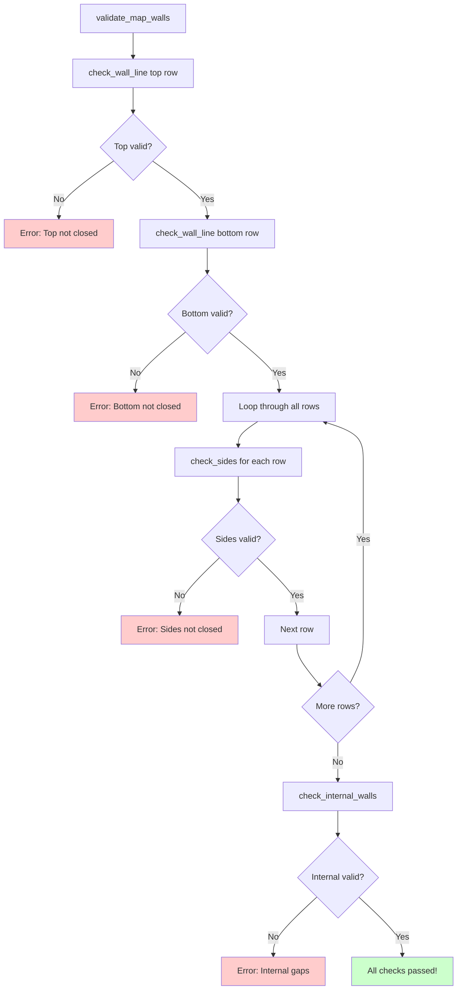
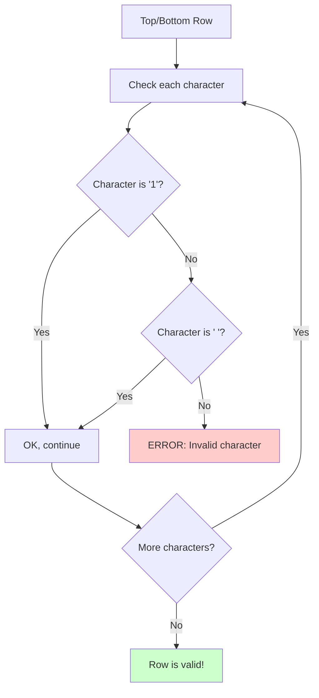
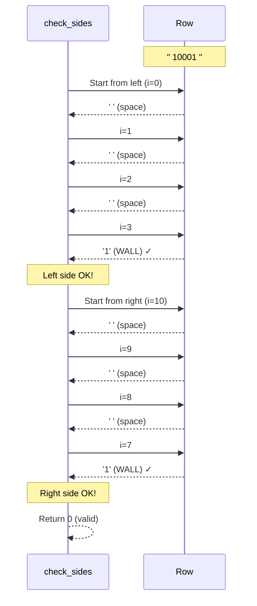
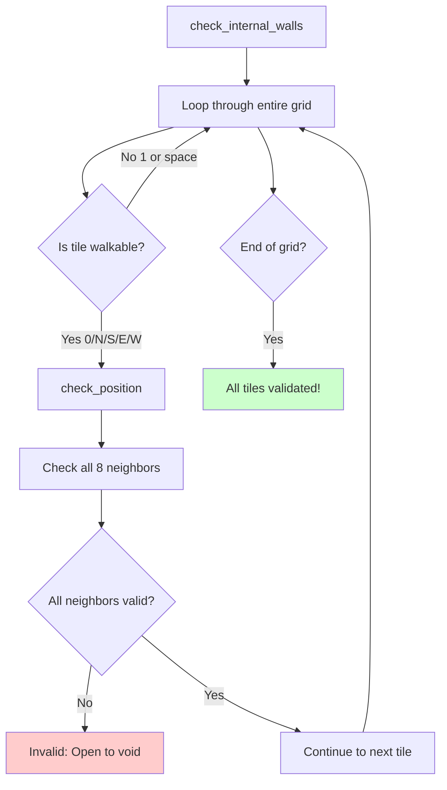
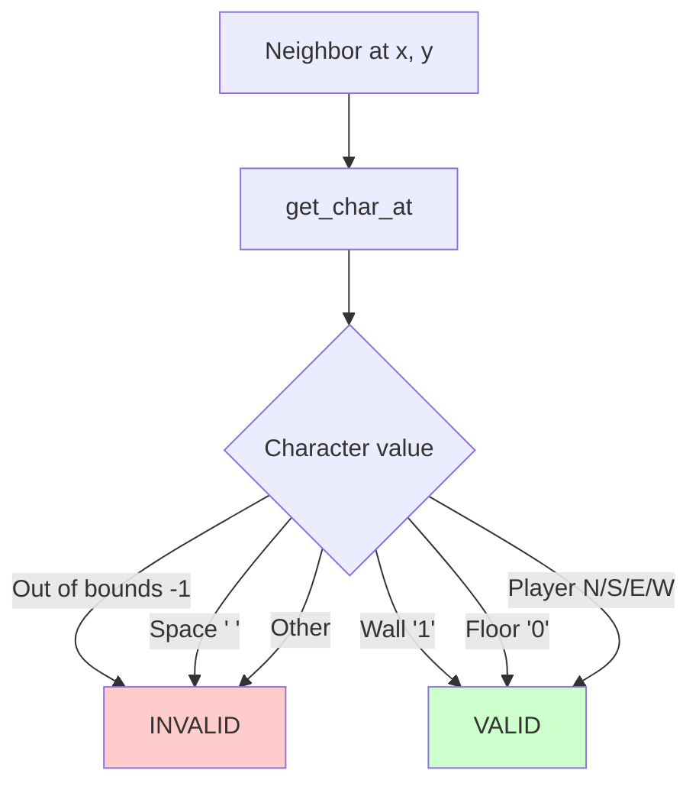
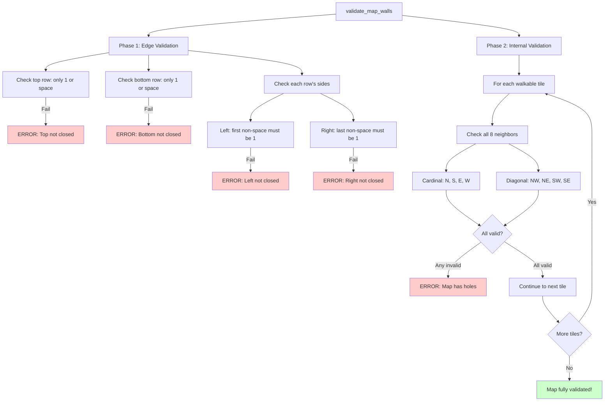

# Map Validation - Ensuring a Valid Game Level

## Table of Contents
1. [Overview](#overview)
2. [Why Validation is Critical](#why-validation-is-critical)
3. [The Validation Pipeline](#the-validation-pipeline)
4. [Validating Top and Bottom Walls](#validating-top-and-bottom-walls)
5. [Validating Side Walls](#validating-side-walls)
6. [Validating Internal Walls](#validating-internal-walls)
7. [The 8-Direction Check](#the-8-direction-check)
8. [Complete Example Walkthroughs](#complete-example-walkthroughs)

---

## Overview

**Map validation** is the third and final phase of parsing. After the map is read and the player is found, we must ensure the map is **playable and safe**. The main goal: **every walkable area must be completely enclosed by walls**.

### Main Function: `validate_map_walls()`

Located in: **`src/parsing/map_validation.c`**

Called from `parse_config_file()` after map parsing:

```c
// In parsing.c:
if (validate_map_walls(config) < 0)
    ft_exit(1, "Map not properly closed by walls");
```

---

## Why Validation is Critical

### The Problem: Open Maps

Without proper validation, a player could "walk off the edge":

```
Invalid map (hole in wall):
11111
10001  ← Space here! Player could escape
1 0N1
10001
11111
```

Or walk into undefined space:

```
Invalid map (open on side):
11111
00N01  ← No wall on left! Player could go left infinitely
10001
11111
```

### What We're Checking



---

## The Validation Pipeline



### Function: `validate_map_walls()`

**File:** `src/parsing/map_validation.c`

```c
int validate_map_walls(t_config *config)
{
    int i;

    // Check first row (top)
    if (check_wall_line(config->map.grid[0]) < 0)
        return (-1);
    
    // Check last row (bottom)
    if (check_wall_line(config->map.grid[config->map.height - 1]) < 0)
        return (-1);
    
    // Check sides of each row
    i = 0;
    while (i < config->map.height)
    {
        if (check_sides(config, i) < 0)
            return (-1);
        i++;
    }
    
    // Check internal walls
    return (check_internal_walls(config));
}
```

---

## Validating Top and Bottom Walls

### Function: `check_wall_line()`

**File:** `src/parsing/map_validation.c`

```c
static int check_wall_line(const char *line)
{
    int i;

    i = 0;
    while (line[i])
    {
        if (line[i] != WALL && line[i] != NOT_WALKABLE)
            return (-1);
        i++;
    }
    return (0);
}
```

### What This Checks

The top and bottom rows can **only** contain:
- `'1'` (WALL)
- `' '` (NOT_WALKABLE / space)

Any other character means the map isn't properly closed!

### Valid Examples

```
Top/Bottom: "1111111"
            ✓ All walls

Top/Bottom: "   1111111   "
            ✓ Spaces + walls (spaces are OK on edges)
```

### Invalid Examples

```
Top/Bottom: "1110111"
               ↑ '0' is walkable! Player could escape!
            ✗ INVALID

Top/Bottom: "111N111"
               ↑ Player on edge! Could walk off!
            ✗ INVALID
```

### Visual Explanation



### Example Validation

```
Map:
Row 0: "111111"  ← Checking this (top)
Row 1: "100101"
Row 2: "101001"
Row 3: "1100N1"
Row 4: "111111"  ← Will check this (bottom)

check_wall_line("111111"):
  Check '1' → OK
  Check '1' → OK
  Check '1' → OK
  Check '1' → OK
  Check '1' → OK
  Check '1' → OK
  Return 0 (valid!)
```

---

## Validating Side Walls

### Function: `check_sides()`

**File:** `src/parsing/map_validation2.c`

```c
int check_sides(t_config *config, int row)
{
    int     len;
    int     i;

    len = ft_strlen(config->map.grid[row]);
    if (len == 0)
        return (0);
    
    // Check left side: find first non-space
    i = 0;
    while (i < len && config->map.grid[row][i] == NOT_WALKABLE)
        i++;
    if (i < len && config->map.grid[row][i] != WALL)
        return (-1);
    
    // Check right side: find last non-space
    i = len - 1;
    while (i >= 0 && config->map.grid[row][i] == NOT_WALKABLE)
        i--;
    if (i >= 0 && config->map.grid[row][i] != WALL)
        return (-1);
    
    return (0);
}
```

### What This Checks

For each row:
1. **Left side:** The first non-space character must be a wall (`'1'`)
2. **Right side:** The last non-space character must be a wall (`'1'`)

### Why Skip Spaces?

Maps can have irregular shapes with leading/trailing spaces:

```
    11111    ← Spaces on left and right
    10001
11111111111  ← Full width row
10000000001
11111111111
    10001
    11111
```

We need to check the **actual edges**, not the spaces!

### Visual Step-by-Step



### Examples

#### Valid Row

```
Row: "   10N01   "
      ^^^     ^^^
      spaces  spaces
         ↓   ↓
         1   1  ← Both ends are walls ✓
```

**Trace:**

```
len = 11
Left check:
  i=0: ' ' → skip
  i=1: ' ' → skip
  i=2: ' ' → skip
  i=3: '1' → WALL ✓

Right check:
  i=10: ' ' → skip
  i=9: ' ' → skip
  i=8: ' ' → skip
  i=7: '1' → WALL ✓

Result: Valid!
```

#### Invalid Row (Left)

```
Row: "   00N01   "
         ↑
         First non-space is '0', not '1'! ✗
```

**Trace:**

```
Left check:
  i=0: ' ' → skip
  i=1: ' ' → skip
  i=2: ' ' → skip
  i=3: '0' → NOT A WALL ✗

Return -1 (invalid!)
```

#### Invalid Row (Right)

```
Row: "   10N00   "
              ↑
              Last non-space is '0', not '1'! ✗
```

---

## Validating Internal Walls

### Function: `check_internal_walls()`

**File:** `src/parsing/map_validation2.c`

```c
int check_internal_walls(t_config *config)
{
    int     i;
    int     j;
    char    c;

    i = 0;
    while (i < config->map.height)
    {
        j = 0;
        while (config->map.grid[i][j])
        {
            c = config->map.grid[i][j];
            if (c == WALKABLE || c == 'N' || c == 'S' || c == 'E' || c == 'W')
            {
                if (check_position(config, j, i) < 0)
                    return (-1);
            }
            j++;
        }
        i++;
    }
    return (0);
}
```

### What This Checks

For **every walkable tile** (including player position), we verify that **all 8 surrounding neighbors** are valid (not open to void).



---

## The 8-Direction Check

### Function: `check_position()`

**File:** `src/parsing/map_validation2.c`

```c
static int check_position(t_config *config, int x, int y)
{
    if (!is_valid_neighbor(config, x - 1, y))
        return (-1);
    if (!is_valid_neighbor(config, x + 1, y))
        return (-1);
    if (!is_valid_neighbor(config, x, y - 1))
        return (-1);
    if (!is_valid_neighbor(config, x, y + 1))
        return (-1);
    if (!is_valid_neighbor(config, x - 1, y - 1))
        return (-1);
    if (!is_valid_neighbor(config, x + 1, y - 1))
        return (-1);
    if (!is_valid_neighbor(config, x - 1, y + 1))
        return (-1);
    if (!is_valid_neighbor(config, x + 1, y + 1))
        return (-1);
    return (0);
}
```

### The 8 Neighbors

```
Visual representation of neighbors around position (x, y):

       y-1
        |
x-1 ----+---- x+1
        |
       y+1

┌───┬───┬───┐
│NW │ N │NE │  NW = (x-1, y-1)  N  = (x,   y-1)  NE = (x+1, y-1)
├───┼───┼───┤
│ W │ * │ E │  W  = (x-1, y  )  *  = (x,   y  )  E  = (x+1, y  )
├───┼───┼───┤
│SW │ S │SE │  SW = (x-1, y+1)  S  = (x,   y+1)  SE = (x+1, y+1)
└───┴───┴───┘
```

### Why Check Diagonals?

Consider this map:

```
111
1 0
101
```

If we **only** checked the 4 cardinal directions (N, S, E, W):

```
Check (1, 1) which is '0':
  North (1, 0): '1' ✓
  South (1, 2): '0' ✓
  West  (0, 1): '1' ✓
  East  (2, 1): space... INVALID!
```

But what about this case:

```
11
 01
11
```

The '0' at (1, 1):
- North (1, 0): '1' ✓
- South (1, 2): '1' ✓
- East (2, 1): '1' ✓
- West (0, 1): space...

The space at (0, 1) creates a diagonal opening! Player could "clip" through:

```
11
 0  ← Player here could potentially clip to the space
11
```

So we check **all 8 directions including diagonals** to be safe!

### Function: `is_valid_neighbor()`

**File:** `src/parsing/map_validation2.c`

```c
static int is_valid_neighbor(t_config *config, int x, int y)
{
    int c;

    c = get_char_at(config, x, y);
    if (c == -1 || c == NOT_WALKABLE)
        return (0);
    return (c == WALL || c == WALKABLE || c == 'N'
        || c == 'S' || c == 'E' || c == 'W');
}
```

**What makes a neighbor valid?**



**Valid neighbors:**
- `'1'` (wall) - OK, blocks movement but encloses space
- `'0'` (walkable floor) - OK, another walkable tile
- `'N'`, `'S'`, `'E'`, `'W'` (player) - OK, walkable position

**Invalid neighbors:**
- `' '` (space/void) - NOT OK, player could escape to undefined space
- Out of bounds - NOT OK, accessing outside the map array

### Function: `get_char_at()`

**File:** `src/parsing/map_validation2.c`

```c
static int get_char_at(t_config *config, int x, int y)
{
    if (y < 0 || y >= config->map.height)
        return (-1);
    if (x < 0 || x >= (int)ft_strlen(config->map.grid[y]))
        return (-1);
    return (config->map.grid[y][x]);
}
```

**Why return `-1` for out of bounds?**

This allows us to distinguish between:
- A valid space character `' '` (which is invalid for neighbors)
- Out of bounds (also invalid, but for a different reason)

Both are treated as invalid neighbors, but the `-1` makes debugging easier!

**Bounds checking:**

```
Map:
  x: 0 1 2 3 4 5
y:
0   1 1 1 1 1 1
1   1 0 0 1 0 1
2   1 0 1 0 0 1
3   1 1 0 0 N 1
4   1 1 1 1 1 1

height = 5
width = 6 (for each row)

Valid x: 0 to 5
Valid y: 0 to 4

get_char_at(config, 10, 2):
  y = 2: OK (0 <= 2 < 5)
  x = 10: strlen(grid[2]) = 6
  10 >= 6: OUT OF BOUNDS
  Return -1
```

---

## Complete Example Walkthroughs

### Example 1: Valid Map

```
Map:
111111
100101
101001
1100N1
111111
```

#### Step 1: Check Top Row

```
check_wall_line("111111"):
  All characters are '1' ✓
  Result: Valid
```

#### Step 2: Check Bottom Row

```
check_wall_line("111111"):
  All characters are '1' ✓
  Result: Valid
```

#### Step 3: Check Sides

```
Row 0 "111111": First='1', Last='1' ✓
Row 1 "100101": First='1', Last='1' ✓
Row 2 "101001": First='1', Last='1' ✓
Row 3 "1100N1": First='1', Last='1' ✓
Row 4 "111111": First='1', Last='1' ✓
Result: All valid
```

#### Step 4: Check Internal Walls

```
Walkable tiles to check:
(1,1): '0'
(2,1): '0'
(4,1): '0'
(2,2): '0'
(4,2): '0'
(2,3): '0'
(3,3): '0'
(4,3): 'N'

Check (1,1) '0':
  ┌───┬───┬───┐
  │'1'│'1'│'1'│  (0,0) (1,0) (2,0)
  ├───┼───┼───┤
  │'1'│'0'│'0'│  (0,1) (1,1) (2,1)
  ├───┼───┼───┤
  │'1'│'0'│'1'│  (0,2) (1,2) (2,2)
  └───┴───┴───┘
  
  All neighbors are valid (walls or walkable) ✓

... (similar for all other tiles) ...

Result: All tiles valid!
```

**Final result:** ✅ Map is valid!

---

### Example 2: Invalid Map (Hole in Wall)

```
Map:
111111
10 101  ← Space in middle! (position 2,1)
101001
1100N1
111111
```

#### Validation Process

```
Step 1: Top row ✓
Step 2: Bottom row ✓
Step 3: Sides:
  Row 1 "10 101": 
    First='1' ✓
    Last='1' ✓
  (All rows pass)

Step 4: Internal walls:
  Check (1,1) '0':
    Neighbors include (2,1) which is ' ' (space) ✗
    Return -1: INVALID!
```

**Visual of the problem:**

```
11111
10 10  ← '0' at (1,1) is next to space at (2,1)
  ↑↑
  |└─ Space (void)
  └── Walkable tile
  
Player at (1,1) could "walk" into the space!
```

**Error:** `Map not properly closed by walls`

---

### Example 3: Invalid Map (Open on Left)

```
Map:
111111
00N001  ← No wall on left!
100001
111111
```

#### Validation Process

```
Step 1: Top row ✓
Step 2: Bottom row ✓
Step 3: Sides:
  Row 1 "00N001":
    i = 0: '0' (not a space)
    First non-space is '0', not '1' ✗
    Return -1: INVALID!
```

**Why it fails:**

```
111111
00N001  ← First character is '0', should be '1'
↑
Left edge must be a wall!
```

**Error:** `Map not properly closed by walls`

---

### Example 4: Valid Map with Spaces

```
Map:
    1111
    10N1
11111001
10000001
11111111
```

#### Visual Grid

```
Actual grid (spaces shown as '·'):
  0 1 2 3 4 5 6 7
0 · · · · 1 1 1 1
1 · · · · 1 0 N 1
2 1 1 1 1 1 0 0 1
3 1 0 0 0 0 0 0 1
4 1 1 1 1 1 1 1 1
```

#### Validation Process

```
Step 1: Top row "····1111"
  All characters are space or '1' ✓

Step 2: Bottom row "11111111"
  All characters are '1' ✓

Step 3: Sides:
  Row 0 "····1111":
    Skip spaces (0-3)
    First non-space at 4: '1' ✓
    Last non-space at 7: '1' ✓
  
  Row 1 "····10N1":
    First non-space at 4: '1' ✓
    Last non-space at 7: '1' ✓
  
  ... (similar for other rows) ...

Step 4: Internal walls:
  Check (5,1) '0':
    ┌───┬───┬───┐
    │' '│'1'│'1'│  (4,0) (5,0) (6,0)
    ├───┼───┼───┤
    │'1'│'0'│'N'│  (4,1) (5,1) (6,1)
    ├───┼───┼───┤
    │'1'│'0'│'0'│  (4,2) (5,2) (6,2)
    └───┴───┴───┘
    
    NW: (4,0) is ' ' ✗ INVALID!
```

**Wait, this should be invalid!**

The space at (4, 0) is directly diagonal to the walkable tile at (5, 1). This creates a potential escape route!

Let me reconsider... Actually, looking at the map:

```
    1111   ← Row 0: spaces at 0-3, walls at 4-7
    10N1   ← Row 1: spaces at 0-3, then 1,0,N,1
```

The '0' at (5,1) has these neighbors:
- NW (4,0): '1' (wall) ✓
- N  (5,0): '1' (wall) ✓
- NE (6,0): '1' (wall) ✓
- W  (4,1): '1' (wall) ✓
- E  (6,1): 'N' (player) ✓
- SW (4,2): '1' (wall) ✓
- S  (5,2): '0' (floor) ✓
- SE (6,2): '0' (floor) ✓

All valid! ✅

**Final result:** ✅ Map is valid!

---

## Summary Diagram



---

## Quick Reference: Validation Rules

| Check | What It Validates | Valid Characters | Why |
|-------|-------------------|------------------|-----|
| **Top Row** | First row is closed | `'1'`, `' '` | Prevents player from walking off top |
| **Bottom Row** | Last row is closed | `'1'`, `' '` | Prevents player from walking off bottom |
| **Left Side** | First non-space of each row | `'1'` only | Ensures left boundary exists |
| **Right Side** | Last non-space of each row | `'1'` only | Ensures right boundary exists |
| **8 Neighbors** | All walkable tiles fully enclosed | Not `' '` or out of bounds | Prevents player from accessing void |

---

**Continue to:** [Dependencies Deep Dive →](06_dependencies.md)
