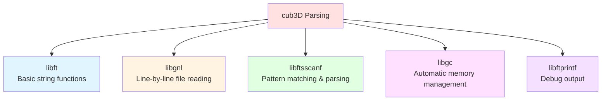
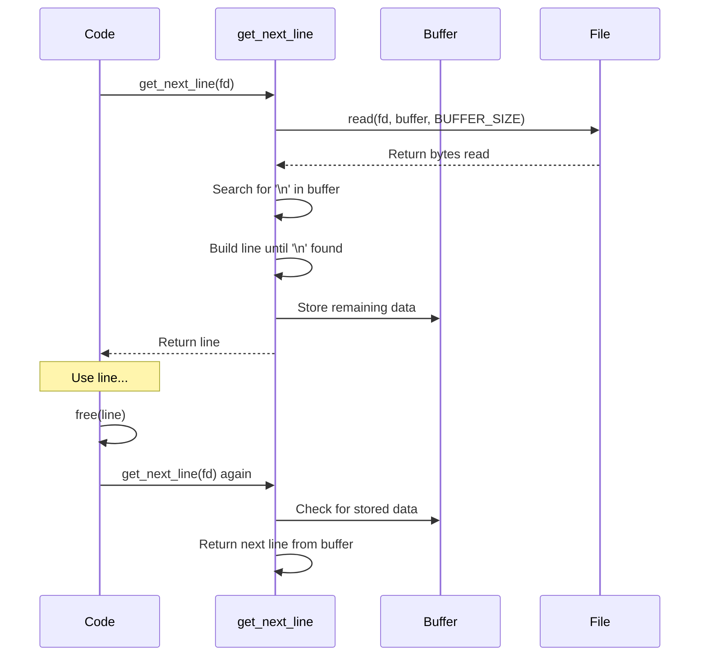
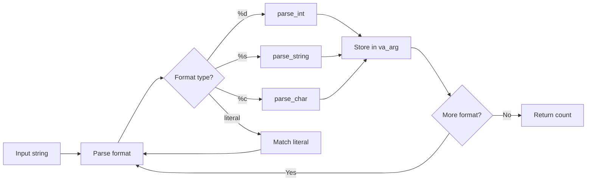
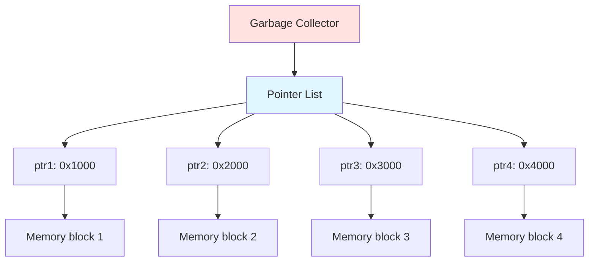
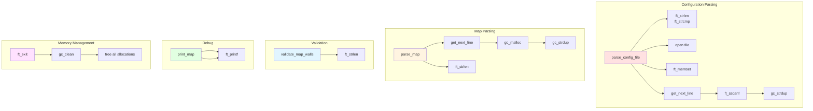
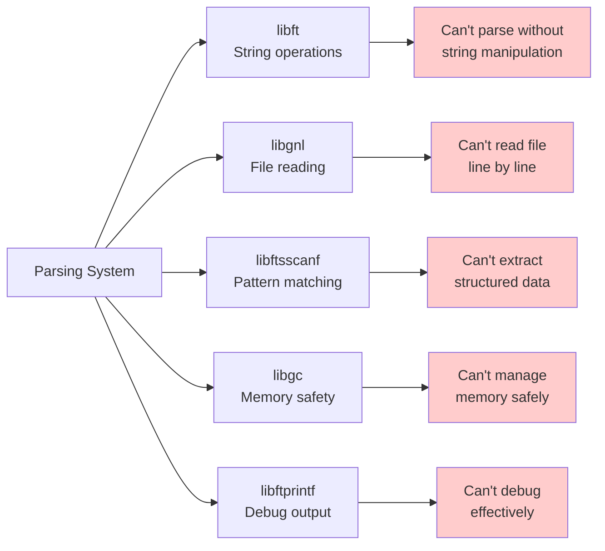

# Dependencies Deep Dive - The Helper Libraries

## Table of Contents
1. [Overview](#overview)
2. [libft - Standard Library Functions](#libft---standard-library-functions)
3. [libgnl - Get Next Line](#libgnl---get-next-line)
4. [libftsscanf - Formatted String Scanning](#libftsscanf---formatted-string-scanning)
5. [libgc - Garbage Collector](#libgc---garbage-collector)
6. [libftprintf - Formatted Printing](#libftprintf---formatted-printing)
7. [MiniLibX - Graphics Library](#minilibx---graphics-library)
8. [Complete Function Reference](#complete-function-reference)

---

## Overview

The cub3D parsing system relies on several custom libraries. Understanding these libraries is crucial to understanding how the parsing code works!



### Dependency Tree

```
cub3D
├── libft          (string manipulation, memory operations)
├── libgnl         (file reading, depends on libft)
├── libftsscanf    (parsing, depends on libft)
├── libgc          (memory management)
├── libftprintf    (debug output, depends on libft)
└── minilibx       (graphics, not used in parsing)
```

---

## libft - Standard Library Functions

**Purpose:** Provides reimplementations of standard C library functions.

### Key Functions Used in Parsing

#### `ft_strlen()` - String Length

```c
size_t ft_strlen(const char *s);
```

**What it does:** Counts characters in a string until null terminator.

**Implementation concept:**

```c
size_t ft_strlen(const char *s)
{
    size_t i;
    
    i = 0;
    while (s[i])
        i++;
    return (i);
}
```

**Visual:**

```
String: "hello\0"
         01234 5
         
Count: 0 → 1 → 2 → 3 → 4 → 5 (stop at \0)
Return: 5
```

**Usage in parsing:**

```c
// Check file extension
len = ft_strlen(path);
if (len < 4 || ft_strcmp(path + len - 4, ".cub") != 0)
    ft_exit(2, "Map file must have .cub extension");
```

---

#### `ft_strcmp()` - String Comparison

```c
int ft_strcmp(const char *s1, const char *s2);
```

**What it does:** Compares two strings character by character.

**Returns:**
- `0` if strings are identical
- Negative if s1 < s2
- Positive if s1 > s2

**How it works:**

```c
int ft_strcmp(const char *s1, const char *s2)
{
    int i;
    
    i = 0;
    while (s1[i] && s2[i] && s1[i] == s2[i])
        i++;
    return (s1[i] - s2[i]);
}
```

**Visual example:**

```
Compare ".cub" with ".cub":
  . == . ✓
  c == c ✓
  u == u ✓
  b == b ✓
  \0 == \0 ✓
Return: 0 (equal)

Compare ".cub" with ".txt":
  . == . ✓
  c == t ✗
Return: 'c' - 't' = -17 (negative)
```

---

#### `ft_strncmp()` - String Comparison (N characters)

```c
int ft_strncmp(const char *s1, const char *s2, size_t n);
```

**What it does:** Like `ft_strcmp`, but only compares first `n` characters.

**Usage in parsing:**

```c
// Check .xpm extension
if (ft_strncmp(path + len - 4, ".xpm", 4) != 0)
    return (0);  // Not an XPM file
```

**Visual:**

```
Compare ".xpm" with ".xpm" (n=4):
  Compare 4 characters only
  . == . ✓
  x == x ✓
  p == p ✓
  m == m ✓
Return: 0 (equal)
```

---

#### `ft_strdup()` - String Duplication

```c
char *ft_strdup(const char *s);
```

**What it does:** Allocates memory and copies a string.

**Implementation concept:**

```c
char *ft_strdup(const char *s)
{
    char    *dup;
    size_t  len;
    size_t  i;
    
    len = ft_strlen(s);
    dup = malloc(len + 1);
    if (!dup)
        return (NULL);
    i = 0;
    while (i < len)
    {
        dup[i] = s[i];
        i++;
    }
    dup[i] = '\0';
    return (dup);
}
```

**Visual:**

```
Original string (on stack):
┌─┬─┬─┬─┬─┬──┐
│h│e│l│l│o│\0│
└─┴─┴─┴─┴─┴──┘

After ft_strdup (on heap):
┌─┬─┬─┬─┬─┬──┐
│h│e│l│l│o│\0│  ← New copy with its own memory
└─┴─┴─┴─┴─┴──┘
```

---

#### `ft_memset()` - Memory Set

```c
void *ft_memset(void *s, int c, size_t n);
```

**What it does:** Sets `n` bytes of memory to value `c`.

**Visual:**

```
Before: [?][?][?][?][?]  (garbage)

ft_memset(ptr, 0, 5)

After:  [0][0][0][0][0]  (all zeros)
```

**Usage in parsing:**

```c
// Initialize config structure
ft_memset(config, 0, sizeof(t_config));
```

This sets **every byte** of the structure to 0:

```
sizeof(t_config) = ~200 bytes (approximate)

Before memset:
config: [random][random][random]...[random]

After memset:
config: [0][0][0]...[0]
        ↓
        All fields initialized:
        - Pointers = NULL (0)
        - Integers = 0
        - Flags = 0
```

---

## libgnl - Get Next Line

**Purpose:** Reads a file line by line, handling any buffer size.

### Main Function: `get_next_line()`

```c
char *get_next_line(int fd);
```

**What it does:** Reads and returns the next line from a file descriptor.

**Returns:**
- Pointer to line (including `\n`) on success
- `NULL` when end of file or error

### How It Works



### Visual Example

```
File contents:
┌───────────────────────────┐
│ NO ./textures/north.xpm\n │ ← Line 1
│ SO ./textures/south.xpm\n │ ← Line 2
│ F 220,100,0\n             │ ← Line 3
└───────────────────────────┘

Call 1: get_next_line(fd)
  Read chunk, find '\n'
  Return: "NO ./textures/north.xpm\n"

Call 2: get_next_line(fd)
  Continue from buffer/read more
  Return: "SO ./textures/south.xpm\n"

Call 3: get_next_line(fd)
  Return: "F 220,100,0\n"

Call 4: get_next_line(fd)
  No more data
  Return: NULL
```

### Internal Structure

```c
typedef struct s_buffer
{
    char            *content;
    struct s_buffer *next;
}   t_buffer;
```

**Why use a linked list?**

When you read from a file, you might read more than one line at once! The excess data needs to be stored:

```
Buffer after first read:
"Line1\nLine2\nLi"
      ↑      ↑
   Return    Store for next call
   Line1     "Line2\nLi"
```

### Usage in Parsing

```c
line = get_next_line(fd);
while (line != NULL)
{
    // Process line
    free(line);
    line = get_next_line(fd);
}
```

**Important:** Always `free()` the returned line!

---

## libftsscanf - Formatted String Scanning

**Purpose:** Parses formatted strings (like standard `sscanf`).

### Main Function: `ft_sscanf()`

```c
int ft_sscanf(const char *str, const char *format, ...);
```

**What it does:** Scans a string and extracts values based on format specifiers.

**Returns:** Number of successfully parsed items.

### Format Specifiers

| Specifier | Meaning | Example |
|-----------|---------|---------|
| `%d` | Signed integer | `"42"` → `42` |
| `%s` | String (until whitespace) | `"hello world"` → `"hello"` |
| `%c` | Single character | `"abc"` → `'a'` |

### How It Works



### Example 1: Parsing Texture Path

```c
char path[256];
int result;

result = ft_sscanf("NO ./textures/north.xpm", "NO %s", path);
//                  ^                          ^
//                  input string               format
```

**Step-by-step:**

```
1. Match literal "NO": ✓
2. Skip whitespace: ✓
3. Parse %s (string): "./textures/north.xpm"
4. Store in path
5. Return 1 (one item parsed)

Result:
  result = 1
  path = "./textures/north.xpm"
```

### Example 2: Parsing RGB Color

```c
int r, g, b;
char c;

result = ft_sscanf("F 220,100,0", "F %d,%d,%d %c", &r, &g, &b, &c);
```

**Step-by-step:**

```
1. Match literal "F": ✓
2. Skip whitespace: ✓
3. Parse %d (int): 220 → r
4. Match literal ",": ✓
5. Parse %d (int): 100 → g
6. Match literal ",": ✓
7. Parse %d (int): 0 → b
8. Try to parse %c: No character after "0"
9. Return 3 (three items parsed)

Result:
  result = 3
  r = 220, g = 100, b = 0
  c = unchanged
```

**Why the extra `%c`?**

It's a validation trick! If `ft_sscanf` returns 3 (not 4), we know there's no extra content:

```c
if (ft_sscanf(line, "F %d,%d,%d %c", &r, &g, &b, &c) != 3)
    return (0);  // Either not enough values, or extra content

// Valid: "F 220,100,0" → returns 3 ✓
// Invalid: "F 220,100,0 extra" → returns 4 ✗
```

### Internal Functions

#### `parse_int()`

```c
int parse_int(const char **str, int *result);
```

**What it does:** Parses an integer from the string.

**Implementation concept:**

```c
int parse_int(const char **str, int *result)
{
    int sign = 1;
    int num = 0;
    
    // Skip whitespace
    while (sc_isspace(**str))
        (*str)++;
    
    // Check for sign
    if (**str == '-')
    {
        sign = -1;
        (*str)++;
    }
    else if (**str == '+')
        (*str)++;
    
    // Parse digits
    if (!sc_isdigit(**str))
        return (0);
    while (sc_isdigit(**str))
    {
        num = num * 10 + (**str - '0');
        (*str)++;
    }
    
    *result = num * sign;
    return (1);
}
```

**Visual example:**

```
Input: "  -42abc"
        ^^
        Skip spaces

Input: "-42abc"
       ^
       Sign: negative

Input: "42abc"
       ^^
       Parse: 4 → num = 4
              2 → num = 42

Input: "abc"
       ^
       Not a digit, stop

Result: *result = -42
```

#### `parse_string()`

```c
int parse_string(const char **str, char *result);
```

**What it does:** Parses a string (until whitespace).

**Visual:**

```
Input: "  hello world"
        ^^
        Skip spaces

Input: "hello world"
       ^^^^^^
       Copy until space

Result: result = "hello"
```

---

## libgc - Garbage Collector

**Purpose:** Automatic memory management to prevent memory leaks.

### How It Works

The garbage collector maintains a **list of all allocated pointers**:



### Key Functions

#### `gc_init()`

```c
int gc_init(void);
```

**What it does:** Initializes the garbage collector.

**Call this ONCE at program start:**

```c
int main(void)
{
    if (gc_init() != 0)
        ft_exit(1, "Failed to initialize garbage collector");
    // ... rest of program
}
```

#### `gc_malloc()`

```c
void *gc_malloc(size_t size);
```

**What it does:** Allocates memory and tracks it.

**Visual:**

```
gc_malloc(100):
  1. malloc(100) → ptr
  2. Add ptr to tracking list
  3. Return ptr

Tracking list:
┌─────────────┐
│ ptr → 0x1000│  ← New entry
└─────────────┘
```

**Usage:**

```c
// Instead of:
char *str = malloc(256);

// Use:
char *str = gc_malloc(256);
```

#### `gc_strdup()`

```c
char *gc_strdup(const char *s);
```

**What it does:** Like `ft_strdup`, but with tracking.

**Implementation:**

```c
char *gc_strdup(const char *s)
{
    char *dup;
    
    dup = gc_malloc(ft_strlen(s) + 1);
    if (!dup)
        return (NULL);
    ft_strcpy(dup, s);
    return (dup);
}
```

#### `gc_clean()`

```c
void gc_clean(void);
```

**What it does:** Frees ALL tracked memory.

**Visual:**

```
Before gc_clean():
Tracking list:
┌─────────────┐
│ ptr1 → 0x1000│
│ ptr2 → 0x2000│
│ ptr3 → 0x3000│
└─────────────┘

After gc_clean():
  free(ptr1)
  free(ptr2)
  free(ptr3)
  
Tracking list:
┌─────────────┐
│   (empty)    │
└─────────────┘
```

**Called automatically by `ft_exit()`:**

```c
void ft_exit(int code, const char *message)
{
    if (message)
        ft_printf("Error: %s\n", message);
    gc_clean();  // Free everything!
    exit(code);
}
```

### Why Use a Garbage Collector?

**Without GC:**

```c
void parse_file(char *path)
{
    char *line1 = malloc(100);
    char *line2 = malloc(100);
    char *line3 = malloc(100);
    
    if (error)
    {
        free(line1);  // Must remember!
        free(line2);
        free(line3);
        return;
    }
    
    // ... use lines ...
    
    free(line1);  // Must remember!
    free(line2);
    free(line3);
}
```

**With GC:**

```c
void parse_file(char *path)
{
    char *line1 = gc_malloc(100);
    char *line2 = gc_malloc(100);
    char *line3 = gc_malloc(100);
    
    if (error)
        ft_exit(1, "Error");  // Automatically frees everything!
    
    // ... use lines ...
    
    // No manual free needed!
}
```

---

## libftprintf - Formatted Printing

**Purpose:** Custom printf implementation for debug output.

### Main Function: `ft_printf()`

```c
int ft_printf(const char *format, ...);
```

**What it does:** Formats and prints output (like standard `printf`).

### Usage in Parsing

#### Debug Output

```c
void print_config(t_config *config)
{
    ft_printf("North Texture: %s\n", config->textures.north);
    ft_printf("South Texture: %s\n", config->textures.south);
    ft_printf("Floor Color: R=%d, G=%d, B=%d\n",
        config->floor.r, config->floor.g, config->floor.b);
    ft_printf("Map: %dx%d, Player at (%d, %d)\n",
        config->map.width, config->map.height,
        config->map.player_pos[0], config->map.player_pos[1]);
}
```

**Output example:**

```
North Texture: ./textures/north.xpm
South Texture: ./textures/south.xpm
Floor Color: R=220, G=100, B=0
Map: 6x5, Player at (4, 3)
```

---

## MiniLibX - Graphics Library

**Purpose:** Provides graphics and window management.

**Note:** MiniLibX is **not** used during parsing, only during game rendering!

### Key Functions (for reference)

```c
void *mlx_init(void);                    // Initialize MLX
void *mlx_new_window(void *mlx, ...);    // Create window
void *mlx_new_image(void *mlx, ...);     // Create image
void mlx_pixel_put(...);                 // Draw pixel
void mlx_put_image_to_window(...);       // Display image
int  mlx_loop(void *mlx);                // Start event loop
```

---

## Complete Function Reference

### Functions Used in Parsing (Sorted by Library)

#### libft

| Function | Purpose | Example Usage |
|----------|---------|---------------|
| `ft_strlen(s)` | Get string length | Check file extension |
| `ft_strcmp(s1, s2)` | Compare strings | Verify ".cub" extension |
| `ft_strncmp(s1, s2, n)` | Compare n chars | Verify ".xpm" extension |
| `ft_strdup(s)` | Duplicate string | (Not used, use `gc_strdup`) |
| `ft_memset(ptr, val, n)` | Set memory | Initialize structures |

#### libgnl

| Function | Purpose | Example Usage |
|----------|---------|---------------|
| `get_next_line(fd)` | Read next line | Read config and map lines |

#### libftsscanf

| Function | Purpose | Example Usage |
|----------|---------|---------------|
| `ft_sscanf(str, fmt, ...)` | Parse formatted string | Extract texture paths and colors |

#### libgc

| Function | Purpose | Example Usage |
|----------|---------|---------------|
| `gc_init()` | Initialize GC | Program start (once) |
| `gc_malloc(size)` | Allocate tracked memory | Allocate grid array |
| `gc_strdup(s)` | Duplicate with tracking | Store texture paths |
| `gc_clean()` | Free all memory | Called by `ft_exit()` |

#### libftprintf

| Function | Purpose | Example Usage |
|----------|---------|---------------|
| `ft_printf(fmt, ...)` | Print formatted output | Debug information |

---

## Dependency Usage Map



---

## Summary: Why Each Library is Essential



### Each Library's Role

| Library | Without It... |
|---------|---------------|
| **libft** | Can't perform basic string operations (length, compare, copy) |
| **libgnl** | Can't read files line by line easily; would need complex buffer management |
| **libftsscanf** | Can't parse structured data; would need manual parsing for each format |
| **libgc** | Memory leaks everywhere; need manual free() for every allocation |
| **libftprintf** | No easy way to output debug information during parsing |

---

**You've reached the end of the parsing documentation!**

## Next Steps

Now that you understand the entire parsing system:

1. **Review the code** with this documentation as a guide
2. **Try modifying** some validation rules to see what happens
3. **Create test cases** with invalid maps to test error handling
4. **Experiment** with different map layouts

### Recommended Reading Order for Review

1. Start with [Parsing Overview](01_parsing_overview.md) - Big picture
2. Read [Config File Format](02_config_file_format.md) - Understand input format
3. Follow [Configuration Parsing](03_configuration_parsing.md) - How config is read
4. Study [Map Parsing](04_map_parsing.md) - How map is read
5. Deep dive into [Map Validation](05_map_validation.md) - How map is validated
6. Reference [Dependencies](06_dependencies.md) - Understand helper functions

---

**Congratulations!** You now understand every detail of the cub3D parsing system! 🎉
