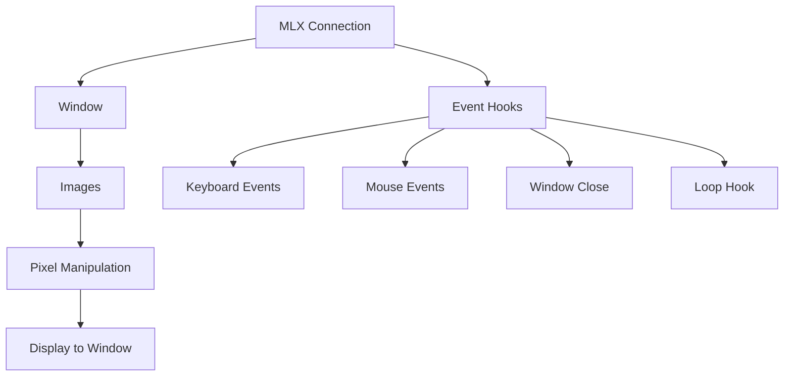
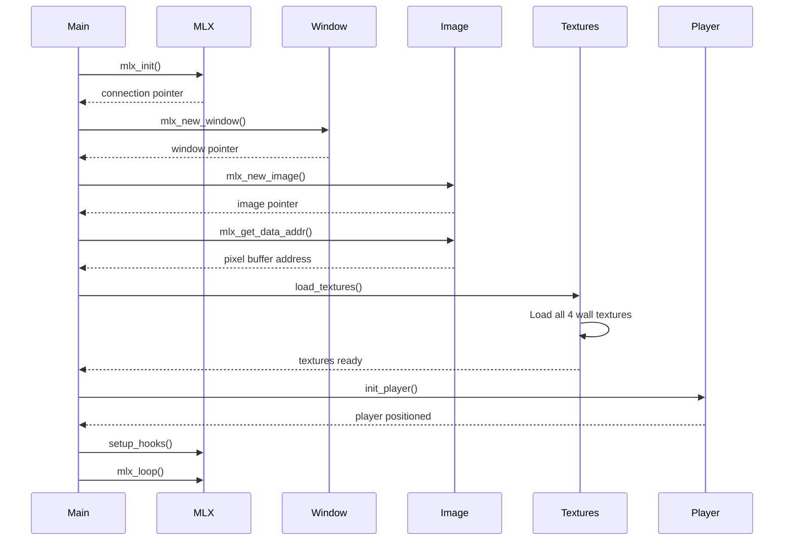
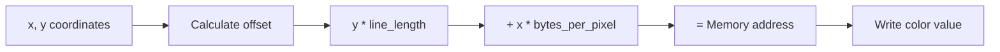
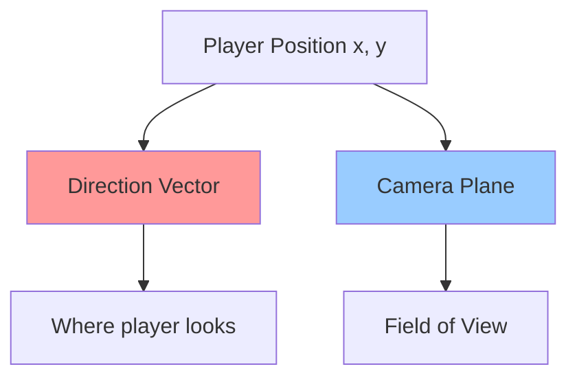
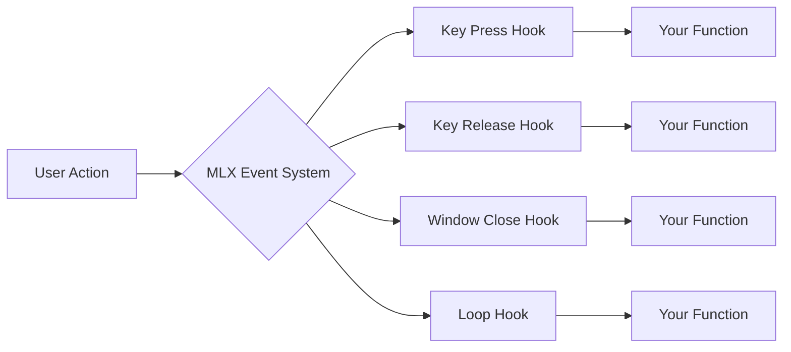
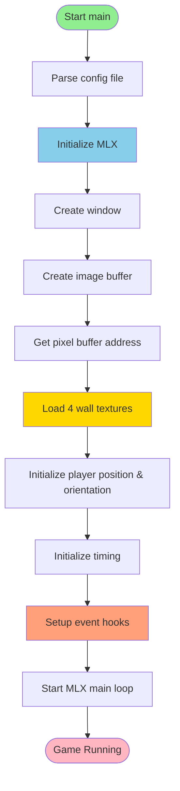

# MLX Initialization and Setup

## Overview

After parsing is complete, the game initializes the graphical environment using **MinilibX (MLX)**, loads textures, and sets up the player. This document explains the initialization phase of the Cub3D project.

## Table of Contents

1. [What is MinilibX?](#what-is-minilibx)
2. [MLX Initialization Flow](#mlx-initialization-flow)
3. [Window Creation](#window-creation)
4. [Image Buffer Setup](#image-buffer-setup)
5. [Texture Loading](#texture-loading)
6. [Player Initialization](#player-initialization)
7. [Event Hooks Setup](#event-hooks-setup)

---

## What is MinilibX?

**MinilibX (MLX)** is a simple graphics library designed for 42 School projects. It provides:

- Window management
- Image rendering
- Event handling (keyboard, mouse)
- Basic drawing primitives

### Key MLX Concepts



**Connection**: The MLX instance that connects to the X server  
**Window**: The display area where graphics are rendered  
**Image**: An off-screen buffer where you draw pixels before displaying  
**Hooks**: Callback functions that respond to user input

---

## MLX Initialization Flow

The initialization happens in the `main()` function after parsing:

```c
int main(int argc, char **argv)
{
    t_game game;
    
    // 1. Parse configuration (already done)
    parse_config_file(&(game.config), argv[1]);
    
    // 2. Initialize MLX
    init_mlx(&game);
    
    // 3. Load textures
    load_textures(&game);
    
    // 4. Initialize player
    init_player(&game);
    
    // 5. Setup timing
    game.time.last_frame = get_time_us();
    game.time.delta_time = 0.016;
    
    // 6. Setup event hooks
    setup_hooks(&game);
    
    // 7. Start main loop
    mlx_loop(game.mlx);
}
```

### Initialization Sequence Diagram



---

## Window Creation

### Function: `init_mlx()`

**File**: `src/game_utils.c`

```c
void init_mlx(t_game *game)
{
    // Step 1: Initialize MLX connection
    game->mlx = mlx_init();
    if (!game->mlx)
        ft_exit(1, "Failed to initialize MLX");
    
    // Step 2: Create a window
    game->win = mlx_new_window(game->mlx, WIDTH, HEIGHT, "cub3D");
    if (!game->win)
        ft_exit(1, "Failed to create window");
    
    // Step 3: Create image buffer
    game->img.img = mlx_new_image(game->mlx, WIDTH, HEIGHT);
    if (!game->img.img)
        ft_exit(1, "Failed to create image");
    
    // Step 4: Get direct access to image pixels
    game->img.addr = mlx_get_data_addr(game->img.img,
            &game->img.bits_per_pixel,
            &game->img.line_length,
            &game->img.endian);
}
```

### What Each Step Does

#### Step 1: MLX Connection
```c
game->mlx = mlx_init();
```
- Establishes connection to the X server (on Linux)
- Returns a pointer that represents this connection
- All subsequent MLX calls need this pointer

#### Step 2: Window Creation
```c
game->win = mlx_new_window(game->mlx, WIDTH, HEIGHT, "cub3D");
```
- Creates a window with specified dimensions: **1200x800** pixels
- Title: "cub3D"
- Returns a window identifier

#### Step 3: Image Buffer
```c
game->img.img = mlx_new_image(game->mlx, WIDTH, HEIGHT);
```
- Creates an **off-screen buffer** where we draw
- Same size as window
- We manipulate pixels here before displaying

#### Step 4: Pixel Access
```c
game->img.addr = mlx_get_data_addr(game->img.img, ...);
```
- Gets direct memory address to pixel data
- Allows fast pixel manipulation
- Returns important information:
  - `bits_per_pixel`: How many bits per pixel (usually 32)
  - `line_length`: Bytes per image line
  - `endian`: Byte order

---

## Image Buffer Setup

### Understanding the Image Buffer

The image buffer is a **1D array** representing a **2D grid** of pixels:

```
Memory Layout:
[Pixel(0,0)][Pixel(1,0)][Pixel(2,0)]...[Pixel(1199,0)]
[Pixel(0,1)][Pixel(1,1)][Pixel(2,1)]...[Pixel(1199,1)]
...
[Pixel(0,799)][Pixel(1,799)]...........[ Pixel(1199,799)]
```

### Pixel Manipulation Function

**File**: `src/rendering.c`

```c
void my_mlx_pixel_put(t_image *img, int x, int y, int color)
{
    char *dst;
    
    // Bounds checking
    if (x < 0 || x >= WIDTH || y < 0 || y >= HEIGHT)
        return;
    
    // Calculate pixel position in 1D array
    dst = img->addr + (y * img->line_length + x * (img->bits_per_pixel / 8));
    
    // Set pixel color
    *(unsigned int *)dst = color;
}
```

### How Pixel Addressing Works



**Formula**:
```
pixel_address = base_address + (y * line_length) + (x * bytes_per_pixel)
```

**Why?**
- `y * line_length`: Skip to correct row
- `x * bytes_per_pixel`: Move to correct column
- Each pixel typically uses 4 bytes (32 bits) for ARGB color

### Color Format

Colors are stored as 32-bit integers:

```
0xAARRGGBB
  │ │ │ └── Blue  (0-255)
  │ │ └──── Green (0-255)
  │ └────── Red   (0-255)
  └──────── Alpha (usually ignored)
```

Example:
```c
int red    = 0x00FF0000;  // Pure red
int green  = 0x0000FF00;  // Pure green
int blue   = 0x000000FF;  // Pure blue
int white  = 0x00FFFFFF;  // White
int black  = 0x00000000;  // Black
```

Creating colors from RGB components:
```c
int color = (r << 16) | (g << 8) | b;
```

---

## Texture Loading

### What are Textures?

Textures are images applied to walls to make them look realistic. In Cub3D, we have 4 textures:
- **North wall** texture
- **South wall** texture
- **West wall** texture
- **East wall** texture

### Texture Structure

```c
typedef struct s_texture
{
    t_image img;        // MLX image data
    int     width;      // Texture width in pixels
    int     height;     // Texture height in pixels
} t_texture;
```

### Loading Process

**File**: `src/textures.c`

```c
void load_textures(t_game *game)
{
    load_texture(game, &game->textures[NORTH], game->config.textures.north);
    load_texture(game, &game->textures[SOUTH], game->config.textures.south);
    load_texture(game, &game->textures[WEST], game->config.textures.west);
    load_texture(game, &game->textures[EAST], game->config.textures.east);
}

static void load_texture(t_game *game, t_texture *texture, char *path)
{
    // Load XPM file into MLX image
    texture->img.img = mlx_xpm_file_to_image(game->mlx, path,
            &texture->width, &texture->height);
    if (!texture->img.img)
        ft_exit(1, "Failed to load texture");
    
    // Get direct pixel access
    texture->img.addr = mlx_get_data_addr(texture->img.img,
            &texture->img.bits_per_pixel,
            &texture->img.line_length,
            &texture->img.endian);
}
```

### Texture Array Organization

```c
game->textures[NORTH]  // Index 0
game->textures[SOUTH]  // Index 1
game->textures[WEST]   // Index 2
game->textures[EAST]   // Index 3
```

### Getting Texture Color

```c
int get_texture_color(t_texture *texture, int x, int y)
{
    char *pixel;
    
    // Bounds checking
    if (x < 0 || x >= texture->width || y < 0 || y >= texture->height)
        return (0);
    
    // Calculate pixel position
    pixel = texture->img.addr + (y * texture->img.line_length
            + x * (texture->img.bits_per_pixel / 8));
    
    // Return color value
    return (*(int *)pixel);
}
```

---

## Player Initialization

### Player Structure

```c
typedef struct s_player
{
    double x;         // Player X position in map
    double y;         // Player Y position in map
    double dir_x;     // Direction vector X component
    double dir_y;     // Direction vector Y component
    double plane_x;   // Camera plane X component
    double plane_y;   // Camera plane Y component
} t_player;
```

### Understanding Player Vectors



#### Direction Vector
- Points in the direction the player is facing
- Length of 1.0 (unit vector)
- Example: Looking North = (0, -1)

#### Camera Plane
- Perpendicular to direction vector
- Defines field of view (FOV)
- Length determines FOV width (0.66 = ~60 degrees)

### Visual Representation

```
         Camera Plane
              |
       -------|-------
      /       |       \
     /        |        \
    /    FOV  |         \
   /          |          \
  /           |           \
 /            |Player      \
              ↓ Direction
```

### Initialization Function

**File**: `src/player.c`

```c
void init_player(t_game *game)
{
    // Position player at center of spawn tile
    game->player.x = game->config.map.player_pos[0] + 0.5;
    game->player.y = game->config.map.player_pos[1] + 0.5;
    
    // Set direction and plane based on spawn orientation
    init_player_north_south(game);
    init_player_west_east(game);
}
```

### Direction Setup by Orientation

#### North Facing (N)
```c
game->player.dir_x = 0;           // Not moving left/right
game->player.dir_y = -1;          // Moving up (north)
game->player.plane_x = PLANE_DIST; // Plane extends left/right
game->player.plane_y = 0;          // Plane doesn't extend up/down
```

Visual:
```
    Plane
    -----
      |
      ↓ Direction
      P (Player)
```

#### South Facing (S)
```c
game->player.dir_x = 0;
game->player.dir_y = 1;            // Moving down
game->player.plane_x = -PLANE_DIST; // Plane flipped
game->player.plane_y = 0;
```

#### West Facing (W)
```c
game->player.dir_x = -1;           // Moving left
game->player.dir_y = 0;
game->player.plane_x = 0;
game->player.plane_y = -PLANE_DIST; // Plane vertical
```

#### East Facing (E)
```c
game->player.dir_x = 1;            // Moving right
game->player.dir_y = 0;
game->player.plane_x = 0;
game->player.plane_y = PLANE_DIST;
```

---

## Event Hooks Setup

### What are Hooks?

Hooks are **callback functions** that MLX calls when specific events occur:



### Hook Setup Function

**File**: `src/main.c`

```c
static void setup_hooks(t_game *game)
{
    // Key press event (event 2, mask 1L << 0)
    mlx_hook(game->win, 2, 1L << 0, (int (*)())handle_keypress, game);
    
    // Key release event (event 3, mask 1L << 1)
    mlx_hook(game->win, 3, 1L << 1, (int (*)())handle_keyrelease, game);
    
    // Window close event (event 17)
    mlx_hook(game->win, 17, 0, (int (*)())close_window, game);
    
    // Game loop (called every frame)
    mlx_loop_hook(game->mlx, game_loop, game);
}
```

### Event Types

| Event | Code | Description |
|-------|------|-------------|
| KeyPress | 2 | Key is pressed down |
| KeyRelease | 3 | Key is released |
| DestroyNotify | 17 | Window close button clicked |

### Hook Functions

#### 1. Key Press Handler
```c
int handle_keypress(int keycode, void *game)
{
    t_game *g = (t_game *)game;
    
    if (keycode == KEY_ESC)
        close_window(g);
    if (keycode == KEY_W)
        g->keys.w = 1;  // Mark W as pressed
    if (keycode == KEY_A)
        g->keys.a = 1;
    // ... etc
    return (0);
}
```

#### 2. Key Release Handler
```c
int handle_keyrelease(int keycode, void *game)
{
    t_game *g = (t_game *)game;
    
    if (keycode == KEY_W)
        g->keys.w = 0;  // Mark W as released
    // ... etc
    return (0);
}
```

#### 3. Window Close Handler
```c
int close_window(void *game)
{
    t_game *g = (t_game *)game;
    
    // Clean up MLX resources
    if (g->img.img)
        mlx_destroy_image(g->mlx, g->img.img);
    
    // Destroy textures
    for (int i = 0; i < 4; i++)
        if (g->textures[i].img.img)
            mlx_destroy_image(g->mlx, g->textures[i].img.img);
    
    // Destroy window and connection
    if (g->win)
        mlx_destroy_window(g->mlx, g->win);
    mlx_destroy_display(g->mlx);
    free(g->mlx);
    
    ft_exit(0, NULL);
    return (0);
}
```

#### 4. Loop Hook (Game Loop)
```c
void *game_loop(void *game)
{
    t_game *g = (t_game *)game;
    
    update_delta_time(g);    // Calculate time since last frame
    process_movement(g);     // Handle player movement
    render_frame(g);         // Draw everything
    cap_framerate(g);        // Limit to 60 FPS
    
    return (NULL);
}
```

---

## Complete Initialization Flow



---

## Key Takeaways

1. **MLX provides the graphics foundation**: window, images, events
2. **Image buffer** is where we draw before displaying
3. **Textures** are loaded as MLX images for wall rendering
4. **Player** is positioned and oriented based on map data
5. **Event hooks** connect user input to game functions
6. **Game loop** runs continuously, updating and rendering

## Next Steps

Continue to [Game Loop and Timing](./08_game_loop_timing.md) to understand how the game runs continuously and manages time.
