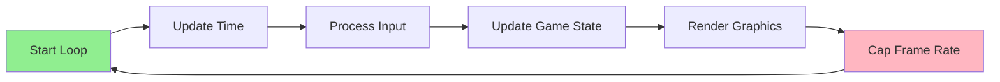
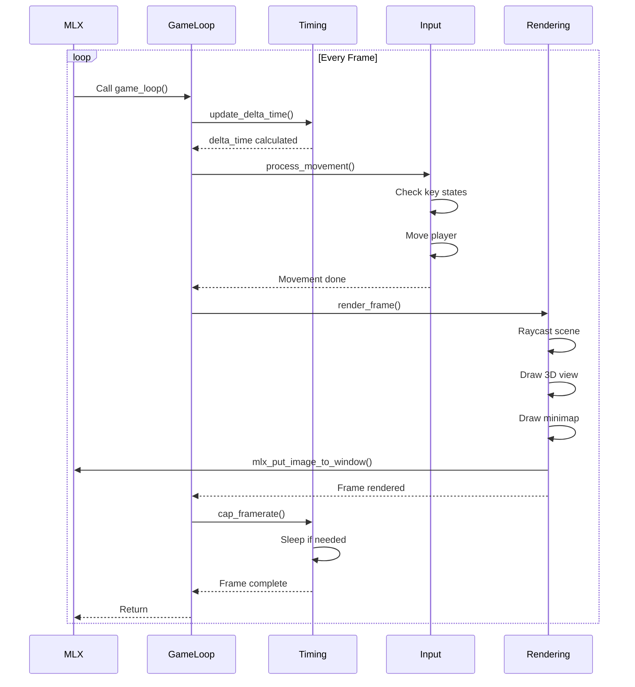
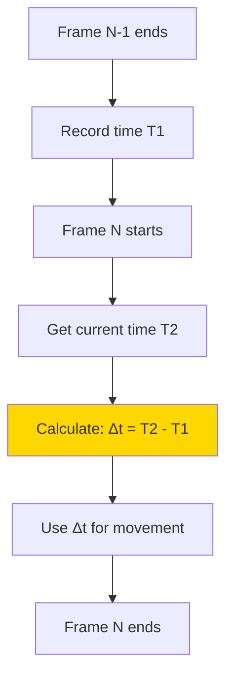
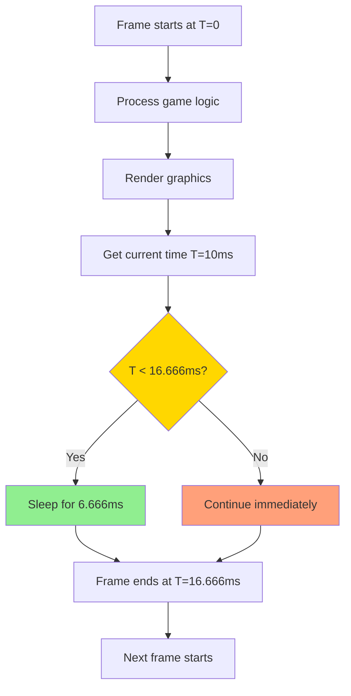
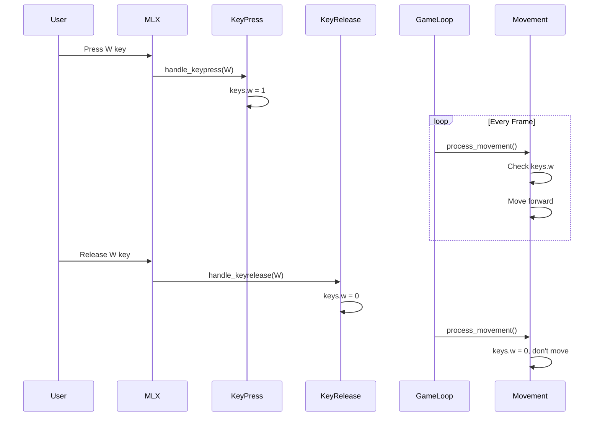

# Game Loop and Timing System

## Overview

The game loop is the **heart of the game**, running continuously at 60 FPS. It handles input, updates game state, renders graphics, and manages timing. This document explains how the game loop works and how timing is controlled.

## Table of Contents

1. [The Game Loop Concept](#the-game-loop-concept)
2. [MLX Loop System](#mlx-loop-system)
3. [Frame Timing](#frame-timing)
4. [Delta Time](#delta-time)
5. [Frame Rate Limiting](#frame-rate-limiting)
6. [Input Processing](#input-processing)

---

## The Game Loop Concept

### What is a Game Loop?

A game loop is an **infinite loop** that runs until the game exits. Each iteration is called a **frame**.



### Standard Game Loop Pattern

```c
while (game_is_running)
{
    // 1. Calculate time since last frame
    update_delta_time();
    
    // 2. Process user input
    process_movement();
    
    // 3. Update game logic
    // (collision detection, physics, etc.)
    
    // 4. Render everything
    render_frame();
    
    // 5. Wait to maintain constant frame rate
    cap_framerate();
}
```

### Why We Need a Game Loop

1. **Continuous Updates**: Game state changes over time
2. **Smooth Animation**: Consistent frame updates create smooth motion
3. **Responsive Input**: Constantly checks for player actions
4. **Time Management**: Controls game speed and physics

---

## MLX Loop System

### How MLX Handles the Loop

MLX provides its own event loop system:

```c
mlx_loop(game.mlx);  // This blocks and runs forever
```

**Important**: `mlx_loop()` never returns! It runs until the program exits.

### Loop Hook

To execute code each frame, we register a **loop hook**:

```c
mlx_loop_hook(game->mlx, game_loop, game);
```

**Parameters**:
- `game->mlx`: The MLX connection
- `game_loop`: Function to call each frame
- `game`: Data passed to the function

### Game Loop Function

**File**: `src/game_utils.c`

```c
void *game_loop(void *game)
{
    t_game *g;
    
    g = (t_game *)game;
    update_delta_time(g);     // Step 1: Update timing
    process_movement(g);      // Step 2: Handle input
    render_frame(g);          // Step 3: Draw everything
    cap_framerate(g);         // Step 4: Maintain 60 FPS
    
    return (NULL);
}
```

### Execution Flow



---

## Frame Timing

### Timing Structure

```c
typedef struct s_time
{
    long    last_frame;    // Time of last frame (microseconds)
    double  delta_time;    // Time since last frame (seconds)
} t_time;
```

### Target Frame Rate

The game targets **60 FPS** (frames per second):

```c
#define TARGET_FPS 60
#define FRAME_TIME_US 16666  // Microseconds per frame (1,000,000 / 60)
```

**Calculation**:
```
Frame time = 1 second / 60 frames = 0.01666... seconds = 16,666 microseconds
```

### Getting Current Time

**File**: `src/timing.c`

```c
long get_time_us(void)
{
    struct timeval tv;
    
    gettimeofday(&tv, NULL);
    return (tv.tv_sec * 1000000 + tv.tv_usec);
}
```

**What it does**:
- Gets current system time
- Converts to microseconds (1/1,000,000 of a second)
- Returns as a `long` integer

**Example**:
```
Time: 1700000000 seconds + 500000 microseconds
= 1700000000000000 + 500000
= 1700000000500000 microseconds total
```

---

## Delta Time

### What is Delta Time?

**Delta time** (Δt) is the time elapsed between the current frame and the previous frame.

### Why Delta Time Matters

Without delta time:
- Fast computers run the game faster
- Slow computers run the game slower
- Inconsistent gameplay experience

With delta time:
- Movement is **time-based**, not frame-based
- Same speed on all computers
- Smooth, consistent motion

### Visual Example

```
Without Delta Time:
Fast PC (100 FPS): Player moves 100 units/second
Slow PC (30 FPS):  Player moves 30 units/second  ← Inconsistent!

With Delta Time:
Fast PC (100 FPS): Player moves 5 units/second × Δt = 5 units/second
Slow PC (30 FPS):  Player moves 5 units/second × Δt = 5 units/second  ← Same!
```

### Calculating Delta Time

**File**: `src/timing.c`

```c
void update_delta_time(t_game *game)
{
    long    current_time;
    long    elapsed;
    
    // Get current time
    current_time = get_time_us();
    
    // Calculate time since last frame
    elapsed = current_time - game->time.last_frame;
    
    // Convert to seconds (from microseconds)
    game->time.delta_time = elapsed / 1000000.0;
    
    // Update last frame time
    game->time.last_frame = current_time;
}
```

### Delta Time Flow



### Example Calculation

```
Frame 1: last_frame = 1000000 μs
Frame 2: current_time = 1016666 μs

elapsed = 1016666 - 1000000 = 16666 μs
delta_time = 16666 / 1000000.0 = 0.016666 seconds

At 60 FPS: delta_time ≈ 0.0167 seconds
At 30 FPS: delta_time ≈ 0.0333 seconds
```

### Using Delta Time for Movement

```c
// Speed constants (units per second)
#define MOVE_SPEED 3.0
#define ROT_SPEED 2.0

void process_movement(t_game *game)
{
    // Scale speed by delta time
    double move_speed = MOVE_SPEED * game->time.delta_time;
    double rot_speed = ROT_SPEED * game->time.delta_time;
    
    if (game->keys.w)
        move_forward(game, move_speed);  // Move 3.0 units/second
    if (game->keys.left)
        rotate_left(game, rot_speed);    // Rotate 2.0 rad/second
}
```

**Calculation**:
```
At 60 FPS (delta_time = 0.0167):
    move_speed = 3.0 × 0.0167 = 0.05 units per frame
    Over 60 frames = 0.05 × 60 = 3.0 units per second ✓

At 30 FPS (delta_time = 0.0333):
    move_speed = 3.0 × 0.0333 = 0.1 units per frame
    Over 30 frames = 0.1 × 30 = 3.0 units per second ✓
```

---

## Frame Rate Limiting

### Why Limit Frame Rate?

1. **Consistent Experience**: Same speed for all players
2. **CPU Efficiency**: Don't waste resources rendering 1000+ FPS
3. **Predictable Timing**: Easier debugging and physics
4. **Power Saving**: Lower power consumption

### Cap Framerate Function

**File**: `src/timing.c`

```c
void cap_framerate(t_game *game)
{
    long current_time;
    long elapsed;
    long sleep_time;
    
    // Get time since frame started
    current_time = get_time_us();
    elapsed = current_time - game->time.last_frame;
    
    // If frame finished too fast, sleep
    if (elapsed < FRAME_TIME_US)
    {
        sleep_time = FRAME_TIME_US - elapsed;
        usleep(sleep_time);  // Sleep for remaining time
    }
}
```

### Frame Rate Control Flow



### Example Scenarios

#### Fast Frame (completes in 10ms)
```
Frame start:   0 μs
Frame end:     10000 μs (10ms of work)
Target:        16666 μs
Sleep needed:  6666 μs (6.666ms)
Total:         16666 μs = 60 FPS ✓
```

#### Slow Frame (completes in 20ms)
```
Frame start:   0 μs
Frame end:     20000 μs (20ms of work)
Target:        16666 μs
Sleep needed:  0 μs (already over time!)
Total:         20000 μs = 50 FPS (slight slowdown)
```

### Frame Time Visualization

```
Target: 60 FPS = 16.666ms per frame

|<------- 16.666ms ------->|
|                          |
|---------|--------|-------|
| Update  | Render | Sleep |
| 2ms     | 8ms    | 6.6ms |
|                          |
|<- Next Frame starts ---->|
```

---

## Input Processing

### Key State Tracking

Instead of handling input directly in callbacks, we track **key states**:

```c
typedef struct s_keys
{
    int w;      // W key pressed?
    int a;      // A key pressed?
    int s;      // S key pressed?
    int d;      // D key pressed?
    int left;   // Left arrow pressed?
    int right;  // Right arrow pressed?
} t_keys;
```

### Why Track States?

**Direct Processing** (Bad):
```c
// In key press event
handle_keypress(...)
{
    if (key == W)
        move_forward();  // Moves once per key press
}
```
❌ Only moves once when key is pressed  
❌ No smooth movement  
❌ Can't hold keys

**State Tracking** (Good):
```c
// In key press event
handle_keypress(...)
{
    if (key == W)
        game->keys.w = 1;  // Mark as pressed
}

// In game loop (every frame)
process_movement(...)
{
    if (game->keys.w)
        move_forward();  // Moves every frame while held
}
```
✓ Smooth continuous movement  
✓ Can hold keys  
✓ Multiple keys simultaneously

### Input Flow



### Processing Multiple Keys

```c
void process_movement(t_game *game)
{
    double move_speed = MOVE_SPEED * game->time.delta_time;
    double rot_speed = ROT_SPEED * game->time.delta_time;
    
    // All keys are checked independently each frame
    if (game->keys.w)
        move_forward(game, move_speed);
    if (game->keys.s)
        move_backward(game, move_speed);
    if (game->keys.a)
        strafe_left(game, move_speed);
    if (game->keys.d)
        strafe_right(game, move_speed);
    if (game->keys.left)
        rotate_left(game, rot_speed);
    if (game->keys.right)
        rotate_right(game, rot_speed);
}
```

**Benefits**:
- Can move forward and strafe simultaneously
- Can rotate while moving
- Smooth, responsive controls

---

## Complete Frame Cycle

### Full Execution Timeline

```mermaid
gantt
    title Single Frame Timeline (16.666ms target)
    dateFormat SSS
    axisFormat %L ms
    
    section Timing
    Update Delta Time    :a1, 000, 1ms
    
    section Input
    Process Movement     :a2, 001, 2ms
    
    section Rendering
    Raycast 3D Scene     :a3, 003, 6ms
    Draw Walls & Textures:a4, 009, 3ms
    Draw Minimap         :a5, 012, 2ms
    Display to Window    :a6, 014, 1ms
    
    section Wait
    Cap Framerate        :a7, 015, 2ms
```



### Frame Budget

At 60 FPS, we have **16.666ms** per frame:

| Task | Time Budget | Percentage |
|------|-------------|------------|
| Delta Time Update | ~0.1ms | 1% |
| Input Processing | ~0.5ms | 3% |
| **Raycasting** | ~8ms | 48% |
| 3D Rendering | ~3ms | 18% |
| Minimap | ~2ms | 12% |
| Display | ~1ms | 6% |
| Frame Cap Wait | ~2ms | 12% |
| **Total** | **16.666ms** | **100%** |

*Note: These are approximate values; actual times vary*

---

## Performance Considerations

### Frame Rate Drops

If processing takes longer than 16.666ms:
- Frame rate drops below 60 FPS
- Game still playable (delta time compensates)
- Movement speed stays consistent

### Optimization Tips

1. **Raycasting**: Most expensive operation
   - Each frame casts 1200 rays (one per screen column)
   - Uses DDA algorithm for efficiency

2. **Pixel Operations**: Fast direct memory access
   - No individual MLX pixel put calls
   - Batch operations in image buffer

3. **Minimap**: Relatively cheap
   - Only draws small viewport
   - Simple tile-based rendering

4. **Texture Sampling**: Optimized lookups
   - Direct memory access
   - No filtering/interpolation

---

## Key Takeaways

1. **Game loop** runs continuously via `mlx_loop_hook()`
2. **Delta time** ensures consistent speed across different hardware
3. **Frame rate capping** maintains 60 FPS target
4. **Key states** enable smooth, responsive controls
5. **Time-based movement** = `speed × delta_time`

## Next Steps

Continue to [Raycasting Fundamentals](./09_raycasting_fundamentals.md) to understand how the 3D view is created.
