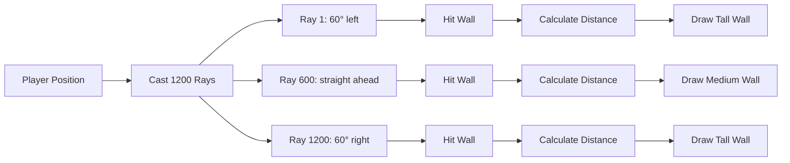
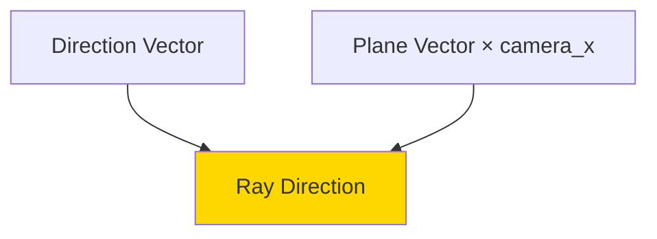
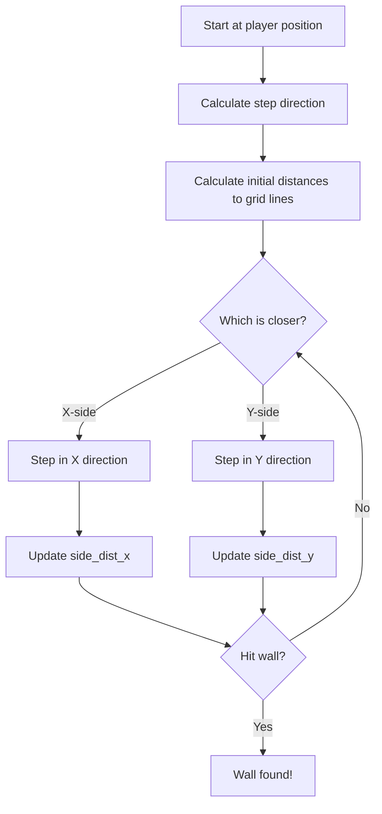
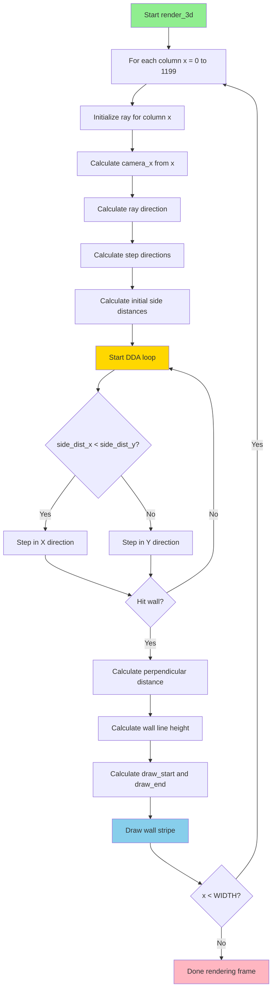

# Raycasting Fundamentals

## Overview

**Raycasting** is the technique used to create the 3D perspective in Cub3D. It's a simplified form of ray tracing that creates a pseudo-3D view by casting rays from the player's position and calculating wall distances. This document explains the mathematics and implementation of raycasting.

## Table of Contents

1. [What is Raycasting?](#what-is-raycasting)
2. [Ray Structure and Initialization](#ray-structure-and-initialization)
3. [Camera and Field of View](#camera-and-field-of-view)
4. [Ray Direction Calculation](#ray-direction-calculation)
5. [DDA Algorithm](#dda-algorithm)
6. [Distance Calculation](#distance-calculation)
7. [Complete Raycasting Process](#complete-raycasting-process)

---

## What is Raycasting?

### The Basic Concept

Raycasting creates a 3D effect by:
1. Casting one ray per screen column (1200 rays for 1200 pixel width)
2. Finding where each ray hits a wall
3. Calculating wall distance
4. Drawing wall height based on distance (closer = taller)



### Top-Down View

```
        Player's View (60° FOV)
             /           \
            /             \
           /               \
          /                 \
    Wall |                   | Wall
         |                   |
         |       Map         |
         |                   |
         ---------------------
```

### Why Raycasting?

**Advantages**:
- Fast (much faster than full ray tracing)
- Simple to implement
- Sufficient for maze-like environments
- Classic retro game aesthetic (Wolfenstein 3D, Doom)

**Limitations**:
- Only works for vertical walls
- Can't look up/down
- No floor/ceiling textures (beyond solid colors)
- Limited to grid-based maps

---

## Ray Structure and Initialization

### Ray Data Structure

**File**: `include/cub3d.h`

```c
typedef struct s_ray
{
    // Ray direction
    double  camera_x;        // X-coordinate in camera space
    double  ray_dir_x;       // Ray direction X component
    double  ray_dir_y;       // Ray direction Y component
    
    // Current map position
    int     map_x;           // Current map tile X
    int     map_y;           // Current map tile Y
    
    // Distance to next grid lines
    double  side_dist_x;     // Distance to next vertical grid line
    double  side_dist_y;     // Distance to next horizontal grid line
    
    // Distance between grid lines
    double  delta_dist_x;    // Distance between vertical grid lines
    double  delta_dist_y;    // Distance between horizontal grid lines
    
    // Wall distance and rendering
    double  perp_wall_dist;  // Perpendicular distance to wall
    int     step_x;          // Step direction X (-1 or +1)
    int     step_y;          // Step direction Y (-1 or +1)
    int     hit;             // Did ray hit a wall?
    int     side;            // Was it X-side (0) or Y-side (1)?
    
    // Wall stripe rendering
    int     line_height;     // Height of wall stripe
    int     draw_start;      // Start Y coordinate
    int     draw_end;        // End Y coordinate
} t_ray;
```

### Initializing a Ray

**File**: `src/raycasting_3d.c`

```c
void init_ray(t_game *game, t_ray *ray, int x)
{
    // Calculate camera X coordinate (-1 to +1 across screen)
    ray->camera_x = 2 * x / (double)WIDTH - 1;
    
    // Calculate ray direction
    ray->ray_dir_x = game->player.dir_x + game->player.plane_x * ray->camera_x;
    ray->ray_dir_y = game->player.dir_y + game->player.plane_y * ray->camera_x;
    
    // Starting map tile
    ray->map_x = (int)game->player.x;
    ray->map_y = (int)game->player.y;
    
    // Calculate delta distances
    ray->delta_dist_x = fabs(1 / ray->ray_dir_x);
    ray->delta_dist_y = fabs(1 / ray->ray_dir_y);
    
    // No wall hit yet
    ray->hit = 0;
}
```

---

## Camera and Field of View

### Understanding Camera Space

The player has two key vectors:
1. **Direction vector** (`dir_x`, `dir_y`): Where player looks
2. **Camera plane** (`plane_x`, `plane_y`): Defines FOV

```
         Left edge of view
              /
             /
    Plane  /
    <---->/
         /|
        / | Direction
       /  |
      /   ↓
     
   Player Position
```

### Camera X Calculation

```c
ray->camera_x = 2 * x / (double)WIDTH - 1;
```

**What this does**:
- Converts screen column `x` to range [-1, +1]
- -1 = leftmost column (left edge of FOV)
- 0 = center column (straight ahead)
- +1 = rightmost column (right edge of FOV)

**Example** (WIDTH = 1200):
```
x = 0    → camera_x = 2*0/1200 - 1    = -1.0  (far left)
x = 600  → camera_x = 2*600/1200 - 1  =  0.0  (center)
x = 1200 → camera_x = 2*1200/1200 - 1 =  1.0  (far right)
```

### Visual Representation

```
Screen columns mapped to camera plane:

Screen:     0              600            1200
           |---------------------------------|
           
camera_x:  -1.0            0.0            +1.0
           
           <---------- Camera Plane -------->
```

---

## Ray Direction Calculation

### The Formula

```c
ray->ray_dir_x = game->player.dir_x + game->player.plane_x * ray->camera_x;
ray->ray_dir_y = game->player.dir_y + game->player.plane_y * ray->camera_x;
```

### Breaking it Down

This formula combines:
1. Player's direction (where they're looking)
2. Camera plane vector (scaled by camera_x)



### Mathematical Explanation

**Direction vector**: Base direction (straight ahead)
```
dir = (dir_x, dir_y)
```

**Plane vector**: Perpendicular to direction, scaled by camera_x
```
plane_offset = (plane_x × camera_x, plane_y × camera_x)
```

**Ray direction**: Sum of both
```
ray_dir = dir + plane_offset
```

### Example Calculation

Player facing **North** with 60° FOV:
```
dir_x = 0, dir_y = -1
plane_x = 0.66, plane_y = 0

For center ray (camera_x = 0):
    ray_dir_x = 0 + 0.66 × 0 = 0
    ray_dir_y = -1 + 0 × 0 = -1
    → Ray goes straight up ✓

For left edge (camera_x = -1):
    ray_dir_x = 0 + 0.66 × (-1) = -0.66
    ray_dir_y = -1 + 0 × (-1) = -1
    → Ray goes up and left ✓

For right edge (camera_x = +1):
    ray_dir_x = 0 + 0.66 × 1 = 0.66
    ray_dir_y = -1 + 0 × 1 = -1
    → Ray goes up and right ✓
```

### Visual Ray Fan

```
         Ray (x=0)          Ray (x=600)       Ray (x=1200)
    camera_x=-1            camera_x=0         camera_x=+1
          ↖                    ↑                   ↗
           \                   |                  /
            \                  |                 /
             \                 |                /
              \                |               /
               \               |              /
                \              |             /
                 \             |            /
                  -------------P-------------
                         Player (P)
                         
                  <---- Camera Plane ---->
```

---

## DDA Algorithm

### What is DDA?

**DDA** (Digital Differential Analyzer) is an efficient algorithm for traversing a grid along a line (ray).

**Goal**: Find the first wall the ray intersects.

### How DDA Works



### Step 1: Calculate Step Direction

**File**: `src/raycasting_3d.c`

```c
void calculate_step_and_side_dist(t_game *game, t_ray *ray)
{
    // For X direction
    if (ray->ray_dir_x < 0)
    {
        ray->step_x = -1;  // Moving left
        ray->side_dist_x = (game->player.x - ray->map_x) * ray->delta_dist_x;
    }
    else
    {
        ray->step_x = 1;   // Moving right
        ray->side_dist_x = (ray->map_x + 1.0 - game->player.x) * ray->delta_dist_x;
    }
    
    // For Y direction
    if (ray->ray_dir_y < 0)
    {
        ray->step_y = -1;  // Moving up
        ray->side_dist_y = (game->player.y - ray->map_y) * ray->delta_dist_y;
    }
    else
    {
        ray->step_y = 1;   // Moving down
        ray->side_dist_y = (ray->map_y + 1.0 - game->player.y) * ray->delta_dist_y;
    }
}
```

### Understanding Delta Distance

**Delta distance** = distance the ray travels between two grid lines

```c
ray->delta_dist_x = fabs(1 / ray->ray_dir_x);
ray->delta_dist_y = fabs(1 / ray->ray_dir_y);
```

**Why?**

For each **unit step** in the grid, the ray travels a certain distance:

```
If ray_dir_x = 0.5 (moving slowly in X):
    To advance 1 grid unit in X requires traveling 2 units along ray
    delta_dist_x = 1 / 0.5 = 2.0

If ray_dir_x = 2.0 (moving quickly in X):
    To advance 1 grid unit in X requires traveling 0.5 units along ray
    delta_dist_x = 1 / 2.0 = 0.5
```

### Visual Example

```
Grid:
    +--------+--------+--------+
    |        |        |        |
    |        |        |        |
    +--------+--------+--------+
    |        |    P   |        |  P = Player (1.3, 1.7)
    |        |   /    |        |  Ray going ↗
    +--------+--/-----+--------+
    |        | /      |        |
    |        |/       |        |
    +--------+--------+--------+

Player at (1.3, 1.7), ray going right-up:
    ray_dir_x = 0.6, ray_dir_y = 0.8
    
    delta_dist_x = 1 / 0.6 = 1.667
    delta_dist_y = 1 / 0.8 = 1.25
    
Initial distances to grid lines:
    Distance to X=2: (2 - 1.3) = 0.7 → side_dist_x = 0.7 × 1.667 = 1.167
    Distance to Y=1: (1.7 - 1) = 0.7 → side_dist_y = 0.7 × 1.25 = 0.875
```

### Step 2: DDA Loop

```c
void perform_dda(t_game *game, t_ray *ray)
{
    while (ray->hit == 0)
    {
        // Check which grid line is closer
        if (ray->side_dist_x < ray->side_dist_y)
        {
            // X-side is closer, step in X
            ray->side_dist_x += ray->delta_dist_x;
            ray->map_x += ray->step_x;
            ray->side = 0;  // Hit vertical wall (X-side)
        }
        else
        {
            // Y-side is closer, step in Y
            ray->side_dist_y += ray->delta_dist_y;
            ray->map_y += ray->step_y;
            ray->side = 1;  // Hit horizontal wall (Y-side)
        }
        
        // Check if we hit a wall
        if (ray->map_x < 0 || ray->map_x >= game->config.map.width
            || ray->map_y < 0 || ray->map_y >= game->config.map.height)
            ray->hit = 1;  // Out of bounds
        else if (game->config.map.grid[ray->map_y][ray->map_x] == WALL)
            ray->hit = 1;  // Hit wall tile
    }
}
```

### DDA Step-by-Step Example

```
Starting position: (1.3, 1.7)
Initial: side_dist_x = 1.167, side_dist_y = 0.875

Step 1:
    side_dist_y < side_dist_x → Step in Y
    map_y: 1 → 2
    side_dist_y: 0.875 → 0.875 + 1.25 = 2.125
    side = 1 (Y-side)
    
Step 2:
    side_dist_x < side_dist_y → Step in X
    map_x: 1 → 2
    side_dist_x: 1.167 → 1.167 + 1.667 = 2.834
    side = 0 (X-side)
    
Step 3:
    side_dist_y < side_dist_x → Step in Y
    map_y: 2 → 3
    Check map[3][2] → Wall! hit = 1
    
Done! Hit wall at (2, 3) on Y-side
```

### Visual DDA Traversal

```
+--------+--------+--------+--------+
|        |        |        |        |
|    1   |    2   |    3   |    4   |
+--------+--------+--------+--------+
|        |        | ✗      |        |
|    1   | P ----→↗ Wall  |        |
+--------+--------+--------+--------+
|        |        |        |        |
|    2   |        |        |        |
+--------+--------+--------+--------+

P: Player starts (1, 1)
Path: (1,1) → (1,2) → (2,2) → ✗ Hit wall
```

---

## Distance Calculation

### Why Perpendicular Distance?

We need the **perpendicular** distance, not the **actual ray distance**:

```
    Wall
    ||||
    ||||
    ||| ← Perpendicular distance
    ||
    ↗ ← Actual ray distance
   /
  P (Player)
```

**Why?**
- Actual distance causes **fisheye effect** (barrel distortion)
- Perpendicular distance gives straight walls

### Fisheye Effect Example

```
Without correction (using ray distance):
    Center rays: short distance → medium height
    Edge rays: long distance → too short
    Result: Walls curve inward (barrel distortion)
    
With correction (using perpendicular distance):
    All rays measure perpendicular to camera plane
    Result: Straight walls ✓
```

### Calculating Perpendicular Distance

**File**: `src/raycasting_3d.c`

```c
void calculate_wall_distance(t_game *game, t_ray *ray)
{
    if (ray->side == 0)  // X-side (vertical wall)
    {
        ray->perp_wall_dist = (ray->map_x - game->player.x
                + (1 - ray->step_x) / 2) / ray->ray_dir_x;
    }
    else  // Y-side (horizontal wall)
    {
        ray->perp_wall_dist = (ray->map_y - game->player.y
                + (1 - ray->step_y) / 2) / ray->ray_dir_y;
    }
    
    // Calculate wall line height
    ray->line_height = (int)(HEIGHT / ray->perp_wall_dist);
    
    // Calculate vertical start and end
    ray->draw_start = -ray->line_height / 2 + HEIGHT / 2;
    if (ray->draw_start < 0)
        ray->draw_start = 0;
    
    ray->draw_end = ray->line_height / 2 + HEIGHT / 2;
    if (ray->draw_end >= HEIGHT)
        ray->draw_end = HEIGHT - 1;
}
```

### Understanding the Formula

**For X-side**:
```c
perp_wall_dist = (map_x - player.x + (1 - step_x) / 2) / ray_dir_x
```

Breaking it down:
1. `map_x - player.x`: Distance in grid units
2. `(1 - step_x) / 2`: Adjusts for which edge of grid cell
   - If `step_x = 1` (going right): `(1-1)/2 = 0`
   - If `step_x = -1` (going left): `(1-(-1))/2 = 1`
3. Divide by `ray_dir_x`: Project onto ray direction

### Wall Height Calculation

```c
ray->line_height = (int)(HEIGHT / ray->perp_wall_dist);
```

**Logic**:
- Closer walls (small distance) → Large height
- Farther walls (large distance) → Small height

**Example** (HEIGHT = 800):
```
Distance 1.0 → line_height = 800 / 1.0 = 800 pixels (fills screen)
Distance 2.0 → line_height = 800 / 2.0 = 400 pixels (half screen)
Distance 4.0 → line_height = 800 / 4.0 = 200 pixels (quarter screen)
```

### Vertical Position

```c
ray->draw_start = -ray->line_height / 2 + HEIGHT / 2;
ray->draw_end = ray->line_height / 2 + HEIGHT / 2;
```

**Centering the wall**:
```
HEIGHT = 800, line_height = 400

draw_start = -400/2 + 800/2 = -200 + 400 = 200
draw_end = 400/2 + 800/2 = 200 + 400 = 600

Screen:
    Y=0   ┌────────────┐ Top
    Y=200 ├────────────┤ Wall starts (draw_start)
          │   WALL    │
    Y=400 │  (center)  │
          │   WALL    │
    Y=600 ├────────────┤ Wall ends (draw_end)
    Y=800 └────────────┘ Bottom
```

---

## Complete Raycasting Process

### Main Rendering Loop

**File**: `src/rendering_3d.c`

```c
void render_3d(t_game *game)
{
    t_ray ray;
    int x;
    
    // Cast one ray per screen column
    x = 0;
    while (x < WIDTH)
    {
        // Step 1: Initialize ray for this column
        init_ray(game, &ray, x);
        
        // Step 2: Calculate step direction and initial distances
        calculate_step_and_side_dist(game, &ray);
        
        // Step 3: Perform DDA to find wall
        perform_dda(game, &ray);
        
        // Step 4: Calculate perpendicular distance
        calculate_wall_distance(game, &ray);
        
        // Step 5: Draw this wall stripe
        draw_wall_stripe(game, &ray, x);
        
        x++;
    }
}
```

### Complete Flow Diagram



---

## Key Takeaways

1. **One ray per column**: Creates 3D effect from 2D map
2. **Camera space**: Maps screen columns to FOV range [-1, +1]
3. **Ray direction**: Combines player direction and camera plane
4. **DDA algorithm**: Efficiently finds wall intersections
5. **Perpendicular distance**: Prevents fisheye distortion
6. **Wall height**: Inversely proportional to distance

## Next Steps

Continue to [3D Rendering and Textures](./10_3d_rendering_textures.md) to learn how walls are drawn with textures.
