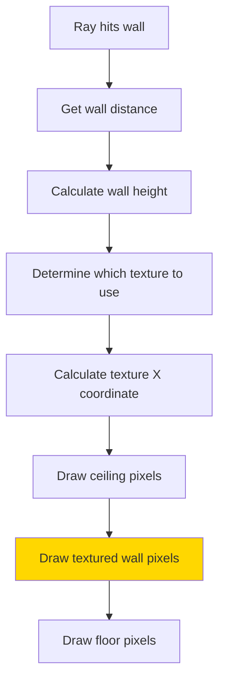
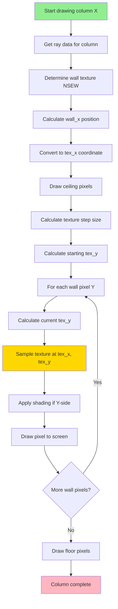

# 3D Rendering and Textures

## Overview

After raycasting determines wall distances, we need to **draw the walls** with textures applied. This document explains how textured 3D walls are rendered column-by-column to create the final image.

## Table of Contents

1. [Wall Rendering Overview](#wall-rendering-overview)
2. [Texture Mapping Fundamentals](#texture-mapping-fundamentals)
3. [Determining Wall Texture](#determining-wall-texture)
4. [Texture Coordinate Calculation](#texture-coordinate-calculation)
5. [Drawing Textured Walls](#drawing-textured-walls)
6. [Floor and Ceiling Rendering](#floor-and-ceiling-rendering)
7. [Shading and Depth](#shading-and-depth)

---

## Wall Rendering Overview

### The Rendering Process

For each ray (screen column), we:
1. Draw ceiling (from top to wall start)
2. Draw textured wall (from wall start to wall end)
3. Draw floor (from wall end to bottom)



### Column-by-Column Rendering

```
Screen divided into columns:

Column: 0  1  2  3  ... 1197 1198 1199
        |  |  |  |       |    |    |
        ▼  ▼  ▼  ▼       ▼    ▼    ▼
     ┌──┬──┬──┬──┬───────┬────┬────┬──┐
     │  │  │  │  │  ...  │    │    │  │ ← Each column
     │  │  │  │  │  ...  │    │    │  │   drawn separately
     │  │█ │█ │  │  ...  │    │█   │  │
     │  │█ │██│  │  ...  │    │██  │  │
     └──┴──┴──┴──┴───────┴────┴────┴──┘
```

Each column represents **one ray's result**.

---

## Texture Mapping Fundamentals

### What is Texture Mapping?

**Texture mapping** applies a 2D image (texture) onto a 3D surface (wall).

```
Texture (64x64):        Wall in 3D:
┌────────────┐         
│ ▓▒░ Brick  │         │  Apply    │
│ ▓▒░ Pattern│    →    │  Texture  │
│ ▓▒░        │         │  Here     │
└────────────┘         
```

### Texture Coordinates

Textures use **UV coordinates**:
- **U**: Horizontal position (0.0 to 1.0 across width)
- **V**: Vertical position (0.0 to 1.0 across height)

```
V=0.0  ┌────────────────┐
       │                │
V=0.5  │       ·        │  ← (U=0.5, V=0.5) = center
       │                │
V=1.0  └────────────────┘
     U=0.0            U=1.0
```

### Texture Sampling

To get a pixel from texture:
```c
// Convert UV (0.0-1.0) to pixel coordinates
int tex_x = (int)(u * texture->width);
int tex_y = (int)(v * texture->height);

// Get color at that position
int color = get_texture_color(texture, tex_x, tex_y);
```

---

## Determining Wall Texture

### Texture Selection Logic

The texture depends on **which side of the wall** was hit:

**File**: `src/rendering_3d_utils.c`

```c
t_texture *get_wall_texture(t_game *game, t_ray *ray)
{
    if (ray->side == 0)  // X-side (vertical walls)
    {
        if (ray->ray_dir_x > 0)
            return (&game->textures[EAST]);   // Hit from west, show east texture
        else
            return (&game->textures[WEST]);   // Hit from east, show west texture
    }
    else  // Y-side (horizontal walls)
    {
        if (ray->ray_dir_y > 0)
            return (&game->textures[SOUTH]);  // Hit from north, show south texture
        else
            return (&game->textures[NORTH]);  // Hit from south, show north texture
    }
}
```

### Visual Texture Selection

```
Top view of map:

         NORTH texture
              ↓
        ┌─────────────┐
   WEST │             │ EAST
texture →│    Wall     │← texture
        │             │
        └─────────────┘
              ↑
         SOUTH texture

Ray direction determines which texture is visible
```

### Side Detection

```c
ray->side  // 0 = X-side (vertical), 1 = Y-side (horizontal)
```

**X-side (vertical walls)**:
- Walls parallel to Y-axis
- Use EAST or WEST texture

**Y-side (horizontal walls)**:
- Walls parallel to X-axis
- Use NORTH or SOUTH texture

---

## Texture Coordinate Calculation

### Step 1: Calculate Wall X

**Wall X** is where exactly on the wall the ray hit (0.0 to 1.0):

**File**: `src/rendering_3d_utils.c`

```c
double calculate_wall_x(t_game *game, t_ray *ray)
{
    double wall_x;
    
    if (ray->side == 0)  // X-side
        wall_x = game->player.y + ray->perp_wall_dist * ray->ray_dir_y;
    else  // Y-side
        wall_x = game->player.x + ray->perp_wall_dist * ray->ray_dir_x;
    
    wall_x -= floor(wall_x);  // Get fractional part (0.0 to 1.0)
    return (wall_x);
}
```

### Understanding Wall X

```
Wall tile (X-side):
Y-axis
│
├─────┐  ← Y = 5.0
│     │
│  ·  │  ← Ray hits at Y = 5.3
│     │
├─────┘  ← Y = 4.0
│
X-axis

wall_x = 5.3 - floor(5.3) = 5.3 - 5.0 = 0.3
→ Hit at 30% along the wall (0.3 = 30%)
```

### Step 2: Convert to Texture X

```c
int calculate_tex_x(t_ray *ray, double wall_x, int tex_width)
{
    int tex_x;
    
    // Map wall_x (0.0-1.0) to texture width (0 to tex_width-1)
    tex_x = (int)(wall_x * (double)tex_width);
    
    // Flip texture for certain orientations
    if (ray->side == 0 && ray->ray_dir_x > 0)
        tex_x = tex_width - tex_x - 1;
    if (ray->side == 1 && ray->ray_dir_y < 0)
        tex_x = tex_width - tex_x - 1;
    
    return (tex_x);
}
```

### Why Flip Texture?

Different viewing angles need texture flipping for correct orientation:

```
Looking at wall from different sides:

From West (ray_dir_x > 0):
    Texture should be flipped
    [Brick pattern reversed]

From East (ray_dir_x < 0):
    Texture normal
    [Brick pattern normal]
```

### Example Calculation

```
Texture width: 64 pixels
wall_x: 0.25 (hit at 25% along wall)

tex_x = (int)(0.25 × 64) = (int)(16.0) = 16

→ Use column 16 of the texture
```

---

## Drawing Textured Walls

### Main Wall Drawing Function

**File**: `src/rendering_3d.c`

```c
void draw_wall_stripe(t_game *game, t_ray *ray, int x)
{
    int y;
    int colors[2];
    
    // Get ceiling and floor colors
    colors[0] = (game->config.ceiling.r << 16)
        | (game->config.ceiling.g << 8) | game->config.ceiling.b;
    colors[1] = (game->config.floor.r << 16)
        | (game->config.floor.g << 8) | game->config.floor.b;
    
    // Draw ceiling
    y = 0;
    while (y < ray->draw_start)
    {
        my_mlx_pixel_put(&game->img, x, y, colors[0]);
        y++;
    }
    
    // Draw textured wall
    draw_textured_wall(game, ray, x);
    
    // Draw floor
    y = ray->draw_end;
    while (y < HEIGHT)
    {
        my_mlx_pixel_put(&game->img, x, y, colors[1]);
        y++;
    }
}
```

### Textured Wall Drawing

```c
static void draw_textured_wall(t_game *game, t_ray *ray, int x)
{
    t_texture   *texture;
    int         tex_x;
    double      vars[2];
    int         color;
    int         y;
    
    // Get which texture to use
    texture = get_wall_texture(game, ray);
    
    // Calculate X coordinate in texture
    tex_x = calculate_tex_x(ray, calculate_wall_x(game, ray), texture->width);
    
    // Calculate step size for texture Y
    vars[0] = 1.0 * texture->height / ray->line_height;
    
    // Calculate starting texture Y position
    vars[1] = (ray->draw_start - HEIGHT / 2 + ray->line_height / 2) * vars[0];
    
    // Draw each pixel of the wall stripe
    y = ray->draw_start;
    while (y < ray->draw_end)
    {
        // Get texture Y coordinate
        int tex_y = (int)vars[1] & (texture->height - 1);
        
        // Get pixel color from texture
        color = get_texture_color(texture, tex_x, tex_y);
        
        // Apply shading for Y-side walls
        if (ray->side == 1)
            color = (color >> 1) & 8355711;
        
        // Draw pixel to screen
        my_mlx_pixel_put(&game->img, x, y, color);
        
        // Move to next texture Y
        vars[1] += vars[0];
        y++;
    }
}
```

### Texture Y Calculation Explained

#### Step Size (`vars[0]`)

```c
vars[0] = 1.0 * texture->height / ray->line_height;
```

**Purpose**: How much to increment texture Y for each screen pixel.

**Example**:
```
Texture height: 64 pixels
Wall line height: 400 pixels (on screen)

step = 64 / 400 = 0.16

→ For every pixel on screen, advance 0.16 pixels in texture
→ Stretches 64-pixel texture across 400-pixel wall
```

#### Starting Position (`vars[1]`)

```c
vars[1] = (ray->draw_start - HEIGHT / 2 + ray->line_height / 2) * vars[0];
```

**Purpose**: Aligns texture properly when wall is partially off-screen.

**Example**:
```
HEIGHT: 800
line_height: 1200 (very tall wall, partially visible)
draw_start: 0 (clipped to top)

vars[1] = (0 - 400 + 600) × step = 200 × step
→ Start sampling texture from middle (not beginning)
```

#### Y Coordinate Loop

```c
int tex_y = (int)vars[1] & (texture->height - 1);
```

**Bit masking** `& (texture->height - 1)` ensures tex_y wraps around:
```
If texture->height = 64 (which is 2^6):
    texture->height - 1 = 63 = 0b00111111
    
Any value ANDed with 63 gives result 0-63:
    65 & 63 = 1
    127 & 63 = 63
    200 & 63 = 8
```

---

## Floor and Ceiling Rendering

### Solid Color Rendering

Cub3D uses **solid colors** for floor and ceiling (no textures):

```c
// Convert RGB to color integer
colors[0] = (ceiling.r << 16) | (ceiling.g << 8) | ceiling.b;
colors[1] = (floor.r << 16) | (floor.g << 8) | floor.b;
```

### Color Bit Packing

```
RGB values: R=255, G=128, B=64

Shift and combine:
    R << 16  = 0x00FF0000
    G << 8   = 0x00008000
    B        = 0x00000040
    ───────────────────────
    Combined = 0x00FF8040
```

### Drawing Ceiling

```c
y = 0;
while (y < ray->draw_start)
{
    my_mlx_pixel_put(&game->img, x, y, colors[0]);
    y++;
}
```

### Drawing Floor

```c
y = ray->draw_end;
while (y < HEIGHT)
{
    my_mlx_pixel_put(&game->img, x, y, colors[1]);
    y++;
}
```

### Column Layout

```
Screen column X:

Y=0     ┌─────┐ ← Ceiling starts
        │ ███ │   (colors[0])
        │ ███ │
Y=200   ├─────┤ ← Wall starts (draw_start)
        │▓▒░▓▒│   
        │▓▒░▓▒│   Textured wall
        │▓▒░▓▒│
Y=600   ├─────┤ ← Wall ends (draw_end)
        │ ███ │
        │ ███ │   Floor (colors[1])
Y=800   └─────┘ ← Screen bottom
```

---

## Shading and Depth

### Y-Side Shading

To create depth perception, **Y-side walls** (horizontal) are darker:

```c
if (ray->side == 1)
    color = (color >> 1) & 8355711;
```

### How This Works

#### Bit Shift Right by 1

```c
color >> 1
```

Divides each color component by 2:
```
Original: 0x00RRGGBB
Shifted:  0x00(RR/2)(GG/2)(BB/2)
```

#### Bitmask `& 8355711`

```
8355711 = 0x7F7F7F
Binary:   01111111 01111111 01111111
```

This masks out overflow bits from the shift:

```
Example:
    Original color: 0x00FF8040
                    R=255, G=128, B=64
    
    After >> 1:     0x007F4020
                    R=127, G=64, B=32
    
    After & 0x7F7F7F: 0x007F4020 (no change, already clean)
```

### Why Darken Y-Sides?

```
Top view:

   Vertical walls (X-side)     Horizontal walls (Y-side)
        │                            ─────
        │ Lighter                    Darker ─────
        │                            ─────
        
Creates visual distinction between wall orientations
```

### Visual Effect

```
X-side wall:           Y-side wall:
┌─────────────┐       ┌─────────────┐
│ ▓▓▓▓▓▓▓▓▓▓▓ │       │ ▒▒▒▒▒▒▒▒▒▒▒ │
│ ▓▓▓ Bright  │       │ ▒▒▒ Darker  │
│ ▓▓▓▓▓▓▓▓▓▓▓ │       │ ▒▒▒▒▒▒▒▒▒▒▒ │
└─────────────┘       └─────────────┘
```

---

## Complete Rendering Pipeline

### Full Process Diagram



### Performance Notes

**Per Frame** (60 FPS):
- **1200 rays** cast (one per column)
- **1200 × 800 = 960,000 pixels** drawn
- Most time spent in raycasting DDA
- Texture sampling is fast (direct memory access)

**Optimization**: 
- Image buffer manipulation (not individual MLX pixel calls)
- No filtering or antialiasing
- Simple integer math for texture coordinates

---

## Example: Drawing One Column

### Given Data
```
Column x: 300
Ray hit wall at distance: 3.5 units
Wall side: X-side (vertical)
Ray direction X: positive (going right)
Wall line height: 228 pixels
Draw start: 286
Draw end: 514
```

### Execution Steps

```
1. Choose texture: EAST (ray going right on X-side)

2. Calculate wall_x:
   wall_x = player.y + 3.5 × ray_dir_y
   wall_x = 2.8 (example)
   wall_x -= floor(2.8) = 0.8
   → Hit at 80% along wall

3. Calculate tex_x:
   tex_x = (int)(0.8 × 64) = 51
   Flip for east: tex_x = 64 - 51 - 1 = 12
   → Use texture column 12

4. Draw ceiling (y=0 to y=286):
   for y in 0..285:
       put_pixel(300, y, ceiling_color)

5. Draw wall (y=286 to y=514):
   step = 64 / 228 = 0.281
   tex_y_pos = 0.0
   
   for y in 286..513:
       tex_y = (int)tex_y_pos = varies 0..63
       color = texture[12][tex_y]
       if (X-side): no shading
       put_pixel(300, y, color)
       tex_y_pos += 0.281

6. Draw floor (y=514 to y=799):
   for y in 514..799:
       put_pixel(300, y, floor_color)
```

---

## Key Takeaways

1. **Column-by-column**: Each ray draws one vertical stripe
2. **Texture selection**: Based on wall side (NSEW)
3. **Texture coordinates**: wall_x and tex_y map texture to wall
4. **Stretching**: Texture height scales to fit wall height
5. **Shading**: Y-side walls darkened for depth
6. **Solid colors**: Floor and ceiling use RGB from config

## Next Steps

Continue to [Player Controls and Movement](./11_player_controls_movement.md) to understand how player input is handled.
