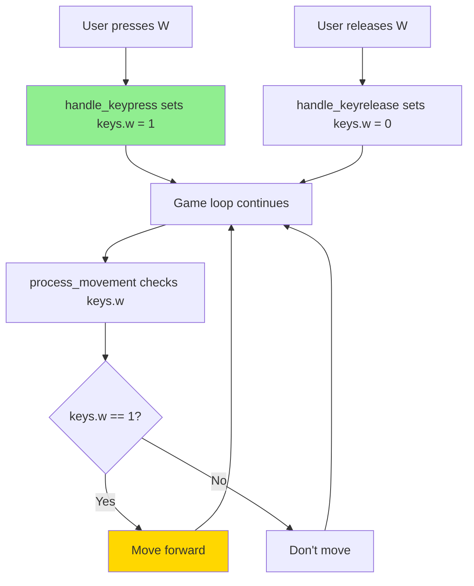
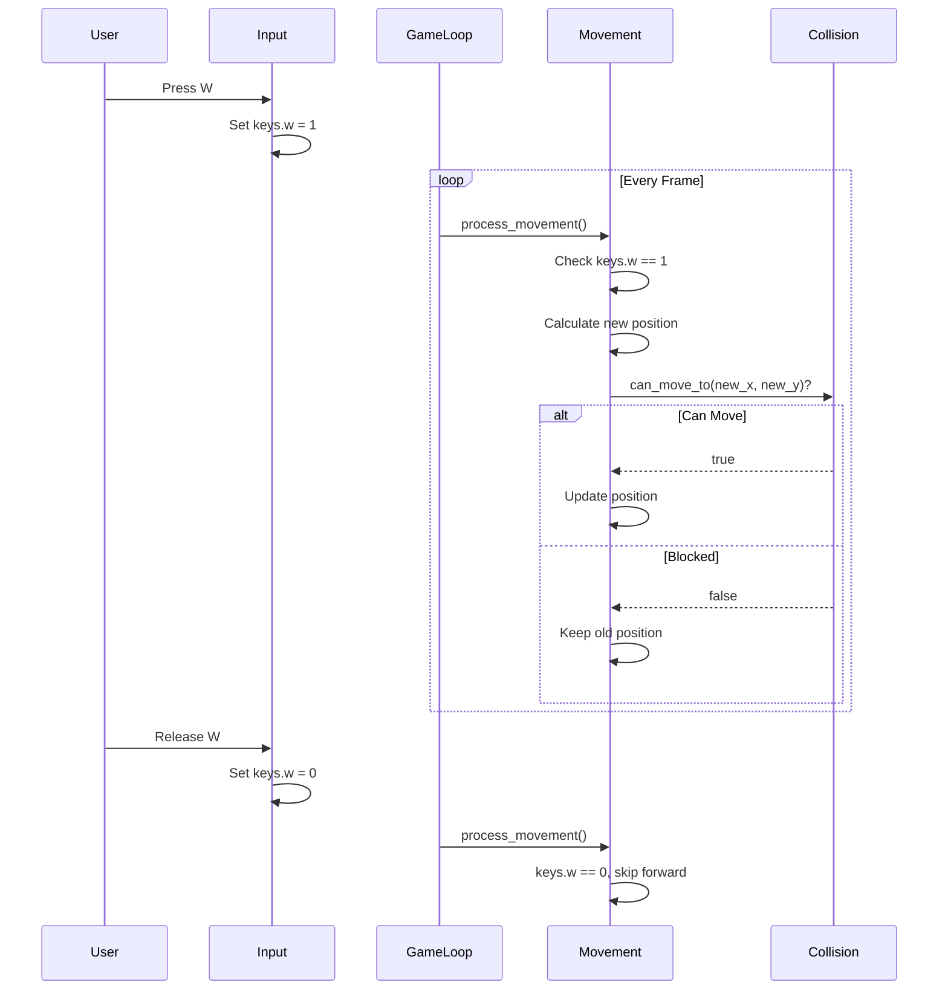

# Player Controls and Movement

## Overview

The player can move through the 3D world using keyboard controls. This document explains how input is captured, how movement is calculated, and how collision detection works to prevent walking through walls.

## Table of Contents

1. [Control Scheme](#control-scheme)
2. [Input System Architecture](#input-system-architecture)
3. [Movement Vectors](#movement-vectors)
4. [Forward and Backward Movement](#forward-and-backward-movement)
5. [Strafing (Side Movement)](#strafing-side-movement)
6. [Rotation](#rotation)
7. [Collision Detection](#collision-detection)

---

## Control Scheme

### Key Bindings

| Key | Action | Description |
|-----|--------|-------------|
| **W** | Move Forward | Move in the direction you're facing |
| **S** | Move Backward | Move opposite to facing direction |
| **A** | Strafe Left | Move left perpendicular to view |
| **D** | Strafe Right | Move right perpendicular to view |
| **←** | Rotate Left | Turn view left (counter-clockwise) |
| **→** | Rotate Right | Turn view right (clockwise) |
| **ESC** | Exit | Close the game |

### Key Codes

**File**: `include/cub3d.h`

```c
#define KEY_ESC 65307
#define KEY_W 119
#define KEY_A 97
#define KEY_S 115
#define KEY_D 100
#define KEY_LEFT 65361
#define KEY_RIGHT 65363
```

*Note*: Key codes are specific to X11 on Linux.

---

## Input System Architecture

### State-Based Input

The game uses **state tracking** instead of immediate response:



### Key State Structure

```c
typedef struct s_keys
{
    int w;      // Forward
    int a;      // Strafe left
    int s;      // Backward
    int d;      // Strafe right
    int left;   // Rotate left
    int right;  // Rotate right
} t_keys;
```

### Key Press Handler

**File**: `src/input_handlers.c`

```c
int handle_keypress(int keycode, void *game)
{
    t_game *g = (t_game *)game;
    
    if (keycode == KEY_ESC)
        close_window(g);
    if (keycode == KEY_W)
        g->keys.w = 1;
    if (keycode == KEY_A)
        g->keys.a = 1;
    if (keycode == KEY_S)
        g->keys.s = 1;
    if (keycode == KEY_D)
        g->keys.d = 1;
    if (keycode == KEY_LEFT)
        g->keys.left = 1;
    if (keycode == KEY_RIGHT)
        g->keys.right = 1;
    
    return (0);
}
```

### Key Release Handler

```c
int handle_keyrelease(int keycode, void *game)
{
    t_game *g = (t_game *)game;
    
    if (keycode == KEY_W)
        g->keys.w = 0;
    if (keycode == KEY_A)
        g->keys.a = 0;
    if (keycode == KEY_S)
        g->keys.s = 0;
    if (keycode == KEY_D)
        g->keys.d = 0;
    if (keycode == KEY_LEFT)
        g->keys.left = 0;
    if (keycode == KEY_RIGHT)
        g->keys.right = 0;
    
    return (0);
}
```

### Movement Processing

**File**: `src/player_rotation.c`

```c
void process_movement(t_game *game)
{
    double move_speed;
    double rot_speed;
    
    // Scale speeds by delta time for frame-independence
    move_speed = MOVE_SPEED * game->time.delta_time;
    rot_speed = ROT_SPEED * game->time.delta_time;
    
    // Check each key independently
    if (game->keys.w)
        move_forward(game, move_speed);
    if (game->keys.s)
        move_backward(game, move_speed);
    if (game->keys.a)
        strafe_left(game, move_speed);
    if (game->keys.d)
        strafe_right(game, move_speed);
    if (game->keys.left)
        rotate_left(game, rot_speed);
    if (game->keys.right)
        rotate_right(game, rot_speed);
}
```

### Speed Constants

```c
#define MOVE_SPEED 3.0  // Units per second
#define ROT_SPEED 2.0   // Radians per second
```

**Frame-independent speed**:
```
Actual movement per frame = MOVE_SPEED × delta_time

At 60 FPS (delta_time = 0.0167):
    move_speed = 3.0 × 0.0167 = 0.05 units per frame
    
At 30 FPS (delta_time = 0.0333):
    move_speed = 3.0 × 0.0333 = 0.1 units per frame
    
Both result in 3.0 units per second!
```

---

## Movement Vectors

### Player Orientation Vectors

The player has two key vectors:

```c
typedef struct s_player
{
    double x;         // Position X
    double y;         // Position Y
    double dir_x;     // Direction vector X
    double dir_y;     // Direction vector Y
    double plane_x;   // Camera plane X
    double plane_y;   // Camera plane Y
} t_player;
```

### Direction Vector

**What it represents**: The direction the player is facing.

```
         ↑ (dir_x, dir_y)
         │
         │ Direction
         │
         P (Player)
```

**Properties**:
- Unit vector (length = 1.0)
- Points where player looks
- Used for forward/backward movement

### Camera Plane Vector

**What it represents**: Perpendicular to direction, defines FOV.

```
    Plane (plane_x, plane_y)
    <----->
         │
         ↓ Direction
         P
```

**Properties**:
- Perpendicular to direction vector
- Length ≈ 0.66 (for 60° FOV)
- Used for strafing left/right

### Example Orientations

#### Facing North
```c
dir_x = 0.0, dir_y = -1.0    // Pointing up
plane_x = 0.66, plane_y = 0.0 // Perpendicular (horizontal)
```

#### Facing East
```c
dir_x = 1.0, dir_y = 0.0     // Pointing right
plane_x = 0.0, plane_y = 0.66 // Perpendicular (vertical)
```

---

## Forward and Backward Movement

### Forward Movement

**File**: `src/player_movement.c`

```c
void move_forward(t_game *game, double move_speed)
{
    double new_x;
    double new_y;
    
    // Calculate new position
    new_x = game->player.x + game->player.dir_x * move_speed;
    new_y = game->player.y + game->player.dir_y * move_speed;
    
    // Check collision before moving
    if (can_move_to(game, new_x, new_y))
    {
        game->player.x = new_x;
        game->player.y = new_y;
    }
}
```

### Backward Movement

```c
void move_backward(t_game *game, double move_speed)
{
    double new_x;
    double new_y;
    
    // Move opposite to direction
    new_x = game->player.x - game->player.dir_x * move_speed;
    new_y = game->player.y - game->player.dir_y * move_speed;
    
    if (can_move_to(game, new_x, new_y))
    {
        game->player.x = new_x;
        game->player.y = new_y;
    }
}
```

### Vector Math Explanation

**Forward**: Add direction vector
```
new_position = current_position + (direction × speed)

Example (facing north, speed=0.05):
    dir = (0, -1)
    new_x = 5.0 + 0 × 0.05 = 5.0
    new_y = 5.0 + (-1) × 0.05 = 4.95
    
    → Moved 0.05 units north (up)
```

**Backward**: Subtract direction vector
```
new_position = current_position - (direction × speed)

Example (facing north, speed=0.05):
    new_x = 5.0 - 0 × 0.05 = 5.0
    new_y = 5.0 - (-1) × 0.05 = 5.05
    
    → Moved 0.05 units south (down)
```

### Visual Example

```
Map grid:
    4 ┌──────┬──────┬──────┐
      │      │      │      │
    3 ├──────┼──────┼──────┤
      │      │  P   │      │  P facing ↑ (north)
    2 ├──────┼──▲───┼──────┤  Press W
      │      │  │   │      │  Move to (5.0, 2.95)
    1 ├──────┼──┼───┼──────┤
      │      │      │      │
    0 └──────┴──────┴──────┘
        4      5      6
```

---

## Strafing (Side Movement)

### What is Strafing?

**Strafing** means moving sideways without changing view direction.

```
         ↑ Looking
         │
    ←────P────→ Strafe left/right
```

### Strafe Left

**File**: `src/player_movement.c`

```c
void strafe_left(t_game *game, double move_speed)
{
    double new_x;
    double new_y;
    
    // Move opposite to camera plane
    new_x = game->player.x - game->player.plane_x * move_speed;
    new_y = game->player.y - game->player.plane_y * move_speed;
    
    if (can_move_to(game, new_x, new_y))
    {
        game->player.x = new_x;
        game->player.y = new_y;
    }
}
```

### Strafe Right

```c
void strafe_right(t_game *game, double move_speed)
{
    double new_x;
    double new_y;
    
    // Move along camera plane
    new_x = game->player.x + game->player.plane_x * move_speed;
    new_y = game->player.y + game->player.plane_y * move_speed;
    
    if (can_move_to(game, new_x, new_y))
    {
        game->player.x = new_x;
        game->player.y = new_y;
    }
}
```

### Why Use Plane Vector?

The **plane vector is perpendicular** to direction:

```
Facing North:
    direction = (0, -1)  pointing ↑
    plane = (0.66, 0)    pointing →
    
    Strafe right: move along plane → (move right)
    Strafe left: move opposite plane ← (move left)
```

### Strafe Calculation Example

```
Player facing North:
    dir = (0, -1)
    plane = (0.66, 0)
    position = (5.0, 5.0)
    move_speed = 0.05

Strafe right (press D):
    new_x = 5.0 + 0.66 × 0.05 = 5.033
    new_y = 5.0 + 0 × 0.05 = 5.0
    
    → Moved 0.033 units to the right

Strafe left (press A):
    new_x = 5.0 - 0.66 × 0.05 = 4.967
    new_y = 5.0 - 0 × 0.05 = 5.0
    
    → Moved 0.033 units to the left
```

---

## Rotation

### Rotation Math

Rotation uses **2D rotation matrices**:

```
Rotate vector (x, y) by angle θ:

new_x = x × cos(θ) - y × sin(θ)
new_y = x × sin(θ) + y × cos(θ)
```

### Rotate Left (Counter-Clockwise)

**File**: `src/player_rotation.c`

```c
void rotate_left(t_game *game, double rot_speed)
{
    double old_dir_x;
    double old_plane_x;
    
    // Rotate direction vector
    old_dir_x = game->player.dir_x;
    game->player.dir_x = game->player.dir_x * cos(-rot_speed)
        - game->player.dir_y * sin(-rot_speed);
    game->player.dir_y = old_dir_x * sin(-rot_speed)
        + game->player.dir_y * cos(-rot_speed);
    
    // Rotate camera plane vector
    old_plane_x = game->player.plane_x;
    game->player.plane_x = game->player.plane_x * cos(-rot_speed)
        - game->player.plane_y * sin(-rot_speed);
    game->player.plane_y = old_plane_x * sin(-rot_speed)
        + game->player.plane_y * cos(-rot_speed);
}
```

### Rotate Right (Clockwise)

```c
void rotate_right(t_game *game, double rot_speed)
{
    double old_dir_x;
    double old_plane_x;
    
    // Rotate direction vector
    old_dir_x = game->player.dir_x;
    game->player.dir_x = game->player.dir_x * cos(rot_speed)
        - game->player.dir_y * sin(rot_speed);
    game->player.dir_y = old_dir_x * sin(rot_speed)
        + game->player.dir_y * cos(rot_speed);
    
    // Rotate camera plane vector
    old_plane_x = game->player.plane_x;
    game->player.plane_x = game->player.plane_x * cos(rot_speed)
        - game->player.plane_y * sin(rot_speed);
    game->player.plane_y = old_plane_x * sin(rot_speed)
        + game->player.plane_y * cos(rot_speed);
}
```

### Why Negative Angle for Left?

```
Counter-clockwise (left): negative angle
Clockwise (right): positive angle

This is standard mathematical convention
```

### Rotation Example

```
Initial (facing North):
    dir = (0, -1)
    plane = (0.66, 0)

Rotate right by 0.1 radians (≈5.7°):
    
    new_dir_x = 0 × cos(0.1) - (-1) × sin(0.1)
              = 0 × 0.995 - (-1) × 0.0998
              = 0.0998
    
    new_dir_y = 0 × sin(0.1) + (-1) × cos(0.1)
              = 0 × 0.0998 + (-1) × 0.995
              = -0.995
    
    new_dir = (0.0998, -0.995)
    → Now facing slightly east of north
```

### Rotation Visualization

```
Before rotation (facing North):
        ↑ dir
        │
        P

After rotating right 45°:
        ↗ dir
       /
      P

After rotating right 90°:
        → dir
        
        P
```

### Both Vectors Rotate

**Important**: Both `dir` and `plane` must rotate together to maintain perpendicularity:

```
Initial:
    dir = ↑
    plane = →

After rotation:
    dir = ↗
    plane = ↘ (still perpendicular!)
```

---

## Collision Detection

### Collision Check Function

**File**: `src/player.c`

```c
int can_move_to(t_game *game, double new_x, double new_y)
{
    int map_x;
    int map_y;
    
    // Convert to map coordinates
    map_x = (int)new_x;
    map_y = (int)new_y;
    
    // Check bounds
    if (map_x < 0 || map_x >= game->config.map.width
        || map_y < 0 || map_y >= game->config.map.height)
        return (0);  // Out of bounds
    
    // Check for wall
    if (game->config.map.grid[map_y][map_x] == WALL)
        return (0);  // Wall blocking
    
    return (1);  // Can move
}
```

### How Collision Detection Works

1. **Convert to Grid Coordinates**
   ```c
   map_x = (int)new_x;  // 5.7 → 5
   map_y = (int)new_y;  // 3.2 → 3
   ```

2. **Check Bounds**
   ```c
   if (map_x < 0 || map_x >= width || ...)
       return 0;  // Outside map
   ```

3. **Check Tile Type**
   ```c
   if (grid[map_y][map_x] == '1')
       return 0;  // Hit wall
   ```

### Grid vs. Continuous Coordinates

```
Map grid (discrete):          Player position (continuous):
                              
┌─────┬─────┬─────┐          ┌─────┬─────┬─────┐
│  0  │  1  │  0  │          │     │#####│     │
├─────┼─────┼─────┤          ├─────┼─────┼─────┤
│  0  │  0  │  0  │          │  P  │     │     │
├─────┼─────┼─────┤          ├(1.3)┼─────┼─────┤
│  1  │  0  │  0  │          │#####│     │     │
└─────┴─────┴─────┘          └─────┴─────┴─────┘

Player at (1.3, 1.7)         # = Wall (grid[y][x] == '1')
Grid tile: [1][1]            P = Player (floating point position)
```

### Collision Example

```
Player at (2.9, 3.5) wants to move to (3.1, 3.5):

1. Convert to grid:
   map_x = (int)3.1 = 3
   map_y = (int)3.5 = 3

2. Check grid[3][3]:
   If grid[3][3] == '1':
       return 0  → Movement blocked!
   If grid[3][3] == '0':
       return 1  → Movement allowed!
```

### Simple Collision Model

This collision detection is **simple but effective**:

**Pros**:
- Fast (just one grid check)
- Easy to understand
- Works well for maze games

**Cons**:
- No smooth sliding along walls
- Player is treated as a point (no size)
- Can't move diagonally along walls

### Advanced Collision (Not Implemented)

For smoother collision, you could:
1. Check multiple points around player (corners)
2. Implement sliding along walls
3. Use player radius instead of point

---

## Combined Movement Example

### Simultaneous Input

Player can press multiple keys:

```c
// All checked independently each frame
if (keys.w && keys.d && keys.right)
{
    move_forward();     // W pressed
    strafe_right();     // D pressed
    rotate_right();     // Right arrow pressed
}
```

### Example Movement Sequence

```
Frame 1:
    Press W
    → keys.w = 1
    → move_forward()
    → position: (5.0, 5.0) → (5.0, 4.95)

Frame 2:
    Hold W, Press D
    → keys.w = 1, keys.d = 1
    → move_forward() + strafe_right()
    → position: (5.0, 4.95) → (5.033, 4.90)
    → Moving diagonally!

Frame 3:
    Hold W and D, Press →
    → keys.w = 1, keys.d = 1, keys.right = 1
    → move_forward() + strafe_right() + rotate_right()
    → position: changes, direction: rotates
    → Moving and turning simultaneously!
```

---

## Movement Flow Diagram



---

## Key Takeaways

1. **State-based input**: Keys tracked as pressed/released
2. **Delta time**: Movement scaled by frame time
3. **Direction vector**: Used for forward/backward movement
4. **Plane vector**: Used for left/right strafing
5. **Rotation matrix**: Updates both direction and plane
6. **Simple collision**: Grid-based check before movement
7. **Independent keys**: Multiple keys processed simultaneously

## Next Steps

Continue to [Minimap Rendering](./12_minimap_rendering.md) to understand the 2D overhead view.
