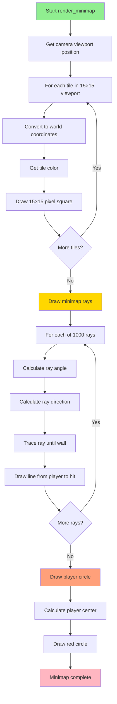

# Minimap Rendering

## Overview

The minimap provides a **2D top-down view** of the surrounding area, showing walls, the player position, and the player's field of view. This document explains how the minimap is rendered, including the camera viewport, ray visualization, and coordinate transformations.

## Table of Contents

1. [Minimap Overview](#minimap-overview)
2. [Viewport System](#viewport-system)
3. [Tile Rendering](#tile-rendering)
4. [Player Rendering](#player-rendering)
5. [Ray Visualization](#ray-visualization)
6. [Coordinate Transformations](#coordinate-transformations)
7. [Line Drawing Algorithm](#line-drawing-algorithm)

---

## Minimap Overview

### What is the Minimap?

The minimap is a **scrolling 2D view** that:
- Shows a 15×15 tile viewport centered on the player
- Displays walls, floors, and empty space
- Shows the player as a red circle
- Visualizes raycasting with green lines
- Updates in real-time as the player moves

### Visual Example

```
Minimap (top-left corner of screen):

┌─────────────────────────────────┐
│ ███████████████████████████████ │ ← Walls (white)
│ ███  floor  ███         ███ ███ │
│ ███         ███         ███ ███ │
│ ███         ███         ███ ███ │
│             ███             ███ │
│     ↗↗↗P↗↗↗ ███             ███ │ ← Player (red) with FOV rays (green)
│             ███             ███ │
│ ███████████████████████████████ │
└─────────────────────────────────┘
```

### Minimap Constants

**File**: `include/cub3d.h`

```c
#define MINIMAP_SCALE 15              // Pixels per map tile
#define MINIMAP_OFFSET_X 10           // X position on screen
#define MINIMAP_OFFSET_Y 10           // Y position on screen
#define MINIMAP_VIEWPORT_TILES 15     // 15×15 tile viewport

// Colors
#define MINIMAP_COLOR_WALL 0xFFFFFF   // White
#define MINIMAP_COLOR_FLOOR 0x333333  // Dark gray
#define MINIMAP_COLOR_PLAYER 0xFF0000 // Red
#define MINIMAP_COLOR_RAY 0x00FF00    // Green
#define MINIMAP_COLOR_BORDER 0x666666 // Medium gray
```

### Minimap Dimensions

```
Viewport size: 15 tiles × 15 tiles
Tile scale: 15 pixels per tile
Total size: 225 × 225 pixels

Screen position: (10, 10) offset from top-left
```

---

## Viewport System

### Camera Tracking

The minimap viewport **follows the player**, always keeping them centered:

```
Map (full):                  Viewport (visible):
┌────────────────┐          ┌─────────┐
│                │          │         │
│                │          │    P    │ ← Player centered
│       P        │    →     │         │
│                │          └─────────┘
│                │          15×15 tiles shown
└────────────────┘
Full map
```

### Camera Start Calculation

**File**: `src/rendering_utils.c`

```c
void get_camera_start(t_game *game, int *cam_start_x, int *cam_start_y)
{
    *cam_start_x = (int)game->player.x - MINIMAP_VIEWPORT_TILES / 2;
    *cam_start_y = (int)game->player.y - MINIMAP_VIEWPORT_TILES / 2;
}
```

**How it works**:
```
Player at (10.5, 8.3)
Viewport: 15 tiles

cam_start_x = 10 - 15/2 = 10 - 7 = 3
cam_start_y = 8 - 15/2 = 8 - 7 = 1

Viewport shows tiles [3-17] in X, [1-15] in Y
Player appears at center (tile 7, 7 in viewport coordinates)
```

### Example

```
Full map (player at 10, 8):

 0  1  2  3  4  5  6  7  8  9 10 11 12 13 14 15 16 17 18 19
┌──┬──┬──┬──┬──┬──┬──┬──┬──┬──┬──┬──┬──┬──┬──┬──┬──┬──┬──┬──┐
│  │  │  │  │  │  │  │  │  │  │  │  │  │  │  │  │  │  │  │  │
├──┼──┼──┼──┼──┼──┼──┼──┼──┼──┼──┼──┼──┼──┼──┼──┼──┼──┼──┼──┤
│  │  │  │  │  │  │  │  │  │  │  │  │  │  │  │  │  │  │  │  │
...
├──┼──┼──┼──┼──┼──┼──┼──┼──┼──┼──┼──┼──┼──┼──┼──┼──┼──┼──┼──┤
│  │  │  │▓▓▓▓▓▓▓▓▓▓▓▓▓▓▓▓▓▓▓▓▓│  │  │  │  │  │  │  │  │  │  │
├──┼──┼──┼──┼──┼──┼──┼──┼──┼──┼──┼──┼──┼──┼──┼──┼──┼──┼──┼──┤
│  │  │  │▓▓      P(10,8)   ▓▓│  │  │  │  │  │  │  │  │  │  │
├──┼──┼──┼──┼──┼──┼──┼──┼──┼──┼──┼──┼──┼──┼──┼──┼──┼──┼──┼──┤
│  │  │  │▓▓▓▓▓▓▓▓▓▓▓▓▓▓▓▓▓▓▓▓▓│  │  │  │  │  │  │  │  │  │  │
...                            └─────────────┘
                               Viewport: tiles 3-17, 1-15
```

---

## Tile Rendering

### Main Rendering Function

**File**: `src/rendering.c`

```c
void render_minimap(t_game *game)
{
    int map_y;
    int map_x;
    int screen_y;
    int screen_x;
    int cam[2];
    
    // Get viewport top-left corner
    get_camera_start(game, &cam[0], &cam[1]);
    
    // Iterate through viewport
    screen_y = 0;
    while (screen_y < MINIMAP_VIEWPORT_TILES)
    {
        screen_x = 0;
        while (screen_x < MINIMAP_VIEWPORT_TILES)
        {
            // Map screen position to world position
            map_x = cam[0] + screen_x;
            map_y = cam[1] + screen_y;
            
            // Draw tile
            draw_minimap_tile(game, screen_x, screen_y,
                get_tile_color(game, map_x, map_y));
            
            screen_x++;
        }
        screen_y++;
    }
}
```

### Coordinate Systems

```
Screen coordinates:          Map coordinates:
(viewport space)            (world space)

┌─────────────┐            ┌─────────────┐
│ 0,0 → 14,0  │            │ cam_x → cam_x+14
│  ↓      ↓   │            │   ↓        ↓
│ 0,14→ 14,14 │            │ cam_y → cam_y+14
└─────────────┘            └─────────────┘

Conversion:
map_x = cam[0] + screen_x
map_y = cam[1] + screen_y
```

### Getting Tile Color

**File**: `src/rendering_utils.c`

```c
int get_tile_color(t_game *game, int map_x, int map_y)
{
    int line_len;
    
    // Check if position is valid
    if (map_y >= 0 && map_y < game->config.map.height && map_x >= 0)
    {
        line_len = ft_strlen(game->config.map.grid[map_y]);
        if (map_x < line_len)
        {
            // Check tile type
            if (game->config.map.grid[map_y][map_x] == WALL)
                return (MINIMAP_COLOR_WALL);    // White for walls
            else if (game->config.map.grid[map_y][map_x] == WALKABLE)
                return (MINIMAP_COLOR_FLOOR);   // Gray for floor
        }
    }
    return (0x000000);  // Black for out of bounds
}
```

### Drawing a Tile

```c
void draw_minimap_tile(t_game *game, int x, int y, int color)
{
    int i;
    int j;
    int screen_x;
    int screen_y;
    
    // Fill 15×15 pixel square
    i = 0;
    while (i < MINIMAP_SCALE)
    {
        j = 0;
        while (j < MINIMAP_SCALE)
        {
            // Calculate screen position
            screen_x = MINIMAP_OFFSET_X + x * MINIMAP_SCALE + i;
            screen_y = MINIMAP_OFFSET_Y + y * MINIMAP_SCALE + j;
            
            // Draw pixel
            my_mlx_pixel_put(&game->img, screen_x, screen_y, color);
            j++;
        }
        i++;
    }
}
```

### Tile Drawing Example

```
Tile at viewport position (5, 3):

screen_x = MINIMAP_OFFSET_X + 5 × 15 + i
         = 10 + 75 + i
         = 85 to 99 (15 pixels)

screen_y = MINIMAP_OFFSET_Y + 3 × 15 + j
         = 10 + 45 + j
         = 55 to 69 (15 pixels)

Fills rectangle: (85, 55) to (99, 69)
```

---

## Player Rendering

### Player Display

The player is drawn as a **red circle** at the center of the minimap:

```
Minimap center:
┌───────────────┐
│               │
│               │
│       ●       │ ← Red circle (player)
│               │
│               │
└───────────────┘
```

### Player Center Calculation

**File**: `src/rendering_utils.c`

```c
void get_player_center(t_game *game, int *center_x, int *center_y)
{
    double player_offset_x;
    double player_offset_y;
    
    // Get fractional position within tile
    player_offset_x = game->player.x - (int)game->player.x;
    player_offset_y = game->player.y - (int)game->player.y;
    
    // Calculate screen position
    *center_x = MINIMAP_OFFSET_X 
        + (MINIMAP_VIEWPORT_TILES / 2) * MINIMAP_SCALE
        + (int)(player_offset_x * MINIMAP_SCALE);
    
    *center_y = MINIMAP_OFFSET_Y 
        + (MINIMAP_VIEWPORT_TILES / 2) * MINIMAP_SCALE
        + (int)(player_offset_y * MINIMAP_SCALE);
}
```

### Understanding Player Position

```
Player at (10.3, 8.7):
    Integer part: (10, 8) = which tile
    Fractional part: (0.3, 0.7) = position within tile

Viewport center tile: 7, 7 (middle of 15×15 grid)
Tile pixel size: 15×15

Base position:
    x = 10 + 7 × 15 = 115
    y = 10 + 7 × 15 = 115

Offset within tile:
    x += 0.3 × 15 = 4.5 → 4 pixels
    y += 0.7 × 15 = 10.5 → 10 pixels

Final position: (119, 125)
```

### Drawing the Player

**File**: `src/rendering.c`

```c
void draw_minimap_player(t_game *game)
{
    int i;
    int j;
    int screen_x;
    int screen_y;
    int center[2];
    
    get_player_center(game, &center[0], &center[1]);
    
    // Draw circle (simple approximation)
    i = -9;
    while (i <= 9)
    {
        j = -9;
        while (j <= 9)
        {
            screen_x = center[0] + i;
            screen_y = center[1] + j;
            
            // Circle equation: x² + y² ≤ r²
            if (i * i + j * j <= 27)  // radius ≈ 5.2
                my_mlx_pixel_put(&game->img, screen_x, screen_y,
                    MINIMAP_COLOR_PLAYER);
            j++;
        }
        i++;
    }
}
```

### Circle Approximation

```
Circle formula: x² + y² ≤ r²

Using r² = 27:
    r = √27 ≈ 5.2 pixels

Checks 19×19 grid (-9 to +9):
    If distance from center ≤ 5.2: draw red
    Else: skip
    
Result:
        □ □ □ ■ ■ ■ □ □ □
        □ ■ ■ ■ ■ ■ ■ ■ □
        □ ■ ■ ■ ■ ■ ■ ■ □
        ■ ■ ■ ■ ■ ■ ■ ■ ■
        ■ ■ ■ ■ ● ■ ■ ■ ■ ← Center
        ■ ■ ■ ■ ■ ■ ■ ■ ■
        □ ■ ■ ■ ■ ■ ■ ■ □
        □ ■ ■ ■ ■ ■ ■ ■ □
        □ □ □ ■ ■ ■ □ □ □
```

---

## Ray Visualization

### FOV Rays

The minimap draws **1000 rays** fanning out from the player to visualize the field of view:

```
        ↗↗↗↗↗
       ↗    ↗
      ↗  P  ↗  ← 1000 rays in 60° FOV
       ↗    ↗
        ↗↗↗↗↗
```

### Main Ray Drawing Function

**File**: `src/raycasting.c`

```c
void draw_minimap_rays(t_game *game)
{
    int     i;
    double  ray_angle;
    double  ray_dir[2];
    double  fov;
    int     num_rays;
    
    fov = FOV_RAD;           // 60° in radians
    num_rays = 1000;
    
    i = 0;
    while (i < num_rays)
    {
        // Calculate angle for this ray
        ray_angle = -fov / 2.0 + (fov * i / (num_rays - 1));
        
        // Calculate ray direction
        ray_dir[0] = game->player.dir_x * cos(ray_angle)
            - game->player.dir_y * sin(ray_angle);
        ray_dir[1] = game->player.dir_x * sin(ray_angle)
            + game->player.dir_y * cos(ray_angle);
        
        // Cast this ray
        cast_single_ray(game, ray_dir[0], ray_dir[1]);
        
        i++;
    }
}
```

### Ray Angle Calculation

```
FOV: 60° = 1.047 radians
num_rays: 1000

For ray i:
    angle = -FOV/2 + (FOV × i / 999)
    
Ray 0:     -0.524 rad (left edge, -30°)
Ray 500:    0.000 rad (center, 0°)
Ray 999:   +0.524 rad (right edge, +30°)
```

### Casting a Single Ray

```c
static void cast_single_ray(t_game *game, double ray_dir_x, double ray_dir_y)
{
    double ray[2];
    double step[2];
    int    cam[2];
    int    coords[4];
    
    // Start at player position
    ray[0] = game->player.x;
    ray[1] = game->player.y;
    
    // Small step in ray direction
    step[0] = ray_dir_x * 0.05;
    step[1] = ray_dir_y * 0.05;
    
    // Get camera viewport start
    get_camera_start(game, &cam[0], &cam[1]);
    
    // Trace ray until wall hit
    trace_ray(game, ray, step);
    
    // Calculate screen coordinates
    coords[0] = MINIMAP_OFFSET_X 
        + (MINIMAP_VIEWPORT_TILES / 2) * MINIMAP_SCALE
        + (int)((game->player.x - (int)game->player.x) * MINIMAP_SCALE);
    coords[1] = MINIMAP_OFFSET_Y 
        + (MINIMAP_VIEWPORT_TILES / 2) * MINIMAP_SCALE
        + (int)((game->player.y - (int)game->player.y) * MINIMAP_SCALE);
    coords[2] = MINIMAP_OFFSET_X + (int)((ray[0] - cam[0]) * MINIMAP_SCALE);
    coords[3] = MINIMAP_OFFSET_Y + (int)((ray[1] - cam[1]) * MINIMAP_SCALE);
    
    // Draw line from player to hit point
    draw_line(game, coords);
}
```

### Ray Tracing

```c
static void trace_ray(t_game *game, double *ray, double *step)
{
    int i;
    int map_x;
    int map_y;
    
    i = 0;
    while (i < 200)  // Max 200 steps
    {
        // Advance ray
        ray[0] += step[0];
        ray[1] += step[1];
        
        // Convert to map coordinates
        map_x = (int)ray[0];
        map_y = (int)ray[1];
        
        // Check for wall hit
        if (check_wall_hit(game, map_x, map_y))
            break;
        
        i++;
    }
}
```

---

## Coordinate Transformations

### Transformation Pipeline


### World to Viewport

```c
screen_x = map_x - cam_start_x
screen_y = map_y - cam_start_y
```

**Example**:
```
World position: (10, 8)
Camera start: (3, 1)

screen_x = 10 - 3 = 7
screen_y = 8 - 1 = 7

→ Tile at (10, 8) appears at viewport position (7, 7)
```

### Viewport to Pixels

```c
pixel_x = MINIMAP_OFFSET_X + screen_x * MINIMAP_SCALE
pixel_y = MINIMAP_OFFSET_Y + screen_y * MINIMAP_SCALE
```

**Example**:
```
Viewport position: (7, 7)
Scale: 15 pixels/tile
Offset: (10, 10)

pixel_x = 10 + 7 × 15 = 115
pixel_y = 10 + 7 × 15 = 115

→ Tile (7, 7) draws at screen position (115, 115)
```

### Complete Example

```
Player at world (10.5, 8.3)
Camera viewport: (3, 1) to (18, 16)

World tile (10, 8):
    → Viewport tile (7, 7)
    → Screen pixels (115, 115) to (129, 129)

Player fractional offset (0.5, 0.3):
    → Screen pixels + (7.5, 4.5)
    → Player drawn at (122, 119)
```

---

## Line Drawing Algorithm

### Bresenham-style Algorithm

The minimap uses a **line drawing algorithm** to draw rays:

**File**: `src/raycasting.c`

```c
static void draw_line(t_game *game, int *coords)
{
    int     i;
    int     max[2];
    float   vars[5];
    
    // Calculate number of steps
    vars[2] = get_max_steps(coords[2] - coords[0], coords[3] - coords[1]);
    
    // Initialize line variables
    init_line_vars(coords, vars);
    
    // Minimap bounds
    max[0] = MINIMAP_OFFSET_X + MINIMAP_VIEWPORT_TILES * MINIMAP_SCALE;
    max[1] = MINIMAP_OFFSET_Y + MINIMAP_VIEWPORT_TILES * MINIMAP_SCALE;
    
    // Draw line
    i = 0;
    while (i <= (int)vars[2])
    {
        // Check bounds
        if ((int)vars[3] >= MINIMAP_OFFSET_X && (int)vars[3] < max[0]
            && (int)vars[4] >= MINIMAP_OFFSET_Y && (int)vars[4] < max[1])
            my_mlx_pixel_put(&game->img, (int)vars[3], (int)vars[4],
                MINIMAP_COLOR_RAY);
        
        // Advance position
        vars[3] += vars[0];
        vars[4] += vars[1];
        i++;
    }
}
```

### Helper Functions

**File**: `src/raycasting_utils.c`

```c
int get_max_steps(int dx, int dy)
{
    if (abs(dx) > abs(dy))
        return (abs(dx));
    return (abs(dy));
}

void init_line_vars(int *coords, float *vars)
{
    // vars[0] = dx per step
    // vars[1] = dy per step
    // vars[2] = number of steps
    // vars[3] = current x
    // vars[4] = current y
    
    vars[0] = (coords[2] - coords[0]) / vars[2];  // dx per step
    vars[1] = (coords[3] - coords[1]) / vars[2];  // dy per step
    vars[3] = coords[0];  // start x
    vars[4] = coords[1];  // start y
}
```

### Line Drawing Example

```
Draw line from (100, 100) to (120, 110):

dx = 120 - 100 = 20
dy = 110 - 100 = 10

max_steps = max(20, 10) = 20

dx_per_step = 20 / 20 = 1.0
dy_per_step = 10 / 20 = 0.5

For i = 0 to 20:
    x = 100 + i × 1.0
    y = 100 + i × 0.5
    
    i=0:  (100, 100)
    i=5:  (105, 102.5)
    i=10: (110, 105)
    i=20: (120, 110)
```

---

## Complete Minimap Rendering Flow



---

## Key Takeaways

1. **Scrolling viewport**: 15×15 tiles centered on player
2. **Coordinate systems**: World → Viewport → Screen pixels
3. **Tile-based**: Each map tile = 15×15 pixel square
4. **Player visualization**: Red circle at center
5. **Ray visualization**: 1000 green lines showing FOV
6. **Real-time updates**: Moves with player

## Next Steps

Continue to [Complete System Overview](./13_complete_system_overview.md) for a high-level understanding of how everything works together.
