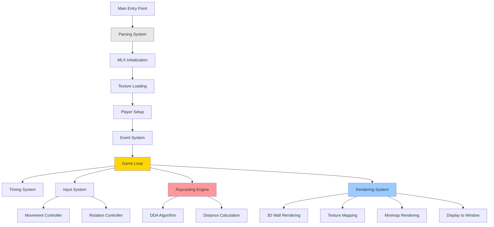
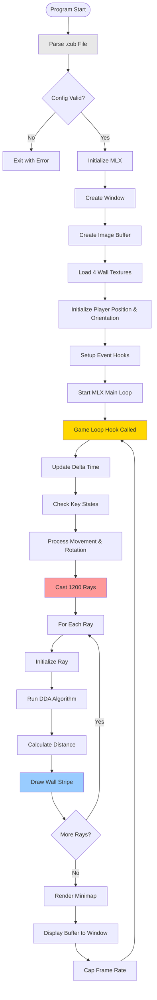
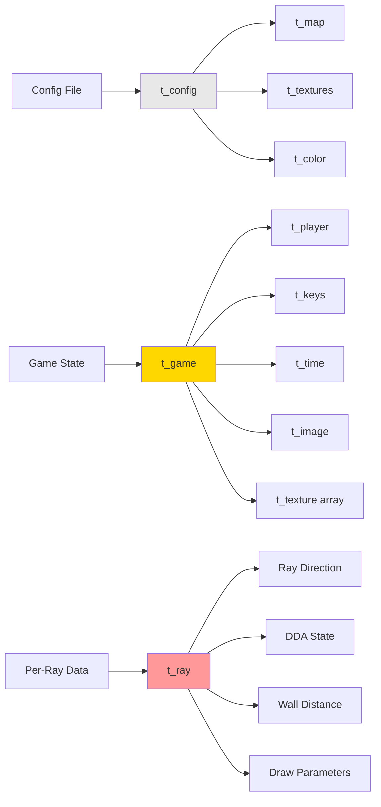
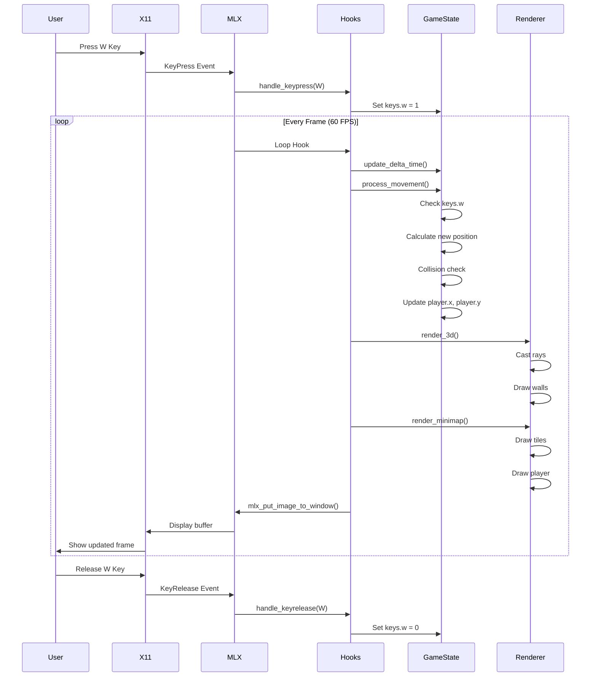
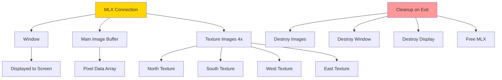

# Complete System Overview

## Overview

This document provides a **comprehensive, high-level overview** of the entire Cub3D system after parsing. It connects all the components together and shows how they interact to create the final game experience.

## Table of Contents

1. [System Architecture](#system-architecture)
2. [Complete Data Flow](#complete-data-flow)
3. [Frame Rendering Pipeline](#frame-rendering-pipeline)
4. [System Interactions](#system-interactions)
5. [Performance Profile](#performance-profile)
6. [Code Organization](#code-organization)
7. [Key Algorithms Summary](#key-algorithms-summary)

---

## System Architecture

### High-Level Component Diagram



### Component Responsibilities

| Component | Responsibility | Files |
|-----------|---------------|-------|
| **Parsing** | Load and validate .cub file | `src/parsing/*` |
| **MLX** | Graphics library interface | `src/game_utils.c` |
| **Textures** | Load and manage wall textures | `src/textures.c` |
| **Player** | Position, direction, and state | `src/player*.c` |
| **Input** | Keyboard event handling | `src/input_handlers.c` |
| **Timing** | Frame rate and delta time | `src/timing.c` |
| **Raycasting** | Calculate wall intersections | `src/raycasting*.c` |
| **Rendering** | Draw 3D view and minimap | `src/rendering*.c` |

---

## Complete Data Flow

### From Startup to Frame



### Data Structures Flow



---

## Frame Rendering Pipeline

### Single Frame Timeline

```mermaid
gantt
    title Single Frame Processing (Target: 16.666ms @ 60 FPS)
    dateFormat SSS
    axisFormat %L ms
    
    section Timing
    Delta Time Update      :a1, 000, 0.1ms
    
    section Input
    Process Key States     :a2, 000, 0.5ms
    Calculate Movement     :a3, 001, 0.5ms
    Update Position        :a4, 001, 0.5ms
    
    section Raycasting
    Cast 1200 Rays         :crit, a5, 002, 8ms
    
    section 3D Rendering
    Draw Ceiling/Floor     :a6, 010, 2ms
    Draw Textured Walls    :a7, 012, 2ms
    
    section Minimap
    Draw Tiles             :a8, 014, 1ms
    Draw Rays              :a9, 015, 0.5ms
    Draw Player            :a10, 015, 0.5ms
    
    section Display
    Copy to Window         :a11, 016, 0.5ms
    Frame Rate Cap         :a12, 016, 0.5ms
```



### Detailed Per-Frame Steps

#### 1. Timing (0.1ms)
```c
update_delta_time(game);
// Calculate time since last frame
// Update delta_time for movement scaling
```

#### 2. Input Processing (1.5ms)
```c
process_movement(game);
// Check keys.w, keys.s, keys.a, keys.d
// Check keys.left, keys.right
// Calculate new position/rotation
// Validate with collision detection
// Update player position
```

#### 3. Raycasting (8ms) 🔥 **Most Expensive**
```c
render_3d(game);
// For x = 0 to 1199:
//     Initialize ray
//     Calculate step direction
//     Perform DDA traversal
//     Calculate wall distance
//     Draw wall stripe
```

#### 4. 3D Rendering (4ms)
```c
// For each column:
//     Draw ceiling pixels
//     Sample texture and draw wall
//     Draw floor pixels
```

#### 5. Minimap (2ms)
```c
render_minimap(game);
// Draw 15×15 tile grid
draw_minimap_rays(game);
// Cast 1000 rays for visualization
draw_minimap_player(game);
// Draw red circle at player position
```

#### 6. Display (1ms)
```c
mlx_put_image_to_window(game->mlx, game->win, game->img.img, 0, 0);
// Copy image buffer to window
cap_framerate(game);
// Sleep if frame finished early
```

---

## System Interactions

### Event-Driven Architecture



### Memory Management



---

## Performance Profile

### Frame Budget Analysis

At **60 FPS**, each frame has **16.666ms**:

| Operation | Time | % Budget | Notes |
|-----------|------|----------|-------|
| **Raycasting** | 8ms | 48% | 1200 DDA traversals |
| **Wall Rendering** | 4ms | 24% | Texture sampling, pixel writes |
| **Minimap** | 2ms | 12% | Tile grid + 1000 rays |
| **Input & Movement** | 1.5ms | 9% | Key processing, collision |
| **Display** | 1ms | 6% | Buffer copy to window |
| **Overhead** | 0.2ms | 1% | Delta time, misc |
| **Total** | **16.7ms** | **100%** | |

### Optimization Techniques Used

1. **Image Buffer Manipulation**
   - Direct memory writes (not individual MLX calls)
   - Single `mlx_put_image_to_window()` per frame

2. **DDA Algorithm**
   - Integer grid stepping (no floating-point in loop)
   - Early exit on wall hit

3. **Texture Sampling**
   - Direct pointer arithmetic
   - No filtering or interpolation
   - Power-of-2 texture sizes for bit masking

4. **Minimap**
   - Limited viewport (15×15 tiles, not whole map)
   - Simple tile rendering

5. **Collision Detection**
   - Single grid cell check
   - No complex collision shapes

### Potential Bottlenecks

```
⚠️ Raycasting: 48% of frame time
   - 1200 rays per frame
   - Each ray uses DDA (variable steps)
   - Could optimize with larger step sizes

⚠️ Texture Sampling: Part of wall rendering
   - 960,000 pixels per frame (1200×800)
   - Each wall pixel reads texture memory
   - Could use lower resolution textures

✓ Everything Else: Acceptable
```

---

## Code Organization

### File Structure by Functionality

```
Project Root
│
├── src/
│   ├── main.c                    ← Entry point, setup, hooks
│   │
│   ├── Game Loop & System
│   │   ├── game_utils.c          ← MLX init, window, game loop
│   │   ├── input_handlers.c      ← Key press/release handlers
│   │   └── timing.c              ← Frame timing, FPS control
│   │
│   ├── Player
│   │   ├── player.c              ← Initialization, collision
│   │   ├── player_movement.c     ← Forward/back/strafe
│   │   └── player_rotation.c     ← Rotation, movement processing
│   │
│   ├── Raycasting
│   │   ├── raycasting_3d.c       ← Main raycasting functions
│   │   ├── raycasting.c          ← Minimap ray visualization
│   │   └── raycasting_utils.c    ← Helper functions
│   │
│   ├── Rendering
│   │   ├── rendering_3d.c        ← 3D wall rendering
│   │   ├── rendering_3d_utils.c  ← Texture selection, coords
│   │   ├── rendering.c           ← Main render, minimap
│   │   └── rendering_utils.c     ← Minimap helpers
│   │
│   ├── Textures
│   │   └── textures.c            ← Load textures, color sampling
│   │
│   └── parsing/                  ← Configuration file parsing
│       ├── parse_config.c
│       ├── parse_map.c
│       └── ...
│
└── include/
    └── cub3d.h                   ← All structures, constants, prototypes
```

### Key Data Structures

```c
// Main game state
typedef struct s_game
{
    void        *mlx;          // MLX connection
    void        *win;          // Window
    t_config    config;        // Parsed configuration
    t_player    player;        // Player state
    t_image     img;           // Main render buffer
    t_keys      keys;          // Input state
    t_time      time;          // Timing info
    t_texture   textures[4];   // Wall textures
} t_game;

// Player state
typedef struct s_player
{
    double x, y;               // Position
    double dir_x, dir_y;       // Direction vector
    double plane_x, plane_y;   // Camera plane
} t_player;

// Per-ray calculation
typedef struct s_ray
{
    // Direction
    double ray_dir_x, ray_dir_y;
    
    // DDA state
    int map_x, map_y;
    double side_dist_x, side_dist_y;
    double delta_dist_x, delta_dist_y;
    int step_x, step_y;
    
    // Results
    double perp_wall_dist;
    int hit, side;
    int line_height;
    int draw_start, draw_end;
} t_ray;
```

---

## Key Algorithms Summary

### 1. Raycasting (DDA)

**Purpose**: Find wall intersections  
**Complexity**: O(distance to wall) per ray  
**Performance**: ~8ms for 1200 rays

```
For each screen column:
    1. Calculate ray direction from player
    2. Step through grid using DDA
    3. Stop at first wall hit
    4. Calculate perpendicular distance
    5. Draw wall stripe
```

### 2. Texture Mapping

**Purpose**: Apply textures to walls  
**Complexity**: O(wall height) per column  
**Performance**: Included in 4ms rendering time

```
For each pixel in wall stripe:
    1. Calculate texture Y coordinate
    2. Sample texture at (tex_x, tex_y)
    3. Apply shading if Y-side
    4. Write to image buffer
```

### 3. Movement & Rotation

**Purpose**: Update player position/orientation  
**Complexity**: O(1) per frame  
**Performance**: ~1.5ms including collision

```
For each pressed key:
    1. Calculate new position using vectors
    2. Check collision at new position
    3. Update if valid
    
For rotation:
    1. Apply 2D rotation matrix to direction
    2. Apply same rotation to camera plane
```

### 4. Minimap Rendering

**Purpose**: Show 2D overhead view  
**Complexity**: O(viewport_size) + O(num_rays)  
**Performance**: ~2ms

```
1. Calculate viewport position (centered on player)
2. Draw 15×15 tile grid
3. Cast 1000 rays for FOV visualization
4. Draw player as circle at center
```

---

## Integration Example: Complete Frame

### Step-by-Step Frame Execution

```
Frame N begins at T=0ms
───────────────────────────────────────────────

T=0.0ms: update_delta_time()
    - Get current time: 1000016666 μs
    - Last frame: 1000000000 μs
    - Elapsed: 16666 μs = 0.016666 seconds
    - Store delta_time = 0.016666

T=0.1ms: process_movement()
    - keys.w = 1, keys.left = 1
    - move_speed = 3.0 × 0.016666 = 0.05
    - rot_speed = 2.0 × 0.016666 = 0.033
    
    Forward movement:
        - new_x = 5.0 + 0 × 0.05 = 5.0
        - new_y = 5.0 + (-1) × 0.05 = 4.95
        - can_move_to(5.0, 4.95) → true
        - player.y = 4.95
    
    Rotation:
        - Apply rotation matrix with -0.033 rad
        - dir = (0, -1) → (0.033, -0.999)
        - plane = (0.66, 0) → (0.659, -0.022)

T=2.0ms: render_3d()
    For x = 0:
        - camera_x = -1.0
        - ray_dir = (0.033, -0.999) + (0.659, -0.022) × (-1.0)
                  = (0.033 - 0.659, -0.999 + 0.022)
                  = (-0.626, -0.977)
        - DDA: Step through grid
        - Hit wall at (2, 3) after 5 steps
        - perp_wall_dist = 3.2
        - line_height = 800 / 3.2 = 250 pixels
        - draw_start = 275, draw_end = 525
        - Draw ceiling: y=0 to y=275
        - Draw wall: y=275 to y=525 (textured)
        - Draw floor: y=525 to y=800
    
    Repeat for x = 1 to 1199...

T=10ms: Raycasting complete

T=12ms: render_minimap()
    - cam_start = (0, 0)  [player at 5.0, 4.95]
    - Draw 225 tiles (15×15)
    - Each tile: 15×15 pixels
    
T=14ms: draw_minimap_rays()
    - Cast 1000 rays
    - Draw green lines from player to walls

T=15ms: draw_minimap_player()
    - center = (115, 112)
    - Draw red circle (radius 5)

T=16ms: mlx_put_image_to_window()
    - Copy 960,000 pixels to window
    - Display update

T=16.5ms: cap_framerate()
    - elapsed = 16500 μs
    - target = 16666 μs
    - sleep(166 μs)

T=16.666ms: Frame N complete
───────────────────────────────────────────────
```

---

## Visual System Summary

```
┌─────────────────────────────────────────────────────────┐
│  CUB3D GAME ENGINE                                      │
├─────────────────────────────────────────────────────────┤
│                                                         │
│  [Parsing] → [MLX Init] → [Texture Load] → [Game Loop] │
│                                     ↓                   │
│                            ┌────────────────┐          │
│                            │  60 FPS Loop   │          │
│                            └────────┬───────┘          │
│                                     ↓                   │
│              ┌──────────────────────────────────┐      │
│              │   1. Update Delta Time           │      │
│              │   2. Process Input (keys)        │      │
│              │   3. Update Player Position      │      │
│              │   4. RAYCAST (1200 rays)         │ ← 48%│
│              │   5. Render 3D Walls + Textures  │      │
│              │   6. Render Minimap (2D view)    │      │
│              │   7. Display to Window           │      │
│              │   8. Cap Frame Rate              │      │
│              └──────────────────────────────────┘      │
│                                                         │
│  Result: Smooth 3D first-person maze exploration       │
│          with real-time minimap                        │
└─────────────────────────────────────────────────────────┘
```

---

## Key Takeaways

1. **Event-Driven Loop**: MLX manages main loop, calls our hooks
2. **State-Based Input**: Keys tracked as states, not events
3. **Raycasting Core**: 48% of frame time, most critical component
4. **Frame Independence**: Delta time ensures consistent speed
5. **Double Buffer**: Draw to image buffer, display when complete
6. **Simple but Effective**: Classic algorithms, proven performance

## Congratulations! 🎉

You now understand the complete Cub3D system:
- How MLX initializes and manages graphics
- How the game loop maintains 60 FPS
- How raycasting creates the 3D view
- How textures are mapped to walls
- How player movement is controlled
- How the minimap provides situational awareness

**You're ready to modify, debug, or extend the codebase!**
