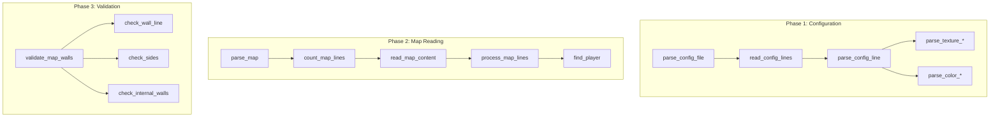
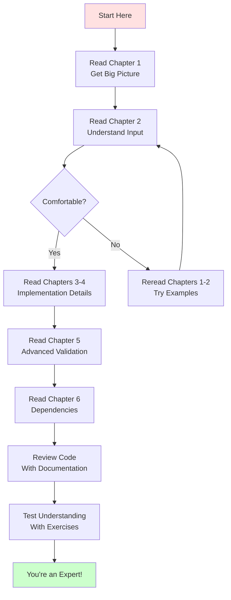

# cub3D Parsing System - Complete Documentation

**A comprehensive guide to understanding every detail of the cub3D configuration and map parsing system.**

---

## 📚 Documentation Structure

This documentation is organized into 6 detailed chapters that will take you from beginner to expert in understanding the cub3D parsing system.

### Chapter Overview


---

## 📖 Reading Guide

### For Beginners (Never Seen This Codebase)

**Start here and read in order:**

1. **[01_parsing_overview.md](01_parsing_overview.md)** ⭐ START HERE
   - Understand the big picture
   - Learn the three parsing phases
   - Get familiar with data structures
   - See the complete flow diagram

2. **[02_config_file_format.md](02_config_file_format.md)**
   - Learn what a `.cub` file looks like
   - Understand texture and color identifiers
   - See valid and invalid examples
   - Learn the map character meanings

3. **[03_configuration_parsing.md](03_configuration_parsing.md)**
   - Deep dive into texture parsing
   - Understand color parsing
   - Learn the bit flag system
   - Trace complete examples

4. **[04_map_parsing.md](04_map_parsing.md)**
   - Understand line-by-line reading
   - Learn memory allocation strategies
   - See how the map grid is built
   - Understand player detection

5. **[05_map_validation.md](05_map_validation.md)**
   - Learn wall validation rules
   - Understand the 8-direction check
   - See why diagonals matter
   - Trace valid and invalid examples

6. **[06_dependencies.md](06_dependencies.md)**
   - Understand helper libraries
   - Learn about the garbage collector
   - See how `get_next_line` works
   - Master `ft_sscanf` patterns

### For Experienced Developers (Know Some C)

**Quick start for faster onboarding:**

1. **[01_parsing_overview.md](01_parsing_overview.md)** - Get the architecture (15 min)
2. **[02_config_file_format.md](02_config_file_format.md)** - Understand input format (10 min)
3. **[05_map_validation.md](05_map_validation.md)** - Focus on the complex validation logic (20 min)
4. **[06_dependencies.md](06_dependencies.md)** - Reference for library functions (as needed)

### For Code Review (Need Specific Info)

**Jump to relevant sections:**

| If you need to understand... | Read this chapter | Key sections |
|------------------------------|-------------------|--------------|
| **How files are opened** | [03: Configuration Parsing](03_configuration_parsing.md) | File Opening and Validation |
| **Texture path validation** | [03: Configuration Parsing](03_configuration_parsing.md) | Texture Parsing Deep Dive |
| **RGB color parsing** | [03: Configuration Parsing](03_configuration_parsing.md) | Color Parsing Deep Dive |
| **Map memory allocation** | [04: Map Parsing](04_map_parsing.md) | Memory Allocation |
| **Player position finding** | [04: Map Parsing](04_map_parsing.md) | Finding the Player |
| **Wall closure validation** | [05: Map Validation](05_map_validation.md) | The 8-Direction Check |
| **Garbage collector** | [06: Dependencies](06_dependencies.md) | libgc - Garbage Collector |
| **ft_sscanf patterns** | [06: Dependencies](06_dependencies.md) | libftsscanf |

---

## 🎯 Learning Objectives

By the end of this documentation, you will understand:

### ✅ Core Concepts
- [ ] How `.cub` files are structured
- [ ] The three phases of parsing (config, map, validation)
- [ ] How bit flags track parsing progress
- [ ] Why memory is allocated in multiple passes
- [ ] How the 8-direction wall check works

### ✅ Technical Details
- [ ] Every parsing function and its role
- [ ] How `ft_sscanf` extracts data
- [ ] Why `get_next_line` is used for file reading
- [ ] How the garbage collector prevents memory leaks
- [ ] The state machine in map line processing

### ✅ Practical Skills
- [ ] How to debug parsing errors
- [ ] How to create valid and invalid test maps
- [ ] How to modify validation rules
- [ ] How to trace execution through the code
- [ ] How to add new configuration elements

---

## 📋 Chapter Summaries

### Chapter 1: Parsing Overview
**Length:** ~3000 words | **Visuals:** 8 diagrams | **Difficulty:** ⭐ Easy

**What you'll learn:**
- The complete parsing pipeline from file to game-ready config
- Main data structures (`t_config`, `t_map`, `t_textures`, etc.)
- Error handling strategy and exit codes
- How the garbage collector fits into the system
- File organization and function responsibilities

**Key diagrams:**
- Complete parsing flow (state diagram)
- Data structure relationships (class diagram)
- File navigation map
- Big picture overview

---

### Chapter 2: Config File Format
**Length:** ~4000 words | **Visuals:** 12 diagrams | **Difficulty:** ⭐ Easy

**What you'll learn:**
- Exact structure of `.cub` files
- All valid characters and identifiers
- Texture path requirements (`.xpm` only)
- RGB color format (0-255 range)
- Map character meanings and rules

**Key diagrams:**
- File structure visualization
- Texture identifier meanings
- Color format breakdown
- Valid vs invalid examples
- Validation checklist flowchart

**Includes:**
- 10+ complete file examples
- Common mistake analysis
- Quick reference tables

---

### Chapter 3: Configuration Parsing
**Length:** ~5000 words | **Visuals:** 15 diagrams | **Difficulty:** ⭐⭐ Medium

**What you'll learn:**
- How `parse_config_file()` orchestrates reading
- Line-by-line processing with `get_next_line()`
- Texture parsing with `ft_sscanf()`
- Color parsing and validation
- The bit flag system in detail

**Key concepts:**
- File descriptor lifecycle
- Format string parsing
- Bitwise operations for flags
- Memory management during parsing
- Dispatcher pattern for config lines

**Includes:**
- Complete function call traces
- Bitwise operation visualizations
- Memory state diagrams
- Step-by-step walkthroughs

---

### Chapter 4: Map Parsing
**Length:** ~4500 words | **Visuals:** 13 diagrams | **Difficulty:** ⭐⭐ Medium

**What you'll learn:**
- Why the file is read multiple times
- How map lines are counted
- Memory allocation for 2D array
- State machine for map reading
- Player position detection

**Key concepts:**
- Two-pass reading strategy
- NULL-terminated pointer arrays
- Map width tracking
- Player character recognition
- Grid coordinate system

**Includes:**
- Complete memory allocation diagrams
- State machine visualization
- Player scanning animation
- Grid index explanations

---

### Chapter 5: Map Validation
**Length:** ~4000 words | **Visuals:** 10 diagrams | **Difficulty:** ⭐⭐⭐ Advanced

**What you'll learn:**
- Why validation is critical
- Edge validation (top, bottom, sides)
- Internal wall validation
- The 8-direction neighbor check
- Why diagonals must be checked

**Key concepts:**
- Four-phase validation pipeline
- Difference between space and wall
- Valid neighbor definition
- Bounds checking
- Walkable tile enclosure

**Includes:**
- Multiple valid/invalid examples
- Visual wall check demonstrations
- Diagonal escape scenarios
- Complete validation traces

---

### Chapter 6: Dependencies
**Length:** ~3500 words | **Visuals:** 8 diagrams | **Difficulty:** ⭐ Easy-Medium

**What you'll learn:**
- How each helper library works
- `libft`: String and memory operations
- `libgnl`: Line-by-line file reading
- `libftsscanf`: Pattern matching
- `libgc`: Automatic memory management
- `libftprintf`: Debug output

**Key concepts:**
- String manipulation internals
- Buffer management in GNL
- Format specifier parsing
- Garbage collector tracking
- Memory leak prevention

**Includes:**
- Complete function reference table
- Implementation concepts
- Usage examples from parsing code
- Dependency usage map

---

## 🔍 Quick Reference

### Key Functions by Phase



### Common Patterns

#### Error Checking Pattern
```c
if (some_check_fails)
    ft_exit(error_code, "Error message");
// Continue only if check passed
```

#### Line Reading Pattern
```c
line = get_next_line(fd);
while (line != NULL)
{
    // Process line
    free(line);
    line = get_next_line(fd);
}
```

#### Allocation Pattern
```c
ptr = gc_malloc(size);
if (!ptr)
    return (-1);
// No manual free needed - GC handles it!
```

---

## 🎨 Visual Guide

Each chapter includes extensive visual aids:

### Diagram Types

| Type | Purpose | Example |
|------|---------|---------|
| **Flowcharts** | Show control flow and decisions | Validation pipeline |
| **Sequence Diagrams** | Show function call order | Configuration parsing |
| **State Machines** | Show processing states | Map line reading |
| **Memory Diagrams** | Show data structures | Grid allocation |
| **Class Diagrams** | Show structure relationships | Config structures |
| **Graph Diagrams** | Show dependencies | File organization |

### Color Coding

Throughout the documentation, colors have meaning:

- 🟢 **Green**: Success, valid examples
- 🔴 **Red**: Errors, invalid examples
- 🔵 **Blue**: Information, neutral state
- 🟡 **Yellow**: Warnings, important notes
- 🟣 **Purple**: Special cases, advanced topics

---

## 🧪 Testing Your Understanding

After reading each chapter, test yourself:

### Chapter 1-2: Basics
- [ ] Can you draw the three parsing phases from memory?
- [ ] Can you write a valid `.cub` file without reference?
- [ ] Can you identify what's wrong with an invalid map?

### Chapter 3-4: Implementation
- [ ] Can you trace `parse_texture_no()` execution?
- [ ] Can you explain why the file is opened multiple times?
- [ ] Can you describe the flag system in your own words?

### Chapter 5-6: Advanced
- [ ] Can you explain why diagonal checks are needed?
- [ ] Can you implement a simple garbage collector?
- [ ] Can you write your own `ft_sscanf` for one format?

---

## 🔧 Practical Exercises

### Exercise 1: Create Test Cases (After Chapter 2)
Create 5 invalid `.cub` files, each with a different type of error:
1. Missing texture
2. Invalid color range
3. Multiple players
4. Hole in wall
5. Invalid character in map

### Exercise 2: Trace Execution (After Chapter 3)
Pick a function and trace it line-by-line:
- Draw the call stack
- Note each variable change
- Identify all validation checks

### Exercise 3: Modify Validation (After Chapter 5)
Try changing the validation rules:
- Allow rectangular maps only (no spaces)
- Require minimum map size
- Add support for new characters

---

## 📊 Code Statistics

To give you perspective on the codebase:

| Metric | Value |
|--------|-------|
| Total parsing files | 10 |
| Lines of parsing code | ~800 |
| Functions in parsing | ~35 |
| Data structures | 8 main structures |
| Validation checks | 4 major phases |
| Error exit points | 10+ |

### File Size Distribution

```
parsing.c            ~70 lines   (orchestration)
parsing_config.c     ~70 lines   (dispatching)
map_parsing.c        ~40 lines   (orchestration)
map_reading.c        ~80 lines   (reading logic)
map_validation.c     ~90 lines   (validation)
map_validation2.c    ~90 lines   (internal checks)
map_utils.c          ~50 lines   (helpers)
utils_parsing.c      ~100 lines  (texture & validation)
utils_parsing2.c     ~60 lines   (color parsing)
parsing_debug.c      ~40 lines   (debug output)
```

---

## 🤝 Contributing to Understanding

If you find any part of this documentation unclear:

1. **Re-read the relevant section** - sometimes it clicks on second reading
2. **Draw your own diagrams** - visual understanding is powerful
3. **Trace the code yourself** - follow execution with a debugger
4. **Test with examples** - create test maps and see what happens
5. **Explain to someone else** - teaching solidifies understanding

---

## 🎓 Prerequisites

To get the most out of this documentation, you should know:

### Required Knowledge
- ✅ Basic C programming (variables, functions, pointers)
- ✅ How files work in C (`open`, `read`, `close`)
- ✅ Basic memory concepts (stack vs heap, malloc/free)
- ✅ How strings work in C (null termination)

### Helpful But Not Required
- ⭐ Bitwise operations
- ⭐ Linked lists
- ⭐ State machines
- ⭐ 2D arrays
- ⭐ File descriptors

**Don't worry!** All concepts are explained from scratch with visuals.

---

## 📈 Learning Path



---

## 📝 Quick Navigation

### By Topic

**File Handling:**
- Opening files: [Chapter 3](03_configuration_parsing.md#file-opening-and-validation)
- Reading lines: [Chapter 3](03_configuration_parsing.md#line-by-line-processing)
- Multiple passes: [Chapter 4](04_map_parsing.md#why-open-the-file-multiple-times)

**Memory Management:**
- Structure initialization: [Chapter 3](03_configuration_parsing.md#step-3-initialize-config-structure)
- Grid allocation: [Chapter 4](04_map_parsing.md#memory-allocation)
- Garbage collector: [Chapter 6](06_dependencies.md#libgc---garbage-collector)

**Validation:**
- Edge validation: [Chapter 5](05_map_validation.md#validating-top-and-bottom-walls)
- Internal validation: [Chapter 5](05_map_validation.md#validating-internal-walls)
- Complete examples: [Chapter 5](05_map_validation.md#complete-example-walkthroughs)

**Dependencies:**
- String functions: [Chapter 6](06_dependencies.md#libft---standard-library-functions)
- File reading: [Chapter 6](06_dependencies.md#libgnl---get-next-line)
- Pattern matching: [Chapter 6](06_dependencies.md#libftsscanf---formatted-string-scanning)

---

## 🌟 Special Features

### Throughout the Documentation

✨ **E.V.E. Structure** - Every complex concept follows:
1. **Explanation** - What it is and why it matters
2. **Visualization** - Diagrams and visual aids
3. **Example** - Concrete code and data examples

✨ **Progressive Complexity** - Each chapter builds on previous knowledge

✨ **Real Code** - All examples are from the actual codebase

✨ **No Assumptions** - Every C concept is explained from scratch

✨ **Mermaid Diagrams** - All flowcharts render properly in GitHub/VS Code

---

## 🎯 Learning Goals

After completing this documentation, you should be able to:

### Understand
- ✅ How the entire parsing system works end-to-end
- ✅ Why each validation check exists
- ✅ How helper libraries integrate
- ✅ The memory management strategy

### Explain
- ✅ To a beginner how `.cub` files become game data
- ✅ Why certain design decisions were made
- ✅ How to debug parsing errors
- ✅ The purpose of each parsing function

### Modify
- ✅ Add new configuration elements
- ✅ Adjust validation rules
- ✅ Improve error messages
- ✅ Optimize parsing performance

---

## 📖 Start Reading

**Ready to begin your journey?**

👉 **[Start with Chapter 1: Parsing Overview →](01_parsing_overview.md)**

---

## 📞 Documentation Info

**Created:** November 2025  
**Format:** Markdown with Mermaid.js diagrams  
**Target Audience:** C programmers (beginner to intermediate)  
**Total Pages:** ~25,000 words across 6 chapters  
**Diagrams:** 75+ visual aids  
**Code Examples:** 100+ snippets  

---

**Happy learning! 🚀**
